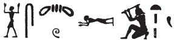
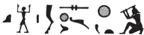

# Column 1 (194-203) {-}

## Esna 194 {-}  
  
  

- Location: Column 1
- Date: Probably Trajan 
- [Hieroglyphic Text](https://www.ifao.egnet.net/uploads/publications/enligne/Temples-Esna003.pdf#page=47){target="_blank"}  
- Bibliography: @sauneron-5, p. 74 (194, A).  See also:
- [194 A](http://www.tempeltexte.uni-tuebingen.de/portal/#/text-detail/907){target="_blank"} 
- [194 B](http://www.tempeltexte.uni-tuebingen.de/portal/#/text-detail/908){target="_blank"}

  

^A^ *nsw.t-bỉty  *  
*ẖnmw-Rʿ nb tȝ-sn.t  *  
*nṯr ʿȝ   *  
*nb p.t tȝ dwȝ.t mw.w ḏw.w  *  
    
*kȝp.n=f hȝy.t  *  
*twȝ.n=f nw.t  *  
*m ḥb=f nfr   *  
*n 3 ȝbd prw sw 1  *  
    
*wbn=f ỉm=s m šww  *  
*m dỉ=f ṯȝw n ʿnḫ  *  
*r fnḏ n nṯr.w  *  
*mỉt.t rmṯ  *  
     
*ỉw n=f ḥʿpỉ  *  
*ỉỉ.n=f ỉry m nḫb  *  
     
*nṯr wʿ dỉ=f ḥfn.w  *  
*n nṯr nb  *  
  
^A^ The King of Upper and Lower Egypt  
Khnum-Re Lord of Esna,  
great god,  
lord of heaven, earth, Duat, water, mountains.  

Just as he covered up the firmament,  
so did he lift up the sky  
in his good festival  
of III Peret 1 ( [Phamenoth 1](https://bookdown.org/shemanefer/Esna2/calendar-ii-77.html#phamenoth-1){target="_blank"} ).  
   
He rises from it as the sun  
as he gives the breath of life  
to the gods' noses,  
and likewise people.  
  
As Hapi arrived for him,  
so he came from the lotus.  
  
The sole god, he gives myriads    
to every god.  

 

^B^ *ẖnmw-Rʿ nb sḫ.t  *  
*ỉty ʿȝ šfy.t  *  
*ḫnt psḏ.t  *  
   
*nb mʿbȝ  *  
*qȝ-(ʿ)  *  
*sḫr ḫfty.w=f  *  
*m ḫ.t n sḫ.t  *  
   
*nb ʿq  *  
*rš.tw n mȝȝ=f  *  
*m wpy=f ʿȝ  *  
    
*ḥqȝ mnỉ.w   *  
*ʿȝ nḫt  *  
*ḥr-ỉb ṯwf  *  
*ḥqȝ tȝ.wy   *  
*m wȝs=f  *  
    
*zbỉ P m ỉḫḫ *  
*ỉnỉ Pr-nṯr m ȝw.t-ỉb  *  
  
^B^ Khnum-Re Lord of the Field  
Sovereign, Great of Prestige  
within the Ennead.  
  
Lord of the 30-spear,  
high of (striking arm)[^fn-194-1],  
who slays his enemies  
with a stick of the field.  
  
Lord of festival,  
one rejoices to see him  
in his great *wpy*-festival.  
  
Ruler of the herdsmen,  
great of strength  
within the papyrus thicket.   
Ruler of the two lands  
through his might.  
  
He who travels to Pe in the evening,[^fn-194-2]  
and reaches Per-netjer in happiness.[^fn-194-3]

[^fn-194-1]: {width=25%} - This passage is corrupt, and the missing signs can be restored by the parallel [Esna 264], 25:{width=25%}
[^fn-194-2]: An allusion to Khnum of the Field speedily visiting Chemmis and the Delta at night, returning to Per-netjer in the morning: @sauneron-1, pp. 71-72; for example [*Esna* II, 190](https://bookdown.org/shemanefer/Esna2/column-f-187-193.html?q=chemmis#esna-190), 1-2; [Esna 197], 23-24; [Esna 202], B; [Esna 249], §22, 4. Note the spelling of *ỉḫḫ*, "dusk; evening": {width=10%}.
[^fn-194-3]: Note the spelling of *ȝw.t-ỉb*: {width=8%}.
