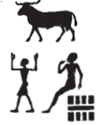
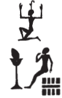

## Esna 195 {-}  
  
  

- Location: Column 1
- Date: Trajan 
- [Hieroglyphic Text](https://www.ifao.egnet.net/uploads/publications/enligne/Temples-Esna003.pdf#page=48){target="_blank"}  
- Bibliography: [194 A](http://www.tempeltexte.uni-tuebingen.de/portal/#/text-detail/907){target="_blank"} 

Heraldic cartouches of Trajan, Neith, Heka, and Khnum. Many unique spellings.

Heka's names are spelled as follows:  
  

**3**&nbsp;&nbsp;&nbsp;&nbsp;{width=5%}  
  
**5**&nbsp;&nbsp;&nbsp;&nbsp;{width=5%}  
  
**8**&nbsp;&nbsp;&nbsp;&nbsp;{width=5.5%}  
  
**10**&nbsp;&nbsp;&nbsp;&nbsp;{width=5%}   