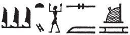
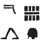
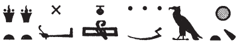

## Esna 196 {-}  
  
  

- Location: Column 1
- Date: Probably Trajan 
- [Hieroglyphic Text](https://www.ifao.egnet.net/uploads/publications/enligne/Temples-Esna003.pdf#page=50){target="_blank"}  
- Bibliography: @sauneron-5, pp. 317-320, 324-330; see also [Tempeltexte 2.0](http://www.tempeltexte.uni-tuebingen.de/portal/#/text-detail/910){target="_blank"} 

**§1**

  

^1^ *nt-ʿ n*  
*ḥb ṯȝy ʿwn(.t)*  
*ỉr(.w) m pr-ẖnmw nb sḫ.t*  
*m ȝbd 3 šmw 20*  
*m ḥb=f nfr *  
*n ḥb ṯȝy ʿwn(.t)*  
*ḥb qn n ẖnmw*  
*ḫr.tw r=f*  
*ỉr(.w) m ȝbd šmw 2 sw 9*  
*r ȝbd 4 šmw ʿrqy*  
   
^1^ The ritual of  
the Festival of Carrying the Staff    
performed in Per-Khnum Lord of the Field,  
on III Shomu 20 (= [Epiphi 20](https://bookdown.org/shemanefer/Esna2/calendar-ii-77.html#epiphi-20) ),  
in his good festival,  
the Festival of Carrying the Staff,  
or the Victory Festival of Khnum,    
as it is also called.  
It is celebrated from II Shomu 9 (= [Payni 9](https://bookdown.org/shemanefer/Esna2/calendar-ii-77.html#payni-9) )  
until IV Shomu 30 (= [Mesore 30](https://bookdown.org/shemanefer/Esna2/calendar-ii-77.html#mesore-30) ).

 

**§2**

  

*ỉr pr-ẖnmw n sḫ.t*  
*pʿy.t n ḥʿpỉ*  
*sḫỉ=s m sḫ.t*  
*pḏ p(ȝ) tp*  
*hbhb Nwn*  
*bdbd nšw m ȝḫ.t*  
*m qȝy.t tp.t*  
*dỉ(.t) m Nwn m ḥȝ.t*  
*nỉ ḫp(r) p.t tȝ dwȝ.t*     
*ṯȝw (n) ʿnḫ wḫȝ wyn*  
*pr=sn ḏ(s)=sn ỉmỉ.tw=sn*  
  
Regarding Per-Khnum of the Field (*sḫ.t*),  
it is the land of Hapi,   
it arose (*sḫỉ*) from the *sḫt*-flood:[^fn-196-0]  
(first) the top part stretched out,[^fn-196-0b]   
the Nun waters were driven out,    
and the sand was molded into the *ȝḫ.t*-field,[^fn-196-1]  
resulting in the initial mound   
which appeared from Nun in the beginning,   
before heaven, earth, or Duat existed:  
the breath (of) life, pillar of air, and light  
they emerged by themselves from among them.  

[^fn-196-0]: {width=22%} - These are clearly puns on the epithet "Khnum Lord of the Field". @sauneron-5, pp. 317-318, n. c, transcribed somewhat differently: *sḫ.t qȝ s(y) m šḫ.t*, "le marais qui s'est exhaussé au-dessus de l'étendue d'eau-Sékhet." While this is possible, I prefer to see the first group as an unconventional spelling of the verb *sḫỉ*, "to rise". 

[^fn-196-0b]: {width=6%} - @sauneron-5, p. 318, n. d, did not translate these signs, but noted the first two could write *bnr* or *rwt*, "outside." Meanwhile, @lost-temples, p. 3, suggested " the summit (beginning of the high floodwaters) rushing (?) (*ḥwỉ pȝ tp (?)*). The first two signs regularly serve as classifiers for *pḏ*, "to stretch out; expand," and at least once serve alone to write this verb: [Esna 350], 16.

[^fn-196-1]: {width=30%} - The first verb is apparently unique, and @sauneron-5, pp. 317-318, with n. g, tentatively read: "le sable fut mêlé à la terre cultivable," and subsequent translators have followed this. Nonetheless, since this refers to sand and water being formed into something solid, the primeval mound, this verb *btbt* or *bdbd* might derive from the same root as *bd*, "mold", the object used to fashion Sokar-Osiris figures out of sand and other materials during the Khoiak festivals:  *Wb* I, 483, 9-12.

^2^ *pr-nṯr *  
*n nṯr nṯr.w*  
*ʿbȝ.t n Km-ȝ.t=f*  
*pr n tȝ-ṯnn*  
*nỉw.t n N.t*  
*s.t-štȝ.t*  
*n nṯr.w pȝwty.w*  
*ḏȝỉs.w ʿȝ.w *  
*nw pȝwty tpy*  
*ʿḥ n Rʿ*  
*ḥw.t-bȝ.w*  
*n Šw Tfn.t*  
*dwȝ.t štȝ.t pw*  
*nn mȝȝ=s rmṯ.w nb(.w)*  
*ỉmḥ.t nt ḥtpty.w*  
   
*wȝỉ r sḫnd=s*  
*ỉn ʿ.wt nb.w*  
*ỉr tkn=s s.t*  
*ḫp(r) ḫrwy.t *  
*m tȝ-(r)-ḏr=f*  
  
^2^ Per-netjer  
of the god of gods (Khnum);  
Aba of Kematef,  
the temple of Tatenen,   
the city of Neith,  
the mysterious place  
of the primeval gods,  
the great Djaisu  
of the first primeval moment;  
the palace of Re;  
Temple of the Bas  
of Shu and Tefnut;  
it is the myterious Duat,  
whih cannot be seen by any humans;  
the cavern of the blessed dead.  
  
May it never be trod upon  
by any livestock.  
If a woman should ever approach it,  
a calamity will befall   
the entire world!  

*ỉw mw ỉmỉ.tw=sn*  
*tỉ-sw ḥr mḥ.t*  
*n pr-ẖnmw n sḫ.t*  
   
^3^ *ỉr nww*  
*zȝw-ẖnn ḫr.tw r=f*  
*s.t gbgb ỉsy.t*   
*r ỉr.tw*  
*m-ḫt ỉr qn ỉm*  
   
*nṯr pn ḥr ḏd*  
*zmȝ wʿ snw=f ỉm=tn*  
  
The water among them  
it is to the north,  
of Per-Khnum of the Field.  
  
^13^ As for the sacred lake,   
it is called *zȝw-ẖnn*:  
the place of massacre by the crew    
which was carried out  
following a rebellious event there.  
  
This god said:  
'May each of you slaughter his fellow!'  

**§3**

 

*ȝbd 2 šmw 9*  
*ỉỉ pw ỉn Rʿ r bw *  
*nty ỉw ỉt=f tȝ-ṯnn ỉm*  
*ḥnʿ zȝ=f Šw*  
*m-ḫt wnn tȝ m nḫn ʿȝ*  
*ʿḥȝ (ḥr) pẖr m tȝ.wy ḫȝs.wt*    
  
*sʿq ḥm=f ḥr gs-ḥry*  
*ỉmnty n Pr-nṯr*  
*r ỉmn=f *  
*(r)-ḥȝ.t sbỉ.w nfy*  
   
*ḥȝp.n=f sḫr.w=f*  
^4^ *m s.t-štȝ.t*  
*ỉmn.n=f sw*  
*m ḥry-ỉb ḏw*  
*ḥw.t-ỉmn wr zp-snw*  
*nn rḫ ỉmỉ.t=s*  
  
II Shomu 9 (= [Payni 9](https://bookdown.org/shemanefer/Esna2/calendar-ii-77.html#payni-9) ),    
Re came to the place  
where is father Tatenen was,  
along with his son Shu,  
after the earth was in great chaos:  
fighting was going around all lands.   
  
His majesty was brought to the Upper Zone,    
west of Per-netjer,  
in order to conceal him  
from these rebels.  
   
He hid his conditions  
^4^ in the mysterious place,  
and he concealed himself  
within a mountain:  
The very great, Hidden Temple,  
its contents are unknown.[^fn-196-3]  
  

[^fn-196-3]: This hidden chapel of North Esna is also described in *Esna* II, 127, 9-10; 129, 2-3.

*ʿḥʿ.n ỉw zȝ=f Šw*  
*r mȝȝ=f*  
*snḏm ỉb=f*  
*m-ḫt mȝȝ=f sw*  
*ḥtp ỉb=f*  
*m ʿḥ=f*  
*ḏd.ỉn=f n ỉt=f*  
*ỉȝw tw zp-snw*  
*p(ȝ) ỉt ỉt.w*  
*tm m ḥʿw=f*  
   
*ḏd.tw n=f Ỉtm*  
*p(ȝ) wrš n sw 9*  
*ḫr.tw r=f*  
*ḏr wrš ḥm=f*  
*m s.t tn*  
  
Then his son Shu came  
to see him,   
his heart was glad  
after he saw him,  
and his heart rested   
in his palace.  
Then he said to his father:  
'Praise to you,  
father of fathers,   
complete (*tm*) of limbs!'  
  
Thus he is called Atum (*Ỉtm*),  
the Guardian (wrS) of Day 9  
he is also called,  
because his Majesty stayed on guard (*wrš*)  
in this place.[^fn-196-4]  

[^fn-196-4]: Similar etymology of this god's name in *Esna* II, 129, 2. The same form of Atum appears again in *Esna* VI, 508, and possibly in *Esna* II, 163, 27.  

*ỉr m-ḫt*  
*wn ỉn sbỉ.w*  
*sḏm=sn sw*  
^5^ *ḏd Rʿ m gs-ḥry*  
*ỉmnty n pr-ẖnmw*  
*ʿḥʿ=k*  
*šm=sn r ỉȝ.t tn*  
*qmȝ=sn ḫnn*  
*ḥnʿ ỉmỉ.w-ḫt(=ỉ) *  
   
*Šw ḥnʿ ỉzy.t Rʿ*  
*smȝ=sn sbỉ.w n Rʿ*  
*m s.t tn*  
  
Now afterwards,    
as for the rebels  
they heard him (Shu).  
  
^5^ Re said in the Upper Zone,   
to the west of Per-Khnum:  
'May you arise!  
They are coming to this mound,  
so they might create chaos  
among my followers.'  
  
So Shu and the Crew of Re  
they slaughtered the rebels of Re  
in this place.  

**§4**

 

*shb.n=f m-ʿqȝ *  
*n s.t-ḥr.t rʿ nb*  
*r ẖnm ỉt=f tȝ-ṯnn*  
*ḥnʿ zȝ=f Šw*  
*m sḫ.t=f*  
*ḏd.tw ẖnmw-Rʿ nb sḫ.t*  
   
*bw nb.w ḥr.tw zp-snw*  
*r tkn* ^6^ *sḫr.w*  
*m-ẖnw=f*  
*pḏ nmt.t r ḫfty.w=f*  
*wr bȝw n šmʿ-mḥw*  
*ntf rdỉ pȝy kȝ.w r ỉd.wt*  
*rmṯ.w ʿ.wt mnmn.t*  
*ʿnḫ=sn m kȝ.w*  
*nw nb sḫ.t*  
*nb ʿnḫ pw*  
*snb r-ḫt=f*  
*nb kȝ.w pw*  
*ṯtf(?) ḏfȝ.w*  
   
*ḥtp ỉb=f*  
*n ḫnd ḥr mw=f*  
^7^ *sḫm ỉb=f*  
*m ḫȝʿ zȝṯw=f*  
*ntf ḏbȝ *  
*ỉr ḏbȝ.w*  
*sr nty r ḫp(r)*  
*ỉw ḏd=f ḫpr(.w) ḥr-ʿ*  
*nn wn ỉr m-ḫm=f*  
    
He enters in across     
from the Upper Place, daily,     
so his father, Tatenen, might unite (*ẖnm*)    
with his son, Shu     
in his field (*sḫ.t*),    
thus one says Khnum-Re Lord of the Field (*sḫ.t*).    
     
Everybody, please keep away  
from disturbing the ^6^ conditions  
within it.  
(Khnum), wide of steps against his enemies,   
great of power in Upper and Lower Egypt:  
it is he who makes bulls mate with cows;  
humans and all livestock  
they live from the food  
of the Lord of the Field.  
He is the Lord of Life,  
and health follows him.  
He is the Lord of Food,  
who pours out(?) provisions.  
  
His heart is pleased  
with whomever treads upon his water;  
^7^ but his heart takes power  
against whomever violates his ground.  
He is the avenger,  
who makes the avenging demons,  
who announces what will come to pass,    
whatever he says happens immediately:  
nobody can act with him unaware.  
   

*nṯr.w rmṯ.w*  
*mỉ=n m šms=f*  
*nb=tn pw *  
   
*tȝ.wy ḫȝs.wt*  
*ḥr=tn r bwt=f*  
*r tm ʿr s.t*  
*r s.t=f*  
*nỉ dgȝ=s kȝ=f m ḫʿỉ*  
*zȝỉ tw r=s*  
*ỉw nsw.t m* ^8^ *bȝq=f*  
*wḏȝ tȝ-r-ḏr=f*  
*r ḫrwy.t*   
  
*ỉw (n)ḏr ỉm r ȝḫ*  
*wȝỉ n thỉ s(w)*  
  
Gods and humans,  
let us come and serve him!  
He is your lord!  
  
Egypt and foreign lands,    
stay away from his abomination,  
do not let a woman go near    
to his place,   
and may she not see his Ka in procession.    
Guard against this,  
and the king will be in ^8^ his graces,  
and the whole earth will be safe  
from calamity.  
  
Whoever adheres to this shall be excellent,  
but woe to whomever violates it.  

**§5**

 
   
*sḫʿ n ẖnmw p(ȝ) nḫy nfr*  
*m tȝ-sn.t*  
*r pr-ẖnmw n sḫ.t*  
*wḏȝ r s.t-ḥr.t*  
*r ẖnm ỉt=f Ỉtm*  
   
*ỉr(.t) snṯr qbḥw*  
*pr.t-ḫrw *  
*m t ḥnq.t ỉḥw ȝpd.w*  
*ỉrp ỉrṯ.t*  
*ỉḫt nb.w nfr*  
*nỉs rn=sn*  
   
^9^ *ʿq r ʿḥ*  
*ḥtp ỉm *  
*ỉw ḥr=f nfr r-ẖnw*  
*ỉr(.t) ʿȝb.t ʿȝ.t*  
*m ỉḫt nb.w nfr*  
   
Procession of Khnum the Good Protector  
from Esna  
to Per-Khnum of the Field,  
going up to the Upper Place  
to unite with his father, Atum.    
  
Performing incense, cool-water,    
voice offerings  
of bread, beer, cattle, fowl,  
wine, milk,   
all good things,   
while calling their names.  
  
^9^ Enter the palace,  
resting therein,  
while his good face looks in.  
Performing the great mixed offering  
of all good things.

*(tm?) rdỉ ḫp(r) ḫrw qȝ*  
*m ʿqȝ=s*  
*wpw(-ḥr) ḫrw ḥknw *  
*nw wʿb ẖry-ḥb ḥry-tp*  
*šmʿy.w mỉt.t*  
   
*ḥr nty s.t ỉȝw pw*  
*Ỉtm ỉȝw m ỉȝk ỉm=s*  
*s.t štȝ.t pw*  
*ỉmn wr zp-snw*  
*ỉwty mȝȝ.tw=s ȝy*  
*ỉmḥ.t pw nty* ^10^ *ḥtpty.w*  
*ḥts(.w) ḥnʿ Ỉtm*  
*m s.t tn *  
   
*ỉr.t ỉhȝy m-pẖr ỉȝ.t tn*  
*r ḏr=s*  
*ỉn z nb*  
*ỉr ỉw wnw.t 11.t n hrw pn *  
*sḫʿ n nṯr pn r pr-ẖnmw*  
*ḥtp ḥr s.t=f wr.t*  
   
(Do not(?)) allow any loud voices  
in front of it,   
except (for) the voices of praises    
by the *wʿb*-priest, chief lector priest,   
and the chorus likewise.  
  
Because it is the Place of the Old Man,   
an aged Atum is in it as an old man.  
It is the mysterious place,  
very greatly hidden,   
without anybody seeing it.    
It is the cavern of ^10^ the blessed dead,  
who are mummified alongisde Atum  
in this place.  
  
Perform *ỉhȝy*-praise all around this mound  
in its entirety  
by every man.  
Then when the 11th hour arrives on this day,  
procession of this god to Per-Khnum,  
resting upon his great throne.  

**§6**

 

*ỉr ẖnmw p(ȝ) nḫy nfr*  
*ẖnmw-Rʿ nb sḫ.t pw*  
*ỉw=f m ḥwnw*  
*zȝ tȝ-ṯnn *  
*wr n ỉt=f(?)*  
   
*Šw pw*  
*ỉw=f m wsr=f m sḫ.t*  
*rdỉ n=f ỉȝw.t n ỉt=f*  
*ỉw=f (ḥr) sr ḫʿ.w*  
*m tȝ-sn.t*  
*r nḏ.t ỉwty*  
   
^11^ *šm=f r pr-ẖnmw n sḫ.t*  
*r sšm tȝ ỉt*  
*r ẖnm ỉt=f Ỉtm*  
*r rdỉ(.t) qbḥw*  
*n šps.w*  
*r sfsf-ȝw pr.t-ḫrw*  
*n Wsỉr nb ʿnḫ.t*  
*ḥnʿ ỉmy.w ỉȝ.t 4.t*  
*m ỉmḥ.t*  
*r rdỉ ḥtp.w-nṯr.w*  
*(n) nty.w-ỉm*  
*r ỉr(.t) ẖr.t*  
*n ḥnmm.t*  
   
*ỉr.n=f ỉs-nỉȝ n nṯr.w*  
*swḥ r ẖnm.ty rmṯ.w*  
*sʿnḫ.n=f wnn.t nb(.w)*  
*m r'-ʿ.wy=f *  
   
As for Khnum the Good Protector,    
he is Khnum-Re Lord of the Field  
while he is a youth,   
the son of Tatenen,   
eldest one of his father(?).  
   
He is (also) Shu,    
while he is in his might in the Field,    
to whom was given the office of his father,    
he announced coronations  
in Esna,   
in order to protect the helpless.  
  
^11^ He goes to Per-Khnum of the Field,
to lead the land of (his) father,  
to unite with his father, Atum;   
to give cool water to the august spirits;    
to deposit offerings and invocations  
for Osiris lord of Ankhet,   
along with those within the four mounds  
in the cavern;  
to give divine offerings  
to those are 'there' (the deceased);  
to make food  
for the sunfolk.  
  
He has made a pleasant breeze for gods,  
and air for the nostrils of humans,   
thus he has enlivened all that exists  
through his handiwork.

^12^ *ȝbd 2 šmw 10*  
*sḫʿ n Ỉs.t nb(.t) ʿbȝ*  
*ỉr(.t) ỉrw=s*  
*mỉ nty r ʿrw pn*  
  
*sḫʿỉ n ḥkȝ p(ȝ) ẖrd*  
*m tȝ-sn.t*  
*ỉr(.t) nt-ʿ=f*  
   
^12^ II Shomu 10 (= [Payni 10](https://bookdown.org/shemanefer/Esna2/calendar-ii-77.html#payni-10) ),  
procession of Isis, Lady of Aba,  
performing her ritual  
like what is on this papyrus roll.  
  
Procession of Heka the Child  
in Esna;  
perform his ritual.[^fn-196-12]

[^fn-196-12]: The festival calendar (*Esna* II, 77, 15) only lists the festival of Heka in his mammisi on this day. Nonetheless, since this is the 10th day of the month, Isis logically performs the decade festival as well, as noted elsewhere on that calendar: *esna* II, 55, 2 (Thoth 10).  

*hrw 11*  
*sḫʿ n ẖnmw p(ȝ) nḫy nfr*  
*m tr n dwȝw*  
*nȝỉ m ḥr=f*  
*r pr-sȝḥw-Rʿ*  
*ḥtp m ʿḥ n pr pn*  
   
*ỉr ỉw wnw.t 11.t m hrw pn*  
*wḏȝ r tȝ-sn.t*  
*ḥtp ḥr s.t=f wr.t*  
    
Day 11  
Procession of Khnum the Good Protector  
at the time of morning.  
He travels forward  
to Per-Sahure,  
resting in the chapel of this temple.  
  
Now when the 11th hour of this day comes  
return to Esna,  
and rest upon his great throne.

