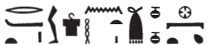

# Column 2 (204-213) {-}  

## Esna 204 {-}  
  
   
  
  
- Location: Column 2
- Date: Probably Trajan
- [Hieroglyphic Text](https://www.ifao.egnet.net/uploads/publications/enligne/Temples-Esna003.pdf#page=71){target="_blank"}  
- Bibliography: @sayed-neith, II, p. 639 Doc. 1036 (204, A); see also [Tempeltexte 2.0](http://www.tempeltexte.uni-tuebingen.de/portal/#/text-detail/919){target="_blank"}

   

^A^ *wbn(.t) m Nwn  *  
*ʿnḫ.t ỉty.t  *  
*sḫḫ n tȝ ẖr wḏ=s  *  
  
*ỉỉ(.t) m wʿ  *  
*qmȝ.n=s ḥḥ.w  *  
*nn ky ḥr-ḫw=s  *  
*nn nṯr ʿrq m sšm=s  *  
     
*šsr(.t) sḫr.w  *  
*ḫp(r.t) m ḥȝ.t  *  
*ḥms(.t) ḥr ns.t=s  *  
*m tȝ-sn.t m tȝ-šmʿ  *  
      
*ʿḥʿ=s m nsw.t   *  
*n msw=s  *  
*ḥr wḏ-md.w n nṯr.w nṯry.t  *  
    
*ỉṯ(.t) mr=s  *  
*m ḫʿỉ ḥr srḫ=s  *  
*ḫʿỉ nb ẖr s.t-rȝ=s  *  
   
*N.t wr.t mw.t-nṯr  *  
*nb(.t) tȝ-sn.t  *  
  
^A^ She who arose from Nun,   
the living-serpent, sovereign,  
the breadth of the earth is under her command.  
  
She who arrived as one,  
and created millions;  
there was no other, except her;  
no god completed in her image.  
  
She who conceives plans,  
who came aboue in the beginning,  
who sits upon her throne  
in Esna in Upper Egypt.  
  
She stands as king  
for her child,  
issuing commands to gods and goddesses.  
  
She who takes the one she loves,  
as the one who appears upon her *serekh*:  
the Lord appears in glory under her authority.    
  
Neith the great, Mother of God,  
Lady of Esna.  
  

^B^ *Ỉrỉ-tȝ twȝ bnw ḥr sȝ=f  *  
*nṯr ʿȝ m ḥw.t-ẖnmw  *  
*nwỉ r ndb.wt=f  *  
    
*nb sḫ.t m ỉfdw n hȝy.ty  *  
*ḥn(b).t=f r grb n tȝ  *  
      
*hyn=f n rsy r ȝb n wṯz.t  *  
*tȝš=f mḥty dỉ-mr.t  *  
*ỉmnty=f ỉs pẖr s.t-Rʿ   *  
*ỉȝbty=f rtḥ-snḥ.t ʿpr wbn Nw.t(??)  *  
  
*ẖnmw-Rʿ nb tȝ-sn.t   *  
*nṯr ʿȝ nb sḫ.t  *  
   
^B^ Irita, who carries the earth on his back.[^fn-204-1]  
Great god in the Temple of Khnum,  
who cares for his districts.  
  
Lord of the Field in the four corners of heaven,  
his measured land is the whole mapped earth.  
   
His southern boundary is the East of the Sky,  
his northern district is the Heaven,  
his west is the circuit of the Throne of Re,  
his east the (???) of Nut:[^fn-204-2]  
  
Khnum-Re Lord of Esna,  
Great God, Lord of the Field.  

[^fn-204-1]: As the cosmic, primeval demiurgic serpent, Irita dwells beneath the earth, and is responsible for creating all products of the field.
[^fn-204-2]: {width=20%} - The reading of this area is very difficult. The first few signs recall the eastern region of of the sky, *rtḥ-qȝb.t*, but then the following is highly unusual.

