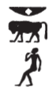
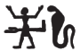

## Esna 205 {-}  
  
- Location: Column 2
- Date: Probably Trajan
- [Hieroglyphic Text](https://www.ifao.egnet.net/uploads/publications/enligne/Temples-Esna003.pdf#page=72){target="_blank"}  
- Bibliography: None

Cartouches of Heka the child, with figures of Khnum, Wadjyt and Nekhbet.   
Heka's name is spelled:  
  
{width=6%}&nbsp;&nbsp;2   
  
{width=4.5%}&nbsp;&nbsp;5 (***ḥ****b* + ***q****nd*)
  
{width=5%}&nbsp;&nbsp;8    
  
{width=7%}&nbsp;&nbsp;11