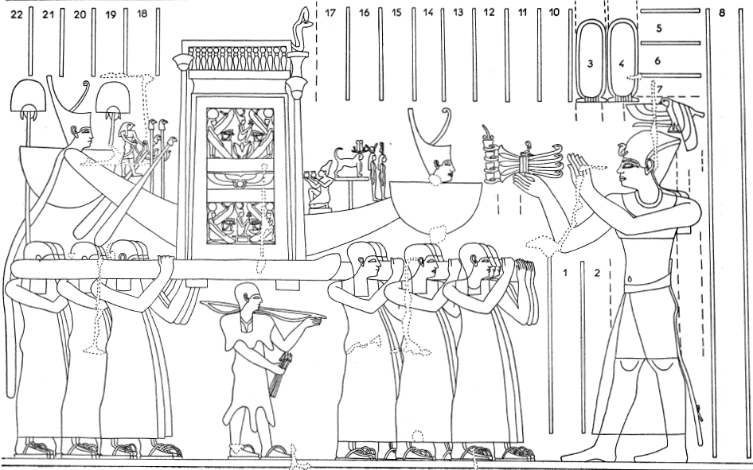

## Esna 207 {-}  
  
  

- Location: Column 2
- Date: Trajan
- [Hieroglyphic Text](https://www.ifao.egnet.net/uploads/publications/enligne/Temples-Esna003.pdf#page=80){target="_blank"}  
- Bibliography: @sauneron-5 pp. 277-280, 295-302. See also [Tempeltexte 2.0](http://www.tempeltexte.uni-tuebingen.de/portal/#/text-detail/923){target="_blank"} 

  

^15^ *ȝbd 3 šmw sw 13*  
*ʿq r ḥw.t-N.t*  
*ỉr(.t) ʿȝb.t ʿȝ.t*  
*m ỉḫt nb.w nfr*  
   
*nỉs nty-ʿ *  
*n ḫʿ n nṯr.t tn*  
*sr wȝ.t *  
^16^ *ỉn sš-mḏȝ.w-nṯr*  
*r wnw.t 3 pẖr(.w) m hrw*  
   
*sḫʿ.n mw.t mw.wt*  
*N.t wr.t*  
*mw.t-nṯr*  
*nb(.t) tȝ-sn.t*  
*ḥnʿ psḏ.t=s*  
*rmn pḏ.t (ẖr)-ḥȝ.t=s*  
*ỉn ḥȝty-ʿ ʿȝ wr*  
*tpy.w-ỉȝ.t=sn mỉt.t*  
*ẖnm ỉtn=s*  
*ḥtp m wsḫ.t ʿȝ.t*  
*ḥtp n psḏ.t=s*  
*ḥr wnm=s ỉȝb=s*  
   
*ỉr.t ỉrw nb.w*  
*n sḫʿ=s*  
*ỉʿb.tw ḥtp.w-nṯr.w wr*  
*m t t-ḥḏ bỉȝ*  
*ḥnq.t ỉrp*  
^17^ *ỉḫt nb nfr*  
*šdḥ bỉ.t ỉrṯ.t *  
*dqr.w sm.w rnp.w*  
*snṯr ḥr sḏ.t*  
*ỉḥw ȝpd.w *  
*ḥr [ḫȝ.wt] n ḥḏ nbw*  
   
*kȝp ʿnty.w*  
*m pr r-ḏr=f*  
*m-ḫnt=f m-rwty=f*  
  
^15^ III Shomu 13 (= [Epiphi 13](https://bookdown.org/shemanefer/Esna2/calendar-ii-77.html#epiphi-13))    
Enter the temple of Neith,  
perform a great composite offering,  
of all good things.  
  
Recite the ritual  
of making this goddess appear,  
and announce the path,  
^16^ by the Scribe of the Divine Book,  
until the third hour of the day has passed.  
  
Procession of the Mother of Mothers,  
Neith the Great,  
Mother of God,  
Lady of Esna,  
along with her Ennead.  
Carrying a bow before her,  
by the Great, Chief Governor,  
and the gods on standards likewise.[^fn-207-00]  
Unite with her sundisk.  
Rest in the Great Courtyard,  
her Ennead stationed  
on her right and left.  
  
Perform every ritual  
of carrying her in procession.  
Assemble great divine offerings,  
of bread, white bread, *bỉȝ*-cakes,  
beer, wine,  
^16^ all good things;  
spiced wine, honey, milk,  
fruits, vegetables, fresh plants,  
incense upon the fire,  
cattle and fowl  
upon [altar]s of silver and gold.  
  
Fumigate with incense  
in the entire temple,  
within it and outside it.

[^fn-207-00]: Compare the depiction of a bark procession for Neith in *Esna* VI, 545, complete with a priest carrying her sacred bow: {width=40%}

*ỉr.t ḥnw *  
*ỉr.t ỉḫt-nṯr*  
*mỉ rʿ nb*  
*ỉn wʿb ʿȝ m hrw=f*  
*wn-ḥr*  
*n nṯr-nỉwty*  
*wn-ḥr *  
*n nṯr.t tn*  
*šd dwȝ.w m hrw pn*  
*dwȝ dšr.t ḥḏ.t*  
*swʿb psḏ.t*  
*ḏsr pr pn*  
^18^ *r ḏr=f*  

*ỉs ẖry-ḥb ḥry-tp*  
*mnʿ.t n.t nbw*  
*ṯḥn r ḫḫ=f*  
*m ḥr n šfy.t*  
*qn ṯȝy.w ḥr rmn=f*  
*šw.t n nỉȝ m tp=f*  
*(ḥr) ʿḥʿ m wbȝw*  
*n ḫft-ḥr n nṯr.t tn*  
*ỉw ḥr=f r mḥy.t*  
*nỉs nty-ʿ n hrw pn*  
*m ḫft-ḥr n nṯr.t tn*  
*ỉr.t ỉrw nb.w n hrw pn*  
   
Perform the service,  
perform the divine ritual,  
just like eveyr day,  
by a wab-priest, great in his day;  
Revealing the face  
of the city god (Khnum);  
Revealing the face  
pf this goddess (Neith);  
recite hymns on this day,  
hymn to the red and white crowns,  
purify the Ennead,  
sanctify this temple  
^18^ in its entirety.  
  
Meanwhile, the Chief Lector Priest  
- having a golden menat,  
and a faience amulet on his neck  
with the face of a ram,  
ceremonial bands on his shoulder,  
and an ostrich plume on his head -  
stands in the forecourt  
of the pronaos of this goddess,  
facing towards the north;  
reciting the ritual of this day,  
in the pronaos of this goddess;  
perform all rites of this day.  

  

*ỉr m-ḫt tr n rwhȝ*  
*ỉn.ḫr=tw* ^19^ *ỉḥ.t km(.t)*  
*ỉs pʿpʿ(.t)*  
*r wsḫ.t-ḫʿ.w*  
*ỉr.t ʿbw=s*  
*m snṯr ḥr sḏ.t*  
*sdm ỉr.t(y)=s *  
*m wȝḏ msdm.t*  
*wrḥ=s m mḏ*  
*rdỉ(.t) šw.ty ḥr tp=s*  
*wȝḏ n ṯḥn r ḫḫ=s*  
   
*bs r ḏȝḏȝ.t tp(.t) Nwn*  
*ḏd-mdw ỉn ẖry-ḥb ḥry-tp*  
*ỉȝw n=t mw.t-nṯr nt Rʿ*  
*qmȝ(.t) Ỉtm*  
*mỉ nty r nty-ʿ*  
*ḥnʿ dwȝ.w *  
  
Now after the time of evening,  
one brings ^19^ a black cow -  
brilliant, moreover, of coat -  
to the Court of Appearances.  
Perform her purification  
with incense upon the fire;  
decorate her eye(s)  
with green powder and galena;  
anoint her with ointment;  
put a double-plumed crown on her head;  
and a faience amulet on her neck.  
  
Go forth to the tribune on the water.  
Words spoken by the Chief Lector Priest:  
'Praise to you, Mother of Re,  
who created Atum...'  
according to the ritual papyrus,  
as well as (other) hymns.  

^20^ *ṯȝy pḏ.t n ỉsr*  
*šsr 4*  
*ỉn ḥȝty-ʿ ʿȝ wr*  
*sṯỉ r rsy.t mḥy.t*  
*ỉmnt.t ỉȝbt.t*  
*ḏd-mdw*  

*ỉnḏ ḥr=t *  
*pḏ.t nt Rʿ*  
*šmr(.t) nt Ỉtm*  
*pḏ.t twy nn*  
*m ʿ n N.t*  
*šsr nty m ḫfʿ=s*  
*ḥr mḏd n=s *  
*ḫfty.w nbw n Rʿ ỉm*  
*sḥtm=s sbỉ.w ḥr=s*  
^21^ *wdỉ=s šsr=s*  
*ʿḏ=s *  
*r ẖȝk.w-ỉb.w*  

*hȝỉ šsr=s *   
*r ḫfty.w nb.w n Rʿ*  
*hȝỉ šsr=s*  
*r ḫfty.w nb.w (pr-ʿȝ)|*  
*m mwt m ʿnḫ*  
*ntf Ỉtm *  
  
^20^ Carrying the tamarisk bow,    
and four arrows,  
by the Very Great Covernor.  
Shooting to the south, north,  
west, and east.  
Words spoken:  
  
Greetings,   
bow of Re,  
bow of Atum,  
this bow here  
is in the hand of Neith!  
The arrow which is in her grasp  
strikes for her  
all enemies of Re.  
She annihlitates her rebels,  
^21^ whe launches her arrows,  
and makes a slaughter   
among the disaffected ones.   
  
Her arrow descends  
against all the enemies of Re!  
Her arrow descends  
against all the enemies of (Pharaoh)|,  
dead or alive:  
(for) he is Atum!  

*ỉ.rwḏ tw ṯz.t zp-snw rwḏ*  
*nỉ wʿ=sn *  
*r šsr=tn*   
  
*sȝḫ=f tn*  
*m B*  
*sḫr=tn sw *  
*ʿȝpp*  
*sswn=tn sw *  
^22^ *spd wʿ=tn*  
*nbs n sḏ.t*  
*(r) ȝḫ.t nḥḥ*  
*rs=tn ṯz(.t) *  
*(r) ȝḫ.t nḥḥ*  
*r sḫr ʿȝpp*  
*m p.t m tȝ*  
*m ḏȝḏȝ.t*  
*n.t nṯr nṯr.t nb*  
   
*mȝʿ-ḫrw Rʿ r ʿȝpp*  
*zp 4*  
*ỉ.sṯỉ r rsy.t*  
*mỉ spd=k (m) p.t tȝ*  
*dr=k ḫfty.w nb.w*  
*nw Rʿ*  
*m rsy.t mḥy.t mỉt.t *  
*ỉmnt.t mỉt.t ỉȝbt.t mỉt.t*  
    
Be strong, team, be strong!  
Not one of them shall escape(?)  
from your arrows.  
  
He shall make you excellent  
against Be (Seth):  
you will strike him down!  
Apophis:  
you will annihilate him!  
^22^ May your harpoons be sharp,  
and the fire burn,  
(at) the Horizon of Eternity![^fn-207-1]  
Be on guard, team!  
(at) the Horizon of Eternity!  
in order to strike down Apophis,  
in heaven and earth,  
and in the council  
of every god and goddess.  
  
Re is justified against Apophis,  
four times:  
shoot (an arrow) to the south,  
may you be sharp (in) heaven and earth,  
and repel all the enemies  
of Re,  
in the south, likewise north,  
likewise west, likewise east.  

[^fn-207-1]: @sauneron-5, p. 288, n. x, emended the Akhet into the chopping block (*ḫb.t*), and transcribed the unusual sign later as *ỉȝ.t*, "le lieu saint", in both cases understanding *nḥḥ* as an adverb ("eternally"). However, context suggests this refers to the ultimate destruction of enemies (stabbing, shooting, burning) in the Eastern Horizon, whence the present translation.

 

*wḏȝ r pr=s m ḥtp*  
*ḏd.ỉn ḥm.w-nṯr.w*  
   
*hy zp-snw*  
*ỉs ỉỉ.tw m nḏm-ỉb*  
^23^ *N.t ỉh.t wr.t*  
*ỉỉ.tw m ḥtp*  
   
*hy zp-snw*  
*n ỉw=s*  
*N.t wr.t*  
*mw.t nṯr nb(.t) tȝ-sn.t*  
*Mnḥy.t-Nb.t-ww*  
*nb(.t) ḫnt-tȝ*  
   
*ḫʿ.n nṯr.t tn*  
*ḥnʿ psḏ.t=s*  
*ḥtp ḥr s.t=s wr.t*  
*sṯ(.t) tkȝ(.w) ʿšȝ.w*  
*m-ẖnw pr pn*  
*ỉr(.t) hrw nfr *  
*ỉn ṯȝy.w ḥmw.wt*  
*ỉr(.t) ỉhy*  
*ỉn nỉw.t tn r-ḏr=s*  
*ỉw nỉ ʿʿw.n z nb*  
*r ḥḏ-tȝ*  
*dỉ(.t) tȝ-sn.t m ḥb*  
  
Proceed to her temple in peace.  
The priests say:  
  
Hey, hey!  
She has arrived in happiness.  
^23^ Neith the great cow  
has arrived in peace!  
  
Hey, hey!  
at her arrival.  
Neith the great,  
Mother of God, Lady of Esna;  
Menhyt-Nebtu,  
Lady of Khent-ta.  
  
This goddess appears in procession  
with her Ennead;  
resting on her great throne;  
lighting numerous torches[^fn-207-2]  
within this temple;  
performing holiday,  
by men and women;  
performing jubilation  
bu the entire city,  
without any person sleeping  
until dawn;  
placing Esna in festival.  

[^fn-207-2]: The ritual lighting of torches for Neith on the night of Epiphi 13 is explained in the preceding cosmogony: [Esna 206], 15. 