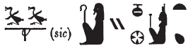

# Column 2 (204-213) {-}  
  
## Esna 209 {-}  
  
  

- Location: Column 2
- Date: Trajan
- [Hieroglyphic Text](https://www.ifao.egnet.net/uploads/publications/enligne/Temples-Esna003.pdf#page=85){target="_blank"}  
- Bibliography: @sauneron-1, pp. 90-92; @sauneron-8, p. 43. See also [Tempeltexte 2.0](http://www.tempeltexte.uni-tuebingen.de/portal/#/text-detail/925){target="_blank"} 

  

^27^ *ỉr(.t) p(ȝ) wdn n Ỉs.t   *  
*m hrw pn mỉ rʿ-nb  *  
*ḏd-mdw  *  
  
^27^ Performing the litany of Isis  
on this day like every day.  
Words spoken:  

**(1)** {width=17%}  

*wdn n Ỉs.t wr.t  *  
*mw.t-nṯr nb(.t) tȝ-sn.t  *  
*ḥr-tp ʿnḫ-wḏȝ-snb  *  
*n nsw.t-bỉty  *  
*^28^ (tryns ḫwỉ)|  *  
  
Offering for Isis[^fn-209-1] the great,  
Mother of God, Lady of Esna,  
in addition to the life, prosperity, health    
for the King of Upper and Lower Egypt  
^28^ (Trajan Augustus)|  

[^fn-209-1]: *ỉ < ỉȝ.t-ṯȝ.wy*, "Nome of the Chicks", *s.t < (tȝ)-sn.t*, "Esna."

**(2)** {width=15%}  

*n Ỉs.t wr.t  *  
*mw.t-nṯr nb(.t) tȝ-sn.t  *  
*ḫnt(.t) pr-nṯr  *  
  
For Isis[^fn-209-2] the great,  
Mother of God, Lady of Esna,  
foremost of Per-netjer.  

[^fn-209-2]: *ỉ < ỉȝ.t-ṯȝ.wy*, "Nome of the Chicks", *s.t < sr.t*, "ram."

**(3)** {width=5.5%}  

*n Ỉs.t wr.t  *  
*mw.t-nṯr nb(.t) ḥw.t-bȝ.w  *  
*ḫnt.t Ỉwny.t  *  
  
For Isis the great,  
Mother of God, Lady of Temple of the Bas,  
foremost of Iunyt.  

**(4)** {width=7%}  

*n Ỉs.t wr.t  *   
*mw.t-nṯr ḥr.t s.t-wr.t  *  
*ḫnt(.t) pr-nṯr  *  
  
For Isis the great,  
Mother of God, upon the great throne,  
foremost of Per-netjer.

**(5)** {width=10%}  

*n Ỉs.t wr.t  *  
*ḥr.t-ỉb ḥw.t-ṯȝ.wy  *  
*ḫnt(.t) pr-sȝḥw-Rʿ   *  
    
*mȝȝ r pȝ wḫȝ n mḥty  *  
*nty n mt(r)  *  
  
For Isis[^fn-209-5] the great,  
within the Temple of the Chicks,  
foremost of Per-Sahure.  
  
(Look to the column to the north  
which is in the middle).[^fn-209-0]  

[^fn-209-5]: *ỉ < ỉtn, s.t < sȝḥ*. Allusion to the toponym Per-Sahure mentioned in this verse.
[^fn-209-0]: Despite this instruction, @sauneron-1, pp. 90-92, was unable to identify any continuation of this hymn.