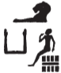

## Esna 215 {-}  
  
- Location: Column 3
- Date: Domitian 
- [Hieroglyphic Text](https://www.ifao.egnet.net/uploads/publications/enligne/Temples-Esna003.pdf#page=95){target="_blank"}  
- Bibliography: None

Cartouches of Heka the child, with figures of Khnum and Horus Behedety.   
Heka's name is spelled:

{width=6%}&nbsp;&nbsp;3;&nbsp;&nbsp; {width=10%}&nbsp;&nbsp;7,
14;&nbsp;&nbsp; {width=9%}&nbsp;&nbsp;11  