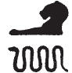
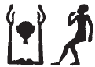

## Esna 223 {-}  
  
- Location: Column 4
- Date: Domitian 
- [Hieroglyphic Text](https://www.ifao.egnet.net/uploads/publications/enligne/Temples-Esna003.pdf#page=114){target="_blank"}  
- Bibliography: None

Cartouches of Heka the child, with figures of Khnum and Horus Behedety.   
Heka's name is spelled:

{width=8%}    2, 8 (snake = *kȝ*);    {width=10%}    5, 11  

