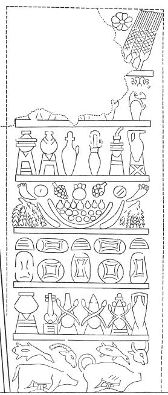

## Esna 224 {-}  
  
   

- Location: Column 4
- Date: Domitian 
- [Hieroglyphic Text](https://www.ifao.egnet.net/uploads/publications/enligne/Temples-Esna003.pdf#page=115){target="_blank"}  
- Bibliography: @sauneron-1, p. 73; @sauneron-5, pp. 74, 81.

^1^ *ḥȝt-ʿ m*   
*smn nḥp  *  
*ỉr(.w) m pr n   *  
*ẖnmw-Rʿ nb tȝ-sn.t  *  
*m ḥb pn nfr  *  
*ỉr(.w) m ȝbd 3 pr.t sw 1  *  
*ḏr nty ḥb Ptḥ pw  *  
*ʿḫỉ.n=f p.t m hrw pn  *  
   
*ḥb n nṯr nb nṯr.t nb.t  *  
*[ʿȝ nḏs]  *  
^2^ *wn kȝ=sn ḥr wȝḥ ʿḫ n Rʿ  *  
*n ẖnmw ḥnʿ psḏ.t=f  *  
*m hrw pn  *  
*ḏsr ḥw.t-ỉt*  
*ḥr nn  *  
    
*smȝʿ ʿȝb.t wr.w  *  
*m ỉḫt nb,w nfr  *  
*m t ḥnq(.t) kȝ.w ȝpd.w  *  
*ỉrp šdḥ bỉ.t ỉrṯ.t   *  
*dqr.w sm.w rnp.w nb.w  *  
*nn ḏr=sn  *  
   
*ỉr(.t) snṯr [...]  *  
^3^ *m pr r-ḏr=f  *  
*m-ḫnt=f m-rwty=f  *  
  
^1^ Beginning of (the ritual)  
of Installing the Potter's Wheel,[^fn-224-1]  
performed in the temple of   
Khnum-Re Lord of Esna,[^fn-224-2]  
in this good festival,  
done in III Peret 1 (= [Phamenoth 1](https://bookdown.org/shemanefer/Esna2/calendar-ii-77.html#phamenoth-1){target='_blank'}).  
Because this is the Festival of Ptah,  
he lifted (*ʿḫỉ*) up the sky on this day.  
  
Festival for every god and goddess  
[great or sma]ll.  
^2^ Their Kas erect the brazier (*ʿḫ*) of Re  
for Khnum and his Ennead  
on this day,  
and the Temple of the Father is sanctified  
because of this.  
  
Presenting the great offering  
consisting of all good things:  
bread, beer, beef, fowl,  
wine, spiced wine, honey, milk,  
fruits, vegetables, all fresh plants  
without limit.[^fn-224-3]  
  
Burning incense [and ...]  
^3^ through the whole temple,  
inside and outside.

[^fn-224-1]: This was obviously one of the biggest festivals for Khnum, lord of the potter's wheel. See now @leitz-loeffler.

[^fn-224-2]:  {width=15%}{width=35%} - This short inscription contains many creative spellings.

[^fn-224-3]: {width=30%} - Detailed representation of such an offering in [Esna 349].