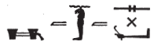

## Esna 225 {-}  
  
  

- Location: Column 4
- Date: Domitian
- [Hieroglyphic Text](https://www.ifao.egnet.net/uploads/publications/enligne/Temples-Esna003.pdf#page=116){target="_blank"}  
- Bibliography: @sauneron-8, pp. 15-21, 59-62. See also [Tempeltexte 2.0](http://www.tempeltexte.uni-tuebingen.de/portal/#/text-detail/1001){target="_blank"}

  

^3^ *ỉr(.t) p(ȝ) wdn n ẖnmw*    
*m hrw pn mỉ rʿ-nb  *  
*ḏd-mdw  *  
  
^3^ Performing the litany of Khnum  
on this day like every day.  
Words spoken:  

*wdn n ẖnmw-Rʿ nb tȝ-sn.t*  
*m rn(.w)=f nb(.w)*  
*ḥr-tp ʿnḫ-wḏȝ-snb  *  
*n nsw.t-bỉty  *  
*(pr-ʿȝ ʿnḫ(.w) ḏ.t)|  *  
  
Offering for Khnum-Re Lord of Esna,   
in all his names,  
in addition to the life, prosperity, health    
for the King of Upper and Lower Egypt,  
(Pharaoh, living forever)|   

**1**  

*n ẖnmw-Rʿ nb tȝ-sn.t*  
*qdỉ rmṯ.w*  
*ms nṯr.w ʿ.wt nb.w*  
*[...]*  
   
For Khnum-Re Lord of Esna,  
who built humans,  
and birthed gods and all livestock  
[...]  
  

**2**  

^4^ *n ẖnmw-Rʿ nb tȝ-sn.t*  
*wtṯ nṯr.w rmṯ.w*  
*ʿw.t nb.w*  
*qmȝ pȝy.w ḥrr.w *  
*ḥnʿ ỉmy.w-mw*  
   
For Khnum-Re Lord of Esna,    
who begat gods, humans,   
all livestock;  
who created birds, serpents  
and all those within the water.

**3**  

*n ẖnmw-Rʿ nb sḫ.t*  
*nb nṯr.w rmṯ.w*  
*nʿš dnỉ.t*  
*nb pḥty*  
*ʿȝ mrw.t*  
*wr bȝw n šmʿ-mḥw*  
  
For Khnum-Re Lord of the Field,  
Lord of gods and humans,  
fierce of cry,  
lord of strength,  
great of love,  
great of power in all Egypt.

**4**  

*n ẖnmw-Rʿ nb sḫ.t*  
*qdỉ* ^5^ *wnn.t*  
*rwḏ nb ḥr-sȝ tȝ*  
  
For Khnum-Re Lord of the Field,    
who built ^5^ what exists,  
and what flourishes on earth.  

**5**  

*n ẖnmw-Rʿ ḥry s.t=f wr.t *  
*ḥry-ỉb Ỉwny.t*  
*kȝ sṯỉ*  
*wtṯ nṯr.w rmṯ.w*  
  
For Khnum-Re upon his great throne,     
within Iunyt;  
ejaculating bull,  
who begat gods and humans.  

**6**  

*n ẖnmw-Rʿ ḥry s.t=f wr.t*  
*ḥry-ỉb ḥw.t-bȝ.w*  
*bȝ pḏ nmt.t*  
*ḫnt sḫ.t=f*  
*ḥry-wḏb*  
*wtṯ ỉḫt nb.w*  
  
For Khnum-Re upon his great throne  
within Temple of the Bas;  
Ba, wide of steps  
within his field;  
Chief of agriculture,  
who begat all things.

**7**  

*n ẖ[nmw-Rʿ ...]*  
^6^ *m r'-ʿ.wy=f*  
  
For Kh[num-Re...]  
^6^ with his handiwork.  

**8**  

*n ẖnmw*  
*qdỉ ḥr nḥp=f*  
*grg spȝ.wt nb.w*  
*m rn=f*  
  
For Khnum  
who builds upon his wheel,  
who populates all nomes  
in his name.  

**9**  

*n ẖnmw qdỉ*  
*ḥry-nḥp*  
*šȝʿ ʿnḫ n Km.t*  
*ḏs=f*  
  
For Khnum the builder,  
Chief of the potter's wheel,  
who began life for Egypt  
all by himself.  

**10**  

*n ẖnmw nḥp*  
*qdỉ m šȝʿ*  
*p.t tȝ dwȝ.t*  
*ẖr sḫr.w=f*  
  
For Khnum the Potter   
who built in the beginning;  
heaven, earth, and Duat  
are under his designs.

**11**  

*n ẖnmw [...]*  
*[...] nṯr.w *  
*[...] *  
^7^ *kȝ.t ʿ.wy=f*  
*ỉr.wt nb.w*  
    
For Khnum [...]  
[...] the gods   
[...]  
^7^ the work of his hands  
(is) everybody.
 

**12**  

*n ẖnmw *  
*ḫnty ʿnḫ.w*  
*nỉ ḥr=f r=sn*  
*r tm rdỉ ws=sn*  
  
For Khnum,  
foremost of the living,  
he never goes away from them,    
so they never lack anything.  

**13**  

*n ẖnmw nb tȝ-sn.t *  
*tȝ r-ḏr=f zȝ.tw r=f*  
*nḥỉ=sn kȝ=f*  
*swȝš=sn n ḥm[=f]*  
*ḫbỉ n [bȝw=f]*  
*nṯr[.w nṯry.t]*  
*nb* ^8^ *tȝ-sn.t *  
*r'-ʿ.wy=f*  
*grg spȝ.wt nỉw.wt*  
    
For Khnum Lord of Esna,    
the whole earth watches out for him:  
as the beseech his Ka,  
so they worship to [his] Majesty.
God[s and goddesses]  
bow down to [his power].  
Lord of ^8^ Esna,  
his handiwork  
is populating nomes and cities.  

**14**  

*n ẖnmw nb Ỉwny.t*  
*rdỉ ṯȝw n(?) wnn.t nb*  
*ḫp(r)=sn ỉm=f*  
     
For Khnum Lord of Iunyt,    
who gives air to(?) all that exists:  
they exist through him.  
  

**15**  

*n ẖnmw *  
*qmȝ swḥ.t*  
*sʿnḫ ṯȝ.w*  
*ỉr nṯr.w*  
*sḫp(r) rmṯ.w*  
*wtṯ ỉḫt nb.w ʿnḫ(.w)*  
  
For Khnum,   
who creates the egg,  
and enlivens the chick,   
who made the gods,  
who produces humans,   
and begets all living things.

**16**  

*n ẖnmw [...]*  
*[nn] kȝ.t nb*  
*m-ḫm=f*  
  
For Khnum [...]    
[there is] no work  
which he is unaware of.  

**17**  

*n ẖnmw*   
^9^ *qmȝ wnn.t*  
*mȝṯ.n=f sḫr.w nb.w*  
*m ỉb=f*  
   
For Khnum,  
^9^ who created what exists.  
He conceived all plans   
through his mind.

**18**  

*n ẖnmw*  
*kȝ ẖr ẖr.wy*  
*ṯz ỉd.wt*  
*qmȝ.n=f wnn.t nb*  
  
For Khnum,  
bull with testicles,    
who assembles wombs,  
having created all that exists.  

**19**  

*n ẖnmw*  
*kȝ sṯỉ*  
*ḥry ỉd.wt*  
*ṯz ỉwʿ*  
*sḫp(r) tȝ.wy*  
  
For Khnum,  
the ejaculating bull,   
who mounts the cows,    
who binds together an heir,    
and produces the two lands.

**20**  

 

*n ẖnmw*  
*bȝ [ỉr mw] m qsw*  
  
For Khnum,  
Ba [who makes semen] in bones.  

**21**  

*[n ẖn]mw*  
*[...]ṯȝw*   
^10^ *m swḥ.t ỉmn(.t)*  
*r sʿnḫ ṯȝw*  
*m-ẖnw štȝ.t*  
  
[For Kh]num,  
[who provides] air  
^10^ in the hidden egg,  
to keep the embryo alive   
within the womb.  

**22**  

*n ẖnmw*  
*ỉr šzp*  
*m wȝ.t-kkw*  
*ỉr zȝ mỉ ỉt=f*  
    
For Khnum,  
who makes light  
in the 'path of darkness',[^fn-225-22]  
who makes a son like his father.  
  

[^fn-225-22]: This euphemism for the birth canal occurs in several other Esna texts: @leitz-loeffler, pp. 24-25, §30.

**23**  

*n ẖnmw*  
*qdỉ qd.w*  
*msỉ ms.w*  
*rrỉ rr.w*  
  
For Khnum,  
builder of builders,   
birther of birthers,  
nurse of nurses.  

**24**  

*n ẖnmw*  
*wn ỉr.ty*  
*[wbȝ?] ʿnḫ.wy*  
*wp ns.t nb*  
*n [...]*  
*[nṯr wʿ]*  
*ỉr sw m ḥḥ.w*  
^11^ *ỉr wnn.t nb*  
*m r'-ʿ.wy=f*  
  
For Khnum,   
who opens the eyes,    
[who opens?] the ears,    
and distinguishes every tongue  
for/of [...]  
[Sole god]  
who made himself into millions,  
^11^ who made all that exists  
through his handiwork.  

**25**  

*n ẖnmw*  
*wʿ wʿ.w*  
*pr ḥḥ.w m kȝ.t=f*  
*rʿ-nb*  
  
For Khnum,  
truly singular,   
but millions emerge through his work   
every day.  

**26**  

*n ẖnmw*  
*nbỉ [sw] ḏs=f*  
*kȝ.t=f pw *  
*ỉr ỉḫt nb.w*  
  
For Khnum,  
who fashioned [him]self,  
making all things   
is his job.

**27**  

*n ẖnmw*  
*sḫm [...]*  
*ỉt ỉt.w*  
*wtṯ nṯr.w rmṯ.w*  
  
For Khnum,  
power [...]  
father of fathers,  
who begets gods and humans.  

**27a**  

*n [ẖn]mw*  
*qmȝ [...]*  
  
For [Khn]um,  
who created [...]

**28**  

^12^ *n ẖnmw*  
*ḥmww n ỉb=f*  
*ỉr wnn.t nb*  
*r mḥ šnw n tȝ*  
  
^12^ for Khnum,  
craftsman in his heart,  
who makes all that exists,  
to fill the circuit of the earth.  
  

**29**  

  
*n ẖnmw*  
*nfr tp.w-rd.w*  
*mnḫ nt.w-ʿ*  
*ỉr ȝḫ.w*  
*n nṯr.w rmṯ.w*  
  
For Khnum,  
good of regulations,   
excellent of procedures,    
who makes good things  
for gods and humans.

**30**  

*n ẖnmw*  
*[...]*  
*ḥtp ḥr ỉr.n=f*  
  
For Khnum,  
[...]   
who is satisfied with what he made.  

**31**  

*n ẖnmw [...]*  
*wḏ msḫn.t*   
*m ḥḏ=f*  
     
For Khnum [...]    
who commands the birth-brick  
from his shrine.
  

**32**  

^13^ *n ẖnmw-Nḥb-kȝ.w*  
*ỉt m šȝʿ*  
*tȝ-ṯnn*  
*ỉr nn r-ȝw*  
  
^13^ For Khnum-Nehebkau,  
the father in the beginning,  
Tatenen,  
who made all of this.  

**33**  

*n ẖnmw*  
*šȝʿ ḫpr*  
*nỉ ḫpr ḫpr.w*  
*ḥḥ n ḥḥ.w pr=sn*  
*[...]*  
  
For Khnum,  
who started existence,  
when nothing else existed;  
millions of millions came forth  
[...]  

**34**  

*[n ẖnmw]*  
*[...] ḥnʿ n.t*  
*[...]*  
  
[For Khnum]  
[...] with the water surface  
[...]

**35**

*n [ẖn]mw-ptḥ-tȝ-ṯnn*  
*ḫnty ʿ-[rsy]*  
^14^ *qmȝ ḥmw.w *  
*ḥry-[ỉb] ṯpḥ.t-ḏȝ.t*  
  
For [Khn]um-Ptah-Tatenen,  
foremost of the [Southern] District,  
^14^ who creates the artisans   
with[in] the Blocked Cavern.

**36**  

*n ẖnmw-Ptḥ-tȝ-ṯnn*  
*Nwn wr*  
*ỉt nṯr.w*  
  
For Khnum-Ptah-Tatenen,  
Great Nun,  
father of the gods. 

**37**  

*n ẖnmw*  
*wbn m Nwn*  
*ỉw tȝ m zmȝw*  
*ỉr nty*  
*qmȝ wnn.t*  
  
For Khnum,  
who arose from Nun,  
while the earth was in darkness,  
who made what is,  
and created what exists.

**38**  

*n ẖnmw-Ỉrỉ-tȝ*  
*n[...]=f*  
*sḥḏ tȝ*   
*m pr(.t)=f*    
  
For Khnum-Irita,    
[...]  
who illumines the earth  
when he came forth.  

**39**  

*n ẖnmw [...]*  
*[...]* ^15^ *wr*  
*pr m Nwn*  
*pr ṯȝw m r'=f*  
*mḥy.t m fnḏ=f*  
   
For Khnum [...]  
great ^15^ [...]  
who emerged from Nun,   
air comes forth from his mouth,   
and the north-wind from his nose.

**40**  

  

*n ẖnmw*  
*ỉmn rn=f*  
*r ms.w=f*  
*sštȝ ḏ.t=f*  
*r pr ỉm=f*  
  
For Khnum,  
who hid his name  
from his children;  
who made secret his body  
for those who came forth from him.

**41**  

*n ẖnmw-Ptḥ-Šw*  
*qmȝ wnn.t*  
*šȝʿ.n=f ṯȝw*  
*nn r[...]*  
^16^ *sḏm.tw ḫrw=f*  
*nn mȝȝ.tw=f*  
   
For Khnum-Ptah-Shu,  
who created what exists:  
he began the wind  
without [...]   
^16^ one hears his voice,  
but he is not seen.  

**42**  

*n ẖnmw*  
*pȝ ỉwn ʿȝ wr šps*  
*n mḥ ḥḥ.w*  
*nty fȝỉ p.t*  
*m r'-ʿ.wy=f*  
   
For Khnum,    
the very great, august column of air,    
of millions of cubits,    
he who supports the sky  
through his handiwork.

**43**  

*n ẖnmw-Ptḥ*  
*ʿḫỉ p.t*  
*Ḥḥ wṯz Nw.t*  
  
For Khnum-Ptah,  
who lifts up the sky,   
Heh who elevates Nut.  

**44**  

*n ẖnmw [...]*   
*smn štȝ.t *  
*m r'-ʿ.wy=f*  
   
For Khnum [...]  
who establishes the firmament  
through his handiwork.

**45**  

*n ẖnmw*  
^17^ *ỉr p.t n ỉtn=f*  
*ḥnʿ ms.w=f*  
  
For Khnum,  
^17^ who made the sky for his sundisk,  
along with his children. 

**46**  

*n ẖnmw*  
*ỉr tȝ n sḫm=f*  
*ḥnʿ qmȝ.n=f*  
  
For Khnum,   
who made the earth for his image,   
along with those he created.

**47**  

*n ẖnmw*  
*ỉr dwȝ.t n ḏ.t=f*  
*ḥnʿ ḥtpty.w*  
  
For Khnum,  
who made the Duat for his corpse,    
along with the blessed dead. 

**48**  

*n ẖnmw*  
*bȝ ḏȝỉ p.t*  
*pẖr ḥry.w ẖry[.w]*  
*[...]*  
   
For Khnum,  
Ba who sails across the sky,    
encircling those above and below,  
[...]

**49**  

*n ẖnmw*  
*bȝ ʿȝ wr*  
^18^ *psḏ m ḥr.t*  
*dgȝ ỉr.wt nb.w ỉm=f*  
   
For Khnum,  
the very great Ba,  
^18^ who shines in heaven,  
so all eyes see through him.

**50**  

*n ẖnmw*  
*ỉtn wr*  
*wbn m ȝḫ.t*  
*dgȝ ḥḥ.w*  
*m ḥr=f nfr*  
  
For Khnum,  
great sundisk,  
who shines in the Akhet:  
millions see  
through his beautiful face.

**51**  

*n ẖnmw-Ptḥ*  
*qmȝ swḥ.t*  
*pr m Nwn*  
  
For Khnum-Ptah,  
who created the egg,  
which/who came emerged from Nun.  

**52**  

*n ẖnmw*  
*nb 30*  
*tȝ-ṯnn *  
*ms [...]*  
*Ptḥ-tȝ-ṯnn*  
*ms ḥmw.w*  
^19^ *r ỉr(.t) kȝ.t nb*  
*m tȝ pn*  
  
For Khnum,  
Lord of the 30 (creator gods),  
Tatenen,   
who birthed [...]  
Ptah-Tatenen,   
who birthed the artisans,    
^19^ to make all works    
in this land.  

**53**  

*n ẖnmw-Ptḥ-Šw*  
*ms nṯr.w*  
*ẖnm ḥr.w-nb.w*  
*ḥr nḥp=f*  
  
For Khnum-Ptah-Shu,  
who birthed the gods,  
who modelled everybody  
on his potter's wheel.

**54**  

*n ẖnmw-Ptḥ-Šw*  
*nb rnp.wt*  
*dpỉ ṯȝw fnḏ nb*  
  
For Khnum-Ptah-Shu,  
Lord of years:    
all noses breathe air. 

**55**  

*n ẖnmw*  
*ỉwn wr*  
*wp p.t r tȝ*  
*ʿnḫ n[ty nb?] ỉm=f*  
  
For Khnum,  
the great column of air,   
who separates sky from earth:   
[all that] is(?) lives through him.

**56**  

*n ẖ[n]mw*  
*Rʿ m nṯr.w*  
*ʿnḫ=sn *  
*m mȝȝ st.wt=f*  
   
For Kh[n]um,  
Re among the gods,  
they live  
from seeing his solar rays.
   

**57**  

*n ẖnmw *  
*bȝ ʿȝ ʿnḫ*  
*ḥry nṯr.w*  
*nty m 4 ḥr.w*  
*ḥr nḥb.t wʿ.t*  
  
For Khnum,  
great living Ba,  
chief of the gods,   
who has four heads  
upon one neck.  

**58**  

*n ẖnmw*  
*bȝ ʿȝ*  
*wr štȝ.t*  
*šfy.t ḥȝ.wt*  
*r nṯr.w nb(.w)*  
  
For Khnum,  
great Ba,  
great of mystery,  
more prestigious of face  
than all the gods.  
  

**59**  

*n ẖnmw*  
*bȝ šfy.t*  
*ḥqȝ ḥqȝ.w*  
  
For Khnum,  
august Ba,  
ruler of rulers.

**60**  

*n ẖnmw*  
*[...] nfr*  
*[...] n ỉr[.t] nb*  
  
For Khnum,  
good [...]  
[...] for everybody.  

**61**  

*n ẖnmw*  
*ẖnm nfrw*  
*r tr=f*  
  
For Khnum,  
who endows goodness  
at his time.

**62**  

^21^ *n ẖnmw*  
*sḫn rnp.wt n ỉtn*  
*r ṯz tȝ*  
*n nsw.t-bỉty*  
  
^21^ For Khnum,  
who grants years of his sundisk,  
to rule the earth,  
for the King of Upper and Lower Egypt.

**63**  

*n ẖnmw-Ỉmn*  
*snḏm m nỉw.t=f*  
*hr m pr=f*  
  
For Khnum-Amun,  
who dwells in his City,  
who is happy in his domain. 

**64**  

*n ẖnmw nb Ỉm.t*  
*qdỉ swḥ.t nb(.t) rʿ-nb*  
*r tm šw tȝ*  
*m pr.t=f*  
   
For Khnum Lord of Imet,    
who builds every egg, daily,    
so the earth is never devoid  
of his seed.  

**65**  

*n ẖnmw nb Ỉm.t*  
*pr m Nwn*  
^22^ *nỉ ḫpr wnn.t*  
  
For Khnum Lord of Imet,  
who emerged from Nun,  
^22^ when what exists did not exist.

**66**  

*n ẖnmw-Nwn*  
*sḫpr tȝ*  
*ỉr ỉḫt nb(.w)*  
*m qmȝ.n ỉb=f*  
   
For Khnum-Nun,   
who produced the earth,    
who makes all things  
through what his mind created.  

**67**  

*n ẖnmw ỉr šʿ*  
*sḫp(r) ỉnr*  
*r ḫwzỉ ḥw.wt-nṯr.w*  
*n nṯr.w nṯr.yt*  
  
For Khnum who makes sand,    
and produces stone,    
to construct temples  
for gods and goddesses. 

**68**  

*n ẖnmw nb Wp.t(-tȝ)*  
*kȝ sṯỉ*  
*ḥqȝ ỉdb.w*  
*ṯz ṯb.ty=f*  
*r sḫỉ Nwn *  
    
For Khnum, Lord of Wepet(-ta),  
ejaculating bull,  
ruler of the shores,  
who lifts up his sandals   
to elevate the Nun waters.[^fn-225-68]

[^fn-225-68]: For this epithet, see @gabolde-1995, especially pp. 244-245, n. 38. The similar passages from Esna all use the verb *swr*, "to make great", rather than *sḫỉ*, "to elevate; make rise."

**69**  

*n ẖnmw ḫnty ḫnt-tȝ*  
^23^ *sr ỉw ḥʿpỉ*  
*m ḫrw=f*  
*mỉty gsgs nwy*  
   
For Khnum, foremost of Khent-ta,  
^23^ ram, at whose voice  
the Inundation arrives.  
The statue(?)[^fn-225-69] who regulates the flood.
  

[^fn-225-69]: {width=18%} - The same term occurs in a similar context in *Esna* II, 12, 14: {width=10%}. Both terms have been left untranslated: *LGG* III, 476b; @recklinghausen-derchain, p. 26, with n. 73, whereas @sauneron-8, p. 19, apparently skipped over this term in the present hymn. In both texts, this designates a form of Khnum who regulates the flood waters, and in *Esna* II, 12, 14, he is also ram-headed, "tall of double plumes, and possessor of a beard." The determinative suggests this might be a mummy or ram-headed statue. Meanwhile, the first sign, typically an ideogram for *mḏd*, elsewhere writes the term *mỉt.t*, "likeness": *Esna* VII, 629, 1; 633 (p. 228, line 8). Accordingly, this might refer to a specific statue or other replica (*Wb*. II, 39, 12) of Khnum near Elephantine.

**70**  

*n ẖnmw-Nwn*  
*[ỉỉ] r ỉwḥ ȝḫ.t*  
*ỉgb.n=f ỉdb.w*  
*m wȝḏwȝḏ*  
   
For Khnum-Nun,  
[who comes] to moisten the field,  
having flooded the shores  
with verdure.

**71**  

*n ẖnmw*  
*srwḏ tȝ m rwḏ=f*  
*sḫp(r) kȝ.w ḏfȝ.w*  
*m r'-ʿ.wy=f*  
  
For Khnum,    
who makes the earth grow  
with his growing;   
who produces food and provisions  
through his handiwork.

**72**  

  

^24^ *n ẖnmw nb sḫ.t*  
*ḫnty ww*  
*sḫp(r) ỉḫt nb.w*  
*m sḫr.w=f*  
  
^24^ For Khnum Lord of the Field,  
foremost of the agricultural district,  
who produces all things  
through his designs.

**73**  

   
*n ẖnmw*  
*ỉr šȝ.w*  
*sḫp(r) sm.w*  
*r sḫp(r) pr.t nb.w*  
*n qmȝ.n=f*  
  
For Khnum,  
who makes plants,  
who produces vegetables     
to produce all seeds,    
for those he created.

**74**  

 

*n ẖnmw*  
*nb wḏb*  
*ỉr ȝḥ(.t)*  
*wp tȝš*  
*n nṯr nb n=f*  
  
For Khnum,    
Lord of Agriculture,    
who makes the field,[^fn-225-74]    
and separates the territory  
of every god in it.  
  

[^fn-225-74]: For this verse, see @recklinghausen-field, pp. 292, n. b, 293, Abb. 1, emending Sauneron's text copy.  

**75**  

*n ẖnmw *  
*nb ww*  
*bỉk nṯry*  
*nb šmʿ-s*  
^25^ *ḥqȝ mḥw-s*  
  
For Khnum,  
Lord of the agricultural domain,  
divine falcon,  
lord of the white crown,  
^25^ ruler of the red crown. 

**76**  

*n ẖnmw-Šw*  
*zȝ Rʿ nb tȝ-sn.t*  
*ỉmȝ-ỉb ḫr nṯr.w*  
  
For Khnum-Shu,  
Son of Re, Lord of Esna,   
gracious before the gods.

**77**  

*n ẖnmw-Šw wr*  
*zȝ ỉtm*  
*nb ḥzw.t*  
*ʿȝ mrw.t*  
  
For Khnum-Shu the great,  
son of Atum,  
lord of praise,  
great of love.

**78**  

*n ẖnmw *  
*ṯȝw n Rʿ*  
*pr m fnḏ=f*  
*ḫp(r) m ḥȝ.t*  
*m Ỉtm*  
  
For Khnum,  
child of Re,  
who came forth from his nose,  
who came about in the beginning  
as Atum.

**79**  

*n ẖnmw *  
*nṯr ʿȝ wr*  
*ḫp(r) m zp tpy*  
*ḫp(r) nṯr nb ỉm=f*  
  
For Khnum,  
the very great god,  
who came about in the first moment,  
every god came about from him.  

**80**  

*n ẖnmw-Šw *  
*rsy-ỉnb=f*  
*ḫnty Ỉwny.t*  
^26^ *ḏfn mnḫ*  
*nb ḥw.t-ỉt*  
  
For Khnum-Shu,  
Resy-inebef,  
foremost of Iunyt;  
^26^ beneficent ancestor,  
Lord of the Temple of the Father.

**81**  

*n ẖnmw-Šw*  
*ṯmȝ-ʿ*  
*ḫnty pr-nṯr*  
*nḏ n ỉt=f*  
*dr bṯn.w=f*  
  
For Khnum-Shu,  
valiant of arm,  
foremost of Per-netjer,  
avenger of his father,  
who repels his rebels.  

**82**  

*n ẖnmw ḫfḫf *  
*nʿš dnỉ.t*  
*ʿȝ pḥty*  
*ḫnty š=f*  
  
For Khnum the crocodile,  
fierce of roar,  
great of strength,  
foremost of his lake.

**83**  

*n ẖnmw pȝ mnhs*  
*ʿȝ hmhm(.t)*  
*nḫt ḫrw*  
  
For Khnum the guardian lion,  
great of battle cry,    
mighty of voice.

**84**  

*n ẖnmw*   
^27^ *rȝ-ḥsȝ*  
*sḫm šfy.t*  
*nb ḏw.w*  
*ḥqȝ nw.w*  
  
For Khnum  
^27^ the wild-mouthed crocodile,  
mighty of prestige,  
lord of mountains,  
ruler of the waters.  

**85**  

 

*n ẖnmw ȝm*  
*wr hmhm.t (ḥr) ḏw.w*  
*rw ʿȝ*  
*ỉwty pḥ=f*  
  
For Khnum the lion,  
great of cry (in) the mountains,  
great lion,  
who cannot be attacked.

**86**  

*n ẖnmw*  
*wr bȝw*  
*ʿȝ šfy.t*  
*nṯr qn m sk*  
  
For Khnum,  
great of power,  
great of prestige,  
mighty god in combat. 

**87**  

*n ẖnmw *  
*ṯȝy* ^28^ *ḫ.t n sḫ.t*  
*pḏ nmt.t*  
*m-sȝ ky.w*  
  
For Khnum,  
who carries ^28^ a stick of the field,[^fn-225-87]  
wide of steps  
pursuing the enemies.

[^fn-225-87]: A reference to the festival of "carrying the baton (*ṯȝy ʿwn.t*)" on Epiphi 20. See the following verse.  

**88**  

*n ẖnmw*  
*ḥbs ḥr=f*  
*r tm ʿn*  
*m 2/3 n 3 šmw*  
  
For Khnum,  
who covers his face  
lest he be too pleasant,[^fn-225-88]    
on 2/3 of III Shomu (= [Epiphi 20](https://bookdown.org/shemanefer/Esna2/calendar-ii-77.html#epiphi-20) ).

[^fn-225-88]: @sauneron-8, p. 21, translated *ʿn*, "to be pleasant", as "la compassion" without comment. Although not noted there, this nuance relies on a similar passage in *Esna* VII, 619, 26-27 (partially preserved also in [Esna 396], 13), where the verb *ȝms*, "to be compassionate" occurs instead. 

**89**  

*n ẖnmw*  
*spr=f nỉw.t=f*  
*m pḥwy rnp.t*  
   
*mȝȝ m-sȝ=f*  
*r p(ȝ) wḫȝ n rsy*  
  
For Khnum,  
he reaches his city  
at the end of the year...  
   
(After this look   
to the column to the south).
  

This hymn continues in [Esna 232].
