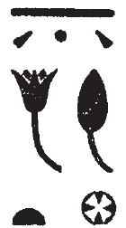

## Esna 231 {-}  
  
- Location: Column 5
- Date: Probably Trajan
- [Hieroglyphic Text](https://www.ifao.egnet.net/uploads/publications/enligne/Temples-Esna003.pdf#page=132){target="_blank"}  
- Bibliography: None

Cartouches of Heka the child, with figures of Khnum and Horus Behedety.   

Heka's name is spelled:

{width=6%}&nbsp;&nbsp;&nbsp;2, 11: ***ḥ****b* + ***q****ȝ*;  {width=7%}&nbsp;&nbsp;&nbsp;5, 11: ***ḥ****ʿʿ* + ***q****ȝ*  

  
  
Esna is also spelled: 

{width=6%}&nbsp;&nbsp;&nbsp;3, 10: ***s****šn* + ***n****ḥb*

