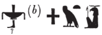

## Esna 232 {-}  
  
  

- Location: Column 5
- Date: Trajan
- [Hieroglyphic Text](https://www.ifao.egnet.net/uploads/publications/enligne/Temples-Esna003.pdf#page=133){target="_blank"}  
- Bibliography: @sauneron-8, pp. 21-24, 200-202. See also [Tempeltexte 2.0](http://www.tempeltexte.uni-tuebingen.de/portal/#/text-detail/999){target="_blank"}

**89 bis**  

^1^ *n ẖnmw*  
*spr=f nỉw.t=f*  
*m pḥwy rnp.t*  
*ḥr-sȝ ỉr sbỉ.w=f*  
*m tm wn*  
  
^1^ For Khnum,    
he returns to his city  
at the end of the year,  
after rendering his rebels  
non-existent.  

**90**  

*n ẖnmw*  
*ʿq ẖȝ.wt ỉdḥw*  
*m grḥ nb*  
*bʿḥ.tw n=f ḥḏ.w *  
  
For Khnum  
who enters the lagoons of the Delta  
every single night,    
for whom milk flows.

**91**  

   
*n ẖnmw *  
*ỉnỉ Pr-nṯr m nḏm-ỉb*  
*wdn.tw n=f ỉḫt *  
  
For Khnum  
who reaches Per-netjer in joy,  
for who one presents offerings. 

**92**  

*n ẖnmw*  
*zmȝ-mȝʿ.t*  
*mrỉ mȝʿ.t*  
*šȝʿ.tw ỉr(.t)* ^2^ *mȝʿ.t*  
*n kȝ=f*  
  
For Khnum,  
Companion of Maat,    
who loves Maat,   
for whose Ka one first began   
^2^ performing Maat.

**93**  

*n ẖnmw p(ȝ) nḫy nfr*  
*n nṯr.w rmṯ.w*  
*nḏty n tȝ r-ȝw=f*  
  
For Khnum the Good Protector  
of gods and humans,  
guardian of the entire earth.

**94**  

*n ẖnmw p(ȝ) nfw nfr*  
*ḥry-ỉb ỉr.t-Ỉtm(?)*  
*ỉry-ḥmw sqd Rʿ*  
  
For Khnum the good wind,    
within the Eye of Atum(?),[^fn-232-1]    
pilot who sails Re.  

[^fn-232-1]: {width=16%} - @sauneron-8, p. 21, n. 2, suggested reading *mʿnḏ.t*, "barque-solaire", which *LGG* V, 331a, noted was "sehr fraglich." Presumably this could be decomposed as: eye = *m(ȝȝ)*, standing man = *ʿnḏty*, "Andjety", and the uterus *t < tmȝ.t*. In other epithets of Khnum the Good Protector, one expects simply *nfw ỉqr*, "the excellent wind." The middle group most closely resembles Atum, hence the present translation (see also *LGG* V, 320b), even though the boat determinative is confusing.

**95**  

*n ẖnmw *  
*p(ȝ) mnỉw nfr n tpy.w-tȝ*  
*ỉmy-r' ỉḥ.w*  
*wr ỉḥ.w*   
   
For Khnum  
the good herdsman of the living,  
chief of cattle,    
great of cattle.

**96**  

*n ẖnmw p(ȝ) ʿȝ*  
*ḥry-ỉb ḥw.t-bȝ.w*  
*ỉmn ḫprw*  
^3^ *ḏsr sštȝ.w*  
  
For Khnum the great  
within the Temple of the Bas,  
hidden of manifestation,  
^3^ sacred of mysterious forms.  

**97**  

*n ẖnmw *  
*wr bȝw n šmʿ-mḥw*  
*tȝ r-ḏr=f ẖr ḥry.t=f*  
  
For Khnum  
great of terror in Upper and Lower Egypt  
the entire earth bears fear for him.

**98**  

*n ẖnmw nb Pr-nṯr*  
*tȝ r-ḏr=f ḥr.tw r bwt=f*  
*r tm ḫp(r) ḫrwy.t ỉm=sn*  
  
For Khnum Lord of Per-Netjer,  
the entire earth avoids his abomination  
lest a catastrophe occur among them.

**99**  

*n ẖnmw ʿȝ pḥty*  
*rw ʿȝ šfy.t*  
*sḫm bȝw=f*  
*r ḫfty=f*  
*ỉq(r)* ^4^ *ḫpš.wy*  
*nḫt-ʿ*  
*ʿ.wy=k rwḏ(.w)*  
*r sḫr sbỉ.w*  
  
For Khnum great of strength,  
lion, great of prestige,  
whose terror is powerful  
against his enemy.  
Excellent(?)[^fn-232-2] ^4^ of strong arms,  
mighty of arm,  
your arms are firm  
to fell the rebels.  

[^fn-232-2]: The text suddenly switches to the second person singular, seemingly interspersing a speech of Khnum from another text or offering scene.

**100**  

*n ẖnmw*  
*bỉk šps*  
*nsw.t nṯr.w*  
*sʿnḫ rmṯ.w*  
  
For Khnum   
august falcon,  
king of the gods,  
who enlivens people.

**101**  

*n ẖnmw-Rʿ*   
*nb bw ỉḫt*  
*wr kȝw*  
*ʿȝ ḏfȝw*  
*nb ʿnḫ*  
*snb r-ḫt=f*  
  
For Khnum-Re  
Lord of the place of offerings,  
great of food,  
plentiful of provisions,  
Lord of life,  
good health reports to him.

**102**  

*n ẖnmw*  
*bȝ wr ḥry-ỉb ʿ.t-bȝ*  
*rdỉ ỉz-nỉȝ n nṯr.w*  
  
For Khnum   
great Ba within Chamber of the Ba,   
who gives pleasant air to the gods.

**103**  

*n ẖnmw-Šw*  
*nb [ỉm]nt.t*  
*sʿnḫ Wsỉr m ỉmḥ.t*  
  
For Khnum-Shu  
Lord of the [We]st,  
who enlivens Osiris in the cavern.  

**104**  

*n ẖnmw ḫnty nb-ʿnḫ*  
*snsn ḥtpty.w*  
  
For Khnum foremost of Neb-ankh,  
who lets the blessed dead breathe.

**105**  

*n ẖnmw-Rʿ nb Qbḥw*  
*sṯỉ ḥʿpỉ m ṯpḥ.t=f*  
  
For Khnum-Re Lord of the Cataract,    
who surges Hapi from his grotto.  

**106**  

*n ẖnmw-Rʿ nb tȝ-sn.t*  
*nṯr ʿȝ nb sḫ.t*  
  
For Khnum-Re Lord of Esna,  
great god, Lord of the Field.

**107**  

*n ẖnmw-Rʿ nb sḫ.t*  
*nṯr ʿȝ nb* ^6^ *tȝ-sn.t*  
*ẖnmw(?) ỉr ẖnm.w 7*  
*bȝ šps ỉr bȝ.w*  
  
For Khnum-Re Lord of the Field,  
great god, Lord ^6^ of Esna,  
Khnum[^fn-232-3] who made the 7 Khnums,  
august Ba who makes the Bas.  

[^fn-232-3]: {width=15%} - Based on similar epithets and the ram-headed determinative, one expects this to be a spelling of "Khnum." The nbi-sign recalls similar perturbed spellings written *ẖ(n)Ḏnb*, with the *nb*-element occurring first (e.g. {width=10%} - [Esna 225], 4, 3). In those spellings, *ẖ(n)* is spelled with the *pḥ*-sign, a variant of the usual animal hide sign. Here, the expected *ẖn* element seems to have been replaced with a synonym (*ỉm.t*, "hide"); perhaps the scribe incorrectly converted the skin sign to this phonetic spelling.  

**108**  

*n ẖnmw*  
*bȝ n Šw*  
*ḥȝ.t nṯr.w*  
*ḫpr ẖr-ḥȝ.t*  
*ỉr p.t tȝ*   
*mw.w ḏw.w*  
*r'-ʿ.wy(=f)*  
*grg spȝ.wt nỉw.wt*  
   
*ṯȝw n ʿnḫ*  
*r fnḏ nṯr.w nṯry.t*  
*ʿḥʿ m nsw.t*  
*n ms.w=f*  
   
*nb ʿnḫ *  
*sʿnḫ nty nb*  
  
For Khnum  
the Ba of Shu,[^fn-232-4]  
first of the gods,  
who came about in the beginning,  
who made heaven, earth,   
waters, and mountains;    
(whose) activity   
is populating nomes and cities.  
  
The breath of life   
for the nose of gods and goddesses;  
he who stands up as king  
of his children.  
  
Lord of life,  
who enlivens all that is.  

[^fn-232-4]: The preceding verse ended with Khnum "making the Bas/rams." The next four epithets identify him with the four primary gods of the Ennead, traditional associated with the four rams of Mendes. This group is mentioned several times at Esna, and are even depicted as a group in [Esna II, 140](https://bookdown.org/shemanefer/Esna2/intercolumnar-wall-c-139-143.html?q=geb#esna-140). 

**109**  

^7^ *n ẖnmw*  
*bȝ n Rʿ*  
*sḥḏ tȝ.wy*  
  
^7^ For Khnum   
the Ba of Re,  
who illumines the two lands.

**110**  

   
*n ẖnmw*  
*bȝ n Wsỉr*  
*pr Ḥʿpỉ m-ḫt=f*  
  
For Khnum  
the Ba of Osiris,  
Hapi comes forth after him.  

**111**  

*n ẖnmw*  
*bȝ n Gbb*  
*srwḏ tȝ*  
*m rḏw=f*  
  
For Khnum  
the Ba of Geb,  
who makes the earth thrive (*srwḏ*)   
with his efflux (*rḏw*).

**112**  

*n ẖnmw-Rʿ nb tȝ-sn.t*  
*nṯr ʿȝ nb Snm(.t)*  
   
For Khnum-Re Lord of Esna,     
great god, Lord of Bigga.  

**113**  

*n ẖnmw-Rʿ nb snm.t*  
*nṯr ʿȝ (nb) tȝ-sn.t*  
  
For Khnum-Re Lord of Bigga,  
great god, (Lord of) Esna.

**114**  

*n ẖnmw-Rʿ*   
*nb Qbḥw*  
^8^ *nṯr ʿȝ nb tȝ-sn.t*  
  
For Khnum-Re   
Lord of the First Cataract,   
^8^ great god, Lord of Esna.

**115**  

*n ẖnmw-Rʿ ḫnt ḫnt-tȝ*  
*nṯr ʿȝ nb Qbḥw*  
  
For Khnum-Re foremost of Khent-ta,  
great god, Lord of the First Cataract.

**116**  

*n ẖnmw-Rʿ*  
*nb Qbḥw*  
*ḫnt ḫnt-tȝ*  
  
For Khnum-Re  
Lord of the First Cataract,  
foremost of Khent-ta.  

**117**  

*n ẖnmw ḫnty ḫnt-tȝ*  
*nṯr ʿȝ*  
*nb šmʿ-mḥw*  
  
For Khnum foremost of Khent-ta,  
great god,  
Lord of Upper and Lower Egypt.

**118**  

*n ẖnmw-Rʿ nb Ỉwny.t*  
*nṯr ʿȝ nb šȝỉs-ḥtp*  
  
For Khnum-Re Lord of Iunyt,  
great god, Lord of Shas-hotep.  

**119**  

*n ẖnmw-Rʿ nb šȝs-ḥtp*  
*nṯr ʿȝ nb Ỉwny.t*  
  
For Khnum-Re Lord of Shas-hotep,  
great god, Lord of Iunyt.  

**120**  

*n ẖnmw-^9^-Šw*  
*zȝ Rʿ *  
*pȝ ṯȝy nfr*  
*qn ṯnr*  
*ʿȝ pḥty*  
*sḫr ḫfty*  
  
For Khnum-^9^-Shu,  
son of Re,  
the beautiful male,  
mighty and valiant,  
great of strength,   
who fells the enemy.

**121**  

*n ẖnmw*  
*bȝ šps n Wsỉr*  
*ḫnty ḥw-nty*  
  
For Khnum  
the august Ba of Osiris,  
foremost of *ḥw-nty*.[^fn-232-5]  

[^fn-232-5]: The same toponym is mentioned in the litany of Osiris: [Esna 208], 24 (53).

**122**  

*n ẖnmw-Rʿ nb ḥr-wr*  
*ʿȝ nḫt*  
*ḥwỉ bṯn=f*  
  
For Khnum-Re Lord of Herwer,  
great of victory,  
who slays his rebel.

**123**  

*n ẖnmw nb Ỉȝ.t-rd*  
*ḫy nfr*  
*bnr mrw(.t)*  
  
For Khnum Lord of Iat-red,  
the beautiful child,  
sweet of love.

**124**  

*n ẖnmw nb šnʿ-ẖn*  
*nb ỉhȝy* ^10^ *ʿšȝ *  
    
For Khnum Lord of *šnʿ-ẖn*,    
lord of plentiful ^10^ jubilation.

**125**  

*n ẖnmw ỉnỉ-ḥr.t*  
*Ḥr ṯmȝ-ʿ*  
*ỉnỉ sn.t=f*  
*wn(.t) ḥr.tw*  
  
For Khnum-Onuris (*Ỉnỉ-ḥr.t*),  
Horus, valiant of arm,   
who brings back (*ỉnỉ*) his sister  
who had been far away (*ḥr.tw*).

**126**  

*n ẖnmw-ḫnty-wȝr=f*  
*sḫt sbỉ.w m r'-ỉȝd.t=f*  
*ḫnt sḫ.t Ḫmw*  
  
For Khnum-*ḫnty-wȝr=f*  
who traps the rebels in his net,[^fn-232-6]  
within the Field of Letopolis.  

[^fn-232-6]: For this term, see @meeks-delta, p. 95, n. 254. It usually occurs in the same context of Khnum-*ḫnty-wȝr=f* trapping enemies in Letopolis, as depicted in *Esna* VI, 531, and alluded to in [Esna 218], 2 and [Esna 255], A.

**127**  

*n ẖnmw *  
*ḫnty sḥ-nṯr*  
*stwḫ nfrw *  
*wrḏ-ỉb*  
  
For Khnum,  
foremost of the Divine Tent,  
who mummifies the 'beauty'  
of Weary of Heart (Osiris).  

**128**  

^11^ *n ẖnmw*  
*bȝ m kȝr=f*  
*ḫnty sḥ n wnm*  
*zmȝ nsw.t ỉḫt *  
*m-bȝḥ=f*  
  
^11^ For Khnum  
Ba in his shrine,  
within the dining hall;[^fn-232-7]    
the king assembles offerings    
before him.  

[^fn-232-7]: For these epithets, see also [Esna 277], 26, §12.

**129**  

*n ẖnmw sḫt-šzp=f*  
*sḥḏ kkw *  
*m ḥ(ȝ)y=f*  
  
For Khnum who Weaves his Light,   
who illumines darkness   
with his radiance.

**130**  

*n ẖnmw*  
*ʿȝ bȝw m-m nṯr.w*  
*ḏsr rn.w m spȝ.wt nỉw.wt*  
  
For Khnum  
great of power among the gods,  
sacred of names in nomes and cities.

**131**  

*n ẖnmw*  
*bỉk šps*   
*m ȝḫ.t-nḥḥ*  
*ḥry-ỉb ʿ-wr m Wȝs.t*  
  
For Khnum   
august falcon  
in the Horizon of Eternity, 
within the great chamber in Thebes.[^fn-232-8]

[^fn-232-8]: Most likely an allusion to the Akh-Menu at Karnak, the chief sanctuary wherein Amun was revered in the form of a falcon: @klotz-caesar, pp. 299-301, with n. d; 302, with n. 492; @gabolde-chateau, pp. 151-152, n. 189.

**132**  

*n ẖnmw*  
*nṯr ʿȝ m Ḫtm*  
^12^ *wr m Ỉwnw*  
     
For Khnum  
great god in Khetem,  
^12^ great one in Heliopolis.

**133**  

*n ẖnmw*  
*Šw tfn.t m mn-s.wt*  
  
For Khnum  
Shu and Tefnut in Men-sut.  

**134**  

*n ẖnmw*  
*sḫm šps*  
*ḫp(r) ḏr-ʿ*  
*m ṯpḥ.t-ḏȝ.t *  
*m Ỉnb-ḥḏ*  
  
For Khnum  
august image,   
who came about long ago,    
in the Blocked Cavern   
in White Walls (Memphis).

**135**  

*n ẖnmw Mnḥy.t m tȝ-sn.t*  
*ṯnn pw ḥnʿ N.t*  
  
For Khnum and Menhyt in Esna,  
that means Tatenen with Neith.[^fn-232-9]

[^fn-232-9]: {width=30%} - Note that Khnum and Menhyt's names here are nearly palindromes of one another (the sky sign = *m(n) < mn.t*, "sky"). They are identified with Tatenen and Neith, whose own names are treated as palindromes elsewhere at Esna.  

**136**  

 
*n ẖnmw Nb.t-ww m Pr-nṯr*   
*Šw* ^13^ *pw ḥnʿ tfn.t*  
     
For Khnum and Nebtu in Per-netjer,    
that means Shu ^13^ and Tefnut.

**137**  

*n ẖnmw*  
*rw.ty*  
*m ḥw.t-ṯȝ.wy*  
   
For Khnum  
the two lion children  
in the Temple of the Chicks.

**138**  

*n ẖnmw *  
*sr ʿȝ wr šps*  
*rdỉ ṯȝw n bw nb mry=f*   
*rsy mḥy ỉmnty ỉȝbty mỉt.t*  
   
For Khnum   
the very great, august ram,[^fn-232-10]      
who gives air to whomever he desires:     
south, north, west, east likewise.[^fn-232-10b]

[^fn-232-10]: {width=12%} - Remarkable spelling of *sr*, "ram", confirmed by the exact parallel to this verse in [Esna 268], B. Elsewhere the two lotus plants write *sn* in *tȝ-sn.t*, "Esna", as in [Esna 231], 3 and 10. Either the present spelling reflects a rare phonetic variant (*sn* for *sr*), or both signs are read acrophonically: *s < sšn, r < rnp*.

[^fn-232-10b]: For a more detailed version of this epithet, see [Esna 377], 2.

**139**  

*n ẖnmw*  
*m rn.w=f nb.w*  
  
For Khnum  
in all his names.  

**140**  

*n ẖnmw*  
*m ḫprw=f nb.w*  
  
For Khnum  
in all his manifestations.

**141**  

^14^ *n ẖnmw*  
*m sštȝ.w=f nb.w*  
  
^14^ For Khnum  
in all his secret forms.  

**142**  

*n ẖnmw*  
*m s.t=f nb*  
  
For Khnum  
in all his places.  

**143**  

*n ẖnmw*  
*m bw nb*  
*mr kȝ=f ỉm*  
   
*dỉ=s(n) ʿnḫ-ḏd-wȝs nb*  
*snb nb*  
*n zȝ-Rʿ (dryns (nty)-ḫwỉ)|*  
*ʿnḫ-wḏȝ-snb*  
*mỉ Rʿ ḏ.t*  
  
For Khnum  
in every place  
his Ka desires to be.  
   
May they give all *ʿnḫ-ḏd-wȝs*,   
all health,  
to the Son of Re (Trajan Augustus)|,  
may he live, prosper, and be healthy,  
like Re, forever!

