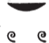
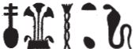

## Esna 234 {-}  
  
  

- Location: Column 5
- Date: Trajan
- [Hieroglyphic Text](https://www.ifao.egnet.net/uploads/publications/enligne/Temples-Esna003.pdf#page=141){target="_blank"}  
- Bibliography: @sauneron-1, pp. 95-96; @sauneron-8, p. 27. See also [Tempeltexte 2.0](http://www.tempeltexte.uni-tuebingen.de/portal/#/text-detail/1004){target="_blank"} 

  

^27^ *ỉr(.t) p(ȝ) wdn Nb.t-ww   *  
*m hrw pn mỉ rʿ-nb  *  
*ḏd-mdw  *  
  
^27^ Performing the litany of Nebtu  
on this day like every day.  
Words spoken:  

*wdn n Nb.t-ww  *  
*nb(.t) tȝ-sn.t  *  
*m rn(.w)=s nb.w*  
*ḥr-tp ʿnḫ[-wḏȝ-s]nb  *  
*n nsw.t-bỉty  *  
*nb-tȝ.wy*  
*(dryns nty-ḫwỉ)|  *  
  
Offering for Nebtu the great,  
Lady of Esna,  
in all her names,  
in addition to the life, [prosperity, hea]lth    
for the King of Upper and Lower Egypt,  
Lord of the Two Lands,  
(Trajan Augustus)|  

**(1)** {width=15%}  

  

^28^ *n Nb.t-ww    *  
*nb(.t) tȝ-sn.t   * 
  
^28^ For Nebtu,  
Lady of Esna.  

**(2)** {width=5.5%}{width=5%}   

  

*n Nb.t-ww    *  
*ỉr.t-Rʿ ḥr(.t) s.t  *  
  
For Nebtu,  
Eye of Re, upon the throne.

 
**(3)**
{width=19%}

  

*n Nb.t-ww  *  
*ḥr.t-ỉb ḥw.t-bȝ.w  *  
  
For Nebtu,[^fn-234-3]  
within the Temple of the Bas.

[^fn-234-3]: **n < nfr; b < bȝ.w; ww*, "field".

**(4)**
{width=22%} 

  

*n Nb.t-ww   *  
*nb(.t) Ỉwny.t  *  
*ḥr(.t) kȝw  *  
   
For Nebtu,[^fn-234-4]  
Lady of Iunyt,  
in charge of food.

[^fn-234-4]: *nb; w < wỉȝ*, "bark"; *w* < ?. @sauneron-8, pp. 86, 169, suggested this might be the feminine ending *t* (< *ṯȝw*); @kurth-1, p. 360, n. 60, proposed it could write *w*, derived from the literary verb *wfȝ*, "to sigh; huff." Alternatively, this could simply be a meronymic substitution (sail of a boat, replaces a boat, *w < wỉȝ*). Even simpler, it might just be an epigraphic error for the similarly shaped *wȝ.t* sign. The sail alludes to spellings of the toponym "Iunyt" with the same sign: e.g. [Esna 259], 3 (5); *Esna* VI, 501; *Esna* VII, 567, 6; 625, 6; 632, 5; derived from *ỉwn*, "pillar of air."  

**(5)** 
{width=14.5%}  

*n Nb.t-ww  *  
*nb(.t) ḥw.t-ỉt  *  
*ḥnw.t nfr.w(t)    *  
  
For Nebtu,[^fn-234-5]  
Lady of the Temple of the Father,  
Mistress of Beautiful women.

[^fn-234-5]: *n or nb < nfr; b < bȝ.t*. "bushes", or *w < wȝḏ*, "papyrus", or *w < ww*, "field"; *w < wȝḥ *. @sauneron-8, p. 156, seems to imply most examples of the middle sign represent *b* in Nebtu; but on pp. 85-86, 91, he noted multiple examples where it appears to write *w*.

**(6)** {width=11%}  

*n Nb.t-ww   *  
*nb.t ḥw.t-Mw.t  *  
*wr ỉdb.(w)  *  
   
*mȝȝ r pȝ wḫȝ n rsy-ỉȝbty  *  
  
  
For Nebtu,  
Lady of the Temple of the Mother,[^fn-234-6a]  
great of cultivated fields.   
  
(Look to the column to the south-east).  
*Hymn continues in [Esna 241] *

[^fn-234-6a]: In the continuation of this verse ([Esna 241], 1, 6bis), Nebtu is said to be "Lady of the Temple of Neith", unless the ideogram of Neith there should actually be read *mw.t*, "mother."