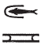

# Column 6 (239-246) {-}

## Esna 239 {-}  
  
  

- Location: Column 6
- Date: Probably Trajan 
- [Hieroglyphic Text](https://www.ifao.egnet.net/uploads/publications/enligne/Temples-Esna003.pdf#page=151){target="_blank"}  
- Bibliography: None. See LGG references in [Tempeltexte 2.0](http://www.tempeltexte.uni-tuebingen.de/portal/#/text-detail/1020){target="_blank"} 

  

^A^ *nsw.t-bỉty  *   
*ỉwn ḥr-ỉb ȝḫ.t*  
*nb ḥḥ.w qmȝ ḥfn.w*  
*ỉr ḥp.t=f*  
*m ḥḥ n ḥḥ.w*  
   
*swḥ n ḫsbḏ*  
*nḥm qnw*  
*sḫp(r) wȝḏwȝḏ*  
*\<qmȝ\> ỉnm.w* 

*ỉt-ỉt.w(?) n pȝwty tpy*  
*wtṯ nfy nḥp nn*  
*qmȝ nḫb*  
*m ḥr-ỉb Nwnw*  
*ỉr Rʿ m qȝy qȝ*  
  
*ẖnmw-Rʿ nb tȝ-sn.t*  
*nb sḫ.t*  
*ḥqȝ ʿȝ ḥn.t*  
*ỉty m rȝ-ḥȝ.wt*
  
^A^ The King of Upper and Lower Egypt,    
Iun-pillar within the Akhet,  
Lord of millions, who created myriads;  
who set his limits  
as millions of millions.  
  
Wind of lapis-lazuli;  
he who rescues the desert area,[^fn-239-1]  
who produces verdure,  
and \<creates\> colors.  
  
Father of fathers of the First Primeval,[^fn-239-2]  
who begat this, and fashioned that;  
he who created the lotus  
in the middle of Nun,  
and made Re in the high mound:  
  
Khnum-Re Lord of Esna,  
Lord of the Field,  
Great Chief of the canal,[^fn-239-3]  
Sovereign in the river mouths.

[^fn-239-1]: {width=13%} - The first hieroglyph is uncertain. Nonetheless, the following series of epithets can be restored thanks to parallels in *Edfou* VIII, 60, 4-5; *Urk* VIII, 119 (5) (noted by *LGG* IV, 283a).
[^fn-239-2]: {width=20%} - Presumably one snake is missing from this epithet, which would refer to Khnum as the father of the Ogdoad, who were the fathers of Re, the first Primeval one.
[^fn-239-3]: {width=05%} - *LGG* II, 240a, read this as aD-mr, "Der Distriktchef", but that does not explain the semi-circle before the fish. This more closely resembles spellings of *ḥn.t*, "water; canal", written with a schematic hand holding an egg + water: *Wb* III, 105; @fairman-canal.

^B^ *nsw.t-bỉty  *   
*Nw.t bẖ.t n Rʿ*  
*ỉr.t-Rʿ *  
*ḥr.t tp n zȝ=s*  
*dgȝ ḥr.w-nb.w*  
   
*nḏ.t n Ḥr-ȝḫty*  
*šps.t wsr.t*  
*ršw Rʿ n mȝȝ=s*  
  
*nb(.t) wpy*  
*šȝʿ.tw n=s nhm*  
*nb(.t) tḫ*  
*ʿšȝ ḥb.w*  
*nn wrš ỉhȝy m wbȝw=s*  
*ršw ṯḥḥ m ḥr=s nfr*  
*Nb.t-ww nb(.t) tȝ-sn.t*  
*nb(.t) ỉbȝ*  
  
^B^ The King of Upper and Lower Egypt,  
Nut, who gave birth to Re,  
the Eye of Re  
upon the head of her son,  
whom all faces behold.    
  
Protector of Harakhty,  
the august and mighty one,  
Re rejoices from seeing her;[^fn-239-4]  
Lady of festival,  
for whom jubilation was begun,  
numerous of festivals:  
there is no drought of cheers in her forecourt,  
celebration and rejoicing are in her good face:  
Nebtu, Lady of Esna,  
Lady of the Dance.  

[^fn-239-4]: {width=12%} - The correct reading is confirmed from [Esna 251], 22, §3. The goose and feather write *rȝ + šw*, while the mouth sign belongs to the word "Re."
