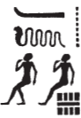
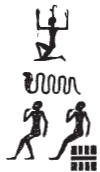
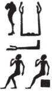
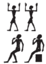

## Esna 240 {-}  
  
- Location: Column 6
- Date: Trajan 
- [Hieroglyphic Text](https://www.ifao.egnet.net/uploads/publications/enligne/Temples-Esna003.pdf#page=152){target="_blank"}  

Cartouches of Trajan, Khnum, Neith, Menhyt, Nebtu, and Heka. Multiple unique spellings.  
  
Heka's names are spelled as follows:  
  

**2**&nbsp;&nbsp;{width=6%}  
  
**4**&nbsp;&nbsp;{width=6%}  
  
**9**&nbsp;&nbsp;{width=6%}  
  
**11**&nbsp;&nbsp;{width=5%}   

