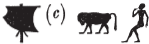
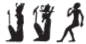

## Esna 242 {-}  
  
 

- Location: Column 6
- Date: Trajan
- [Hieroglyphic Text](https://www.ifao.egnet.net/uploads/publications/enligne/Temples-Esna003.pdf#page=158){target="_blank"}  
- Bibliography: @sauneron-8, pp. 31-35; see also [Tempeltexte 2.0](http://www.tempeltexte.uni-tuebingen.de/portal/#/text-detail/1026){target="_blank"}  

   
^14^ *ỉr(.t) p(ȝ) wdn*  
*n Ḥkȝ pȝ ẖrd*  
*m hrw pn mỉ rʿ-nb*  
*ḏd-mdw*  
   
*wdn n Ḥkȝ pȝ ẖrd*  
^15^ *ʿȝ wr*   
*[tpy] n ẖnmw*  
*m rn(.w)=f nb.w*  
*ḥr-tp ʿnḫ-wḏȝ-snb*  
*n nsw.t-bỉty*  
*(pr-ʿȝ ʿnḫ ḏ.t)|*   
    
^14^ Performing the litany  
for Heka the Child   
on this day, just like every day.  
Words spoken:  
  
Litany for Heka the Child,  
^15^ the very great,  
[first-born] of Khnum,     
in all his names,  
on top of the life, prosperity, health  
for the King of Upper and Lower Egypt,  
(Pharaoh living eternally)|

 
**1**  

*n Ḥkȝ pȝ ẖrd*  
*ʿȝ wr *  
*tpy n ẖnmw*  
  
For Heka the Child,  
the very great,  
first-born of Khnum.

**2**  

*n Ḥkȝ pȝ ẖrd*  
*ʿȝ wr*  
*tpy n Ỉmn*
  
For Heka the Child,    
the very great,  
first-born of Amun.

**3**  

*n Ḥkȝ pȝ ẖrd*  
*ʿȝ wr*  
*tpy n Rʿ*  
  
For Heka the Child,    
the very great,  
first-born of Re.  

**4**  

*n Ḥkȝ pȝ ẖrd*  
*ʿȝ wr*  
*tpy n Ptḥ*  
  
For Heka the Child,    
the very great,  
first-born of Ptah.  

**5**  

^16^ *n Ḥkȝ*  
*[wr] ḥkȝw*  
*zȝ Sḫm.t*  
*ḥry-ỉb tȝ-sn.t*  
  
^16^ For Heka  
great of magic,  
son of Sakhmet,  
within Esna.

**6**  

*n Ḥkȝ*  
*ḥry-ỉb ỉȝ.t-ṯȝ.wy*  
*mrỉ mw.t=f*  
*Mnḥy.t nb(.t) ḫnt-tȝ*  
  
For Heka,  
within Mound of the Chicks,   
beloved of his mother,   
Menhyt, Lady of Khent-ta.

**7**  

*n Ḥkȝ*  
*zȝ tfn.t ḫnt.t Ỉwny.t*  
*rr.t*  
*ms.tw=f Nb.t-ww*  
*ḥnw.t*  
  
For Heka  
son of Tefnut, foremost of Iunyt,  
the nurse;   
Nebtu bore him,    
the Mistress.

**8**  

*n Ḥkȝ*  
*nṯr ʿȝ ḥry-ỉb tȝ-sn.t*  
*Ḥkȝ ms.n Rnnwt.t*  
*ḥry-ỉb* ^17^ *ʿḥ*  
  
For Heka,  
great god within Esna;  
Heka, born of Renenutet,  
within ^17^ the palace.

**9**  

*n Ḥkȝ*  
*šm r sḫ.t*  
*ḫnty Pr-ẖnmw*  
  
For Heka,  
who goes to the Field,  
foremost of Per-Khnum.

**10**  

*n Ḥkȝ*  
*ḫnd ww*  
*ḥry-ỉb Pr-nṯr*  
  
For Heka,  
who traverses the agricultural area,  
within Per-netjer.  

  
  
**11**  {width=18%}  

*n Ḥkȝ*  
*Šw zȝ Rʿ*  
*nb Ỉwny.t*  
  
For Heka,  
Shu,[^fn-242-11] son of Re,   
Lord of Iunyt.  

[^fn-242-11]: Note that in this verse, Heka is spelled with attributes related to Shu-Onuris: the wind, and a raging ape. 

**12**  {width=10%}   
  

  
*n Ḥkȝ*  
*Gbb ỉt-nṯr.w*  
   
For Heka,  
Geb,[^fn-242-2] father of the gods.  

[^fn-242-2]: In this verse, Heka's name is written with ideograms of Horus and Geb. 

**13**  

*n Ḥkȝ*  
*zȝ Sḫm.t*  
*ỉwʿʿ n Ptḥ*  
  
For Heka,  
son of Sakhmet,  
heir of Ptah.

**14**  

*n Ḥkȝ*  
*snsn* ^18^ *bȝ ʿnḫ *  
*n ẖnmw*  
   
For Heka   
who unites ^18^ with the living Ba   
of Khnum.

**15**  

*n Ḥkȝ*  
*zȝỉ r ỉw(.t)=f*  
    
For Heka  
one waits for his arrival.  

**16**  

*n Ḥkȝ*  
*snsn Ḥp ʿnḫ*  
   
For Heka   
who unites with the living Apis.  

**17**  

 
*n Ḥkȝ*  
*nb hȝ.w*(?)    
  
For Heka   
Lord of jubilation(?).  

**18**  

*n Ḥkȝ*  
*nb šm.w*  
  
For Heka  
Lord of omens.[^fn-242-3]  
  

[^fn-242-3]: For this passage, see @ritner-magical, pp. 36-37, n. 167.  

**19**  

   
*n Ḥkȝ*  
*nb bỉȝ.y.t*  
  
For Heka  
Lord of oracles.  

**20**  

*n Ḥkȝ*  
*sr ḫpr*  
  
For Heka  
who announces what will happen.

**21**  

*n Ḥkȝ*  
*wr* ^19^ *m Ỉnb-ḥḏ*  
    
For Heka  
great ^19^ in Memphis. 

**22**  

*n Ḥkȝ*  
*m ḥw.t-Ḥkȝ*  
    
For Heka  
in the Temple of Heka.

**23**  

*n Ḥkȝ*  
*ḫnty pr-mḏȝ.t*  
  
For Heka  
foremost of the House of Papyri.

**24**  

*n Ḥkȝ*  
*ḫnty Pr-ʿnḫ*  
  
For Heka  
foremost of the House of Life.  

**25**  

*n Ḥkȝ*  
*ḫnty Pr-ẖnmw*  
  
For Heka   
foremost of Per-Khnum.

**26**  

*n Ḥkȝ*  
*ḫnty ḥw.t-Ỉtm*  
    
For Heka  
foremost of the Temple of Atum.[^fn-242-4]  

[^fn-242-4]: This temple of Atum is presumably identical with the "Upper Place" or "Great Place", the divine necropolis of North Esna: see [Esna 217], 23 (20), and text note there.

**27**  

*n Ḥkȝ*  
*ḥry-ỉb ʿḥ*  
  
For Heka  
within the palace.

**28**  

*n Ḥkȝ*  
*ḥry-ỉb s.wt-Rʿ*  
  
For Heka  
within the Thrones (*s.wt*) of Re.  

**29**  

*n Ḥkȝ*  
*nb šw.t-Rʿ*  
     
For Heka  
Lord of the Shade (*šw.t*) of Re.

**30**  

*n Ḥkȝ*  
*wn ʿ.wy*  
*nw s.t-ʿȝ.t*   
  
For Heka   
who opens the double doors  
of the Great Place.[^fn-242-5]

[^fn-242-5]: Allusion to the festival of Heka in North Esna on Hathor 22, as described in [Esna 340], 6.

**31**  

^20^ *n Ḥkȝ*  
*snsn [ms.w] Rʿ*  
   
^20^ For Heka   
who lets breathe [the Children of] Re.[^fn-242-31]

[^fn-242-31]: Restoration suggested by @sauneron-3, p. 114, n. b. The Children of Re appear along with the August Ape (Atum) and the double doors of the Great Place in [Esna 340], 6.  

**32**  

*n Ḥkȝ*  
*[...] ỉm=s*  
*ky šps*  
   
For Heka  
[...] in it,   
august ape.  

**33**  

*n Ḥkȝ*  
*ʿnḫ.tw n mȝȝ=f*  
  
For Heka,  
one lives from seeing him.  

**34**  

*n Ḥkȝ*  
*ḥʿʿ.tw n dgȝ=f*  
  
For Heka,   
one rejoices to behold him.  

**35**  

 
*n Ḥkȝ*  
*ṯz n=f ḥȝ.wt*   
  
For Heka,  
for whom hearts are raised.

**36**  

*n Ḥkȝ*  
*wȝḏ nmt.t*  
  
For Heka,  
green[^fn-242-6] of steps. 

[^fn-242-6]: Understanding that he leaves plants growing in his footsteps. Alternatively, this could be a graphic error for *ʿȝ nmt.t*, "great of steps", given the frequent interchange between the similar *wȝḏ* and *ʿȝ*-signs at Esna. See below, verse (48)

**37**  

*n Ḥkȝ*  
*ẖnmw*  
  
For Heka,  
who unites/endows.  

**38**  

*n Ḥkȝ*  
*ḥwnw nfr*  
*mry n ỉt=f*  
   
For Heka  
good youth,   
beloved of his father.

**39**  

^21^ *n Ḥkȝ*   
*ḥʿʿ[.tw ...]=f*  
  
^21^ For Heka,  
one rejoices [...] him.

**40**  

*n Ḥkȝ*  
*bʿḥ tȝ.wy*   
*m nfrw=f*  
    
For Heka  
who floods the two lands  
with his goodness.

**41**  

*n Ḥkȝ*  
*sṯỉ [...] pr.t*  
  
For Heka   
who shoots out [...] seed.  

**42**  

*n Ḥkȝ*  
*wtṯ ỉḫt nb.w*  
  
For Heka  
who begets all things.  

**43**  

*n Ḥkȝ*  
*wr ms.w*  
  
For Heka  
great of children.  

**44**  

*n Ḥkȝ*  
*ʿȝ-pḥty*  
*ṯmȝ-ʿ *  
*sḫr ḫfty=f*  
  
For Heka  
great of strength,  
valiant of arm,  
who strikes down his enemy.

**45**  

*n Ḥkȝ*  
*ỉnỉ mr(w.t)*  
*dr msḏ*  
   
For Heka   
who brings love,    
and repels hate.

**46**  

^22^ *n Ḥkȝ*  
*nn tkn.tw ḏr.ty=f*  
  
^22^ For Heka,  
one may not approach his hands.

**47**  

*n Ḥkȝ*  
*hn.tw n=f*  
  
For Heka,  
for whom one bows down.

**48**  

*n Ḥkȝ*  
*ʿȝ nmt.t*  
*ỉwty ḥm m ȝḫ.w=f*  
  
For Heka,  
great of stride,  
with no deflection of his radiance.

**49**  

*n Ḥkȝ*  
*ỉb n Rʿ*   
*ws(ḫ) nmt.t m ȝḫ.t*  
    
For Heka,  
the heart of Re,  
broad of steps in the Akhet.

**50**  

*n Ḥkȝ*  
*ḏfḏ n ỉr.t Rʿ*  
  
For Heka  
iris of the Eye of Re.

**51**  

*n Ḥkȝ*  
*ḥqȝ n Bȝq.t*  
  
For Heka  
ruler of Baqet (Egypt).

**52**  

*n Ḥkȝ*  
*nb tȝ.wy*  
  
For Heka   
Lord of the Two Lands. 

**53**  

*n Ḥkȝ*  
*nfr wr*  
  
For Heka,  
greatly beautiful.

**54**  

*n Ḥkȝ*  
*ỉwn wr*  
  
For Heka  
great pillar (*ỉwn*) of air.

**55**  

*n Ḥkȝ*  
*ỉwn-^23^-ḥʿʿ*  
  
For Heka,  
the ^23^ moon (*ỉwn-ḥʿʿ*).  

**56**  

*n Ḥkȝ*  
*štȝ ḫprw*  
  
For Heka  
remote of manifestation.

**57**  

*n Ḥkȝ*  
*wḥm msḫʿ.w*  
  
For Heka  
who repeats radiant births.  

**58**  

*n Ḥkȝ*  
*zȝ[-tȝ]*  
*[m] ḥw.t-nṯr*  
  
For Heka,    
*zȝ-[tȝ]*-serpent  
[in] the temple.

**59**  

*n Ḥkȝ*  
*rnp rʿ-nb*  
  
For Heka  
who rejuvenates every day.

**60**  

*n Ḥkȝ p(ȝ) ẖrd*  
*ẖrd.n=f m ẖr(.t)-rnp.t*
  
For Heka the child,  
he rejuvenated annually.  

**61**  

*n Ḥkȝ*  
*ḫy nfr*  
  
For Heka   
beautiful child.

**62**  

*n Ḥkȝ*  
*sḏty ỉqr*  
  
For Heka  
excellent youth.  

**63**  

*n Ḥkȝ*  
*sḏty sḏty.w*  
  
For Heka  
youth of youths.  

**64**  

*n Ḥkȝ*  
*sfy šps*   
  
For Heka   
august youngster.

**65**  

^24^ *n Ḥkȝ*  
*ḥwnw tȝ.wy*  
  
^24^ For Heka  
boy of the two lands.  
 

**66**  

*n Ḥkȝ*  
*ḥwnw ḥwnw.w*  
  
For Heka   
boy of boys.

**67**  

*n Ḥkȝ*  
*nfr-ḥr*  
  
For Heka  
beautiful of face.

**68**  

*n Ḥkȝ*  
*ʿȝ mrw.t*  
  
For Heka  
great of love.

**69**  

*n Ḥkȝ*  
*bnr-mrw.t*
  
For Heka  
sweet of love.

**70**  

*n Ḥkȝ*  
*ỉqr mrw.t *  
   
For Heka  
excellent of love.

**71**  

*n Ḥkȝ*  
*bỉk nṯry*  
   
For Heka  
divine falcon.  

**72**  

*n Ḥkȝ*  
*bỉk bỉk.w*  
  
For Heka  
falcon of falcons.  

**73**  

*n Ḥkȝ*  
*Ḥr m ȝḫ.t*  
    
For Heka   
Horus in the Akhet (Harmakhis).

**74**  

*n Ḥkȝ*  
*sḏty smsw nṯr.w*  
  
For Heka  
eldest child of the gods.  

**75**  

^25^ *n Ḥkȝ*  
*wȝḏ tȝ m pr=f*  
  
^25^ For Heka   
the earth turns green when he comes forth.

**76**  

*n Ḥkȝ*  
*nb wʿ*  
*nn mỉt.t=f*  
  
For Heka  
the sole lord,  
without his peer.

**77**  

*n Ḥkȝ*  
*nsw.t nsw.wt*  
  
For Heka  
King of kings.  

**78**  

*n Ḥkȝ*  
*Ḥr ḥry nṯr.w*  
  
For Heka  
Horus (*Ḥr*), chief (*ḥry*) of the gods.  

**79**  

*n Ḥkȝ*  
*ḥqȝ sḫm.ty*  
    
For Heka (*Ḥkȝ*)  
ruler (*ḥqȝ*) of the two uraei.

**80**  

*n Ḥkȝ*  
*ḥqȝ ʿnḫ.w*  
  
For Heka  
ruler of the living. 

**81**  

*n Ḥkȝ*  
*ḥqȝ qn*  
  
For Heka   
mighty ruler.

**82**  

*n Ḥkȝ*  
*ḥqȝ ḥqȝ.w*  
  
For Heka  
ruler of rulers.

**83**  

*n Ḥkȝ*  
*qn nȝ qn.w*  
  
For Heka   
mightiest of the mighty.

**84**  

*n Ḥkȝ*  
*ỉty mnḫ*  
  
For Heka  
beneficent sovereign.

**85**  

*n Ḥkȝ*  
^26^ *rnp wr*  
  
For Heka  
^26^ great rejuvenating one.  

**86**  

*n Ḥkȝ*  
*mȝȝ ḥn.ty*  
  
For Heka  
who sees the limits of the future. 

**87**  

*n Ḥkȝ*  
*sḏty n ỉr.t-Rʿ*  
  
For Heka  
child of the Eye of Re.

**88**  

*n Ḥkȝ*  
*ḏfḏ n wḏȝ.t*  
  
For Heka   
iris of the *wedjat*-eye.

**89**  

*n Ḥkȝ*  
*dgȝ ḥḥ.w*  
*m ḥr=f nfr*  
  
For Heka   
millions can see  
by means of his beautiful face.

**90**  

*n Ḥkȝ*  
*šfy.t=f dỉ=s m ʿḥ*  
  
For Heka  
whose prestige manifests in the palace.

**91**  

*n Ḥkȝ*  
*mḥ-ỉb n nsw.t-bỉty*
  
For Heka  
trusted one of the King.  

**92**  

*n Ḥkȝ*  
*nḏty ʿšȝ*  
*r bỉȝ.t=f*  
  
For Heka  
who protects numerous ones   
from his wondrous manifestation. 

**93**  

*n Ḥkȝ*  
*nb sȝ-ẖbw*  
  
For Heka  
Lord of Sakhebu (near Letopolis).

**94**  

^27^ *n Ḥkȝ*  
*zȝ Sḫm.t*  
*nb pr-Mȝnw*  
  
^27^ For Heka  
son of Sakhmet,  
Lord of Per-Manu (Western Delta).  

**95**  

*n Ḥkȝ*  
*zȝ Sḫm.t*  
*tp ỉn.t*  
  
For Heka  
son of Sakhmet,  
presiding over the Valley.

**96**  

*n Ḥkȝ*  
*nb ḫȝs.t [ṯmḥw?]*  
    
For Heka  
Lord of the desert of the [Tjemehu?].

**97**  

*n Ḥkȝ*  
*smsw n ṯḥn.t*  
  
For Heka  
eldest of Tjehenet (Libya).

**98**  

*n Ḥkȝ*  
*nh ḥm.w=f*  
  
For Heka  
who protects his servants.

**99**  

   
*n Ḥkȝ*  
*ʿšȝ ỉḫt*  
  
For Heka   
plentiful of offerings.  

**100**  

*n Ḥkȝ*  
*nb kȝw*
  
For Heka  
Lord of food.

**101**  

*n Ḥkȝ*  
*nb ḥtp.w*  
*pr m-ȝw*  
  
For Heka  
Lord of offerings,  
which come forth entirely.

**102**  

*n Ḥkȝ*  
*ʿḥʿ-ḥms* ^28^ *r ḫȝ.w=f*  
  
For Heka   
who dines ^28^ at his offerings.

**103**  

*n Ḥkȝ*  
*ỉr ẖr.t*  
*n r' nb wnm*  
  
For Heka  
who makes sustenance  
for every mouth that eats.  

**104**  

*n Ḥkȝ*  
*ỉwr m sf*  
  
For Heka  
who was conceived yesterday.

**105**  

*n Ḥkȝ*  
*ms m pȝ hrw*   
  
For Heka  
who was born today.  

**106**  

*n Ḥkȝ*  
*rw ʿȝ štȝ *  
*ḫnty Mȝnw*  
  
For Heka  
great, mysterious lion,  
foremost of Manu.  

**107**  

*n Ḥkȝ*  
*ms m wḥm*  
 
For Heka  
who was born again.

**108**  

*n Ḥkȝ*  
*kȝ wr n Rʿ*  
  
For Heka  
great Ka of Re. 

**109**  

*n Ḥkȝ*  
*pr-ʿ*  
  
*mȝȝ m-ḫt=f*  
*(r) p(ȝ) wḫȝ n ỉmnty*  
  
For Heka  
forthcoming of arm.  
  
(After this, look   
to the column to the west).

NB: This hymns continues in [Esna 323].

