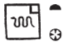
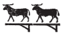

## Esna 243 {-}  
  
 

- Location: Column 6
- Date: Trajan
- [Hieroglyphic Text](https://www.ifao.egnet.net/uploads/publications/enligne/Temples-Esna003.pdf#page=163){target="_blank"}  
- Bibliography: See [Tempeltexte 2.0](http://www.tempeltexte.uni-tuebingen.de/portal/#/text-detail/1029){target="_blank"}  

#### Formula {-}

  
  
^1^ *mn n=k sḫ.t ḥtp.t(w)*  
*pr.t n=k*  
*sḫ.t ḏsr.t(w)*  
*ȝw-*^2^*ỉb=k m sḫ.t wȝḏ.t*  
*ḥrr.w n dwȝ*  
*zbty.w* ^3^ *m wšr*  
*ỉry r-ȝw*  
*r sṯḥn ḥr=k*  
*m tr wp tȝš*  
   
^1^ Receive the fruitful field,   
may you have seeds;  
the sacred field,    
may you be ^2^ happy in the green field:  
the flowers of the morning,    
blossoms ^3^ in the evening,  
likewise in their entirety,    
to make your face shine  
at the time of dividing boundaries.

#### The King {-}

  
  
^4^ *nsw.t-bỉty*  
*nb tȝ.wy*  
*(ȝwtwkrdwr kysrs)|*  
^5^ *zȝ Rʿ*  
*nb ḫʿ.w*  
*(dryns nty-ḫwỉ)|*  
   
^6^ *ỉb qn*  
*wȝḏ šȝ.w*  
^7^ *ỉʿb ḥtp.w*  
*n nb sḫ.t *  
   
^8^ *[nṯr] nfr*  
*snn n Ḥʿpỉ*  
*ḥry-srḫ n Ỉrỉ-tȝ*  
*nb ḥtp.w*  
*srwḏ ȝḫȝḫ.w*  
*[...].tw m šny.w-tȝ=s*  
*ḥnk sšn.w ỉs.w=s*  
*sṯỉ šȝ.w*  
*mzỉ.w*   
*n nbw ḥr ḏʿ.wt=f*  
*ṯḥn ḥr n [...]*  
*[...]*  
*([dryn]s nty-ḫwỉ)|*  
  
^4^ The King of Upper and Lower Egypt,  
Lord of the Two Lands,   
(Autokrator Caesar)|  
^5^ Son of Re,   
Lord of Appearances,   
(Trajan Augustus)|  
  
^6^ Mighty gardener,  
who makes vineyards green,    
^7^ who gathers offerings  
for the Lord of the Field (Khnum).  
  
^8^ The good [god],  
replica of Hapi,    
upon the *serekh* of Irita,   
lord of plant offerings,  
who makes foliage grow,  
[...] with its plants,    
who offers lotuses and its reeds,    
the fragrance of the vineyards,   
and bouquets   
of gold in its ore,[^fn-243-1]    
making the face of [...] shine  
[...]  
([Trajan] Augustus)|  

[^fn-243-1]: For this phrase, see @wilson-lexikon, p. 1226.

#### Khnum-Re Lord of Esna {-}

  
   
^9^ *ḏd-mdw n ẖnmw-Rʿ nb tȝ-sn.t*  
*nsw.t nṯr.w*  
*nṯr ʿȝ*  
*ḫnty ḥw.t-ỉt(?)*  
*Km-ȝ.t=f*  
^10^ *qdỉ qdỉ.w*  
*tȝ-ṯnn*  
*wtṯ nṯr.w*  
*nb (tȝ)-sn.t*  
^11^ *ḫntỉ pr-ʿnḫ*  
*kȝ.tw 7 ẖnm.w*  
*m rn=f*  
*Ptḥ m ỉrw=f*  
*nb nḥp*   
*m* ^12^ *sšm=f*  
*nb sḫ.t*   
*m ḫrpw=f mȝʿ*  
   
^13^ *dỉ=ỉ n=k ww*  
*m šnw n ỉtn*  
*ḥsp(.t) ȝḫȝḫ(.w) m wȝḏwȝḏ*  
   
^9^ Words spoken by Khnum-Re Lord of Esna,[^fn-243-2]    
King of the Gods,   
Great god,  
foremost of Temple of the Father(?),[^fn-243-3]   
Kematef:    
^10^ Builder of builders,    
Tatenen:  
who begat the gods;  
Lord of Iunyt(?),[^fn-243-4]   
^11^ foremost of Per-ankh,    
he is called the Seven Khnums  
by name;  
Ptah in his visible form;    
Lord of the Potter's wheel  
in ^12^ his sacred image;   
Lord of the field  
in his true manifestation.  
   
I give you the agricultural domain   
as the circuit of the sundisk,  
and gardens radiant with verdure.  

[^fn-243-2]: A nearly identical series of epithets for the following occurs in *Esna* VI, 537, 16-19.

[^fn-243-3]: {width=15%} - The parallel in *Esna* VI, 537, 16, substitutes "Per-netjer" here, which would fit the general context (offering agricultural products), and the subsequent mention of Kematef and Lord of the Field. However, to read this toponym here, the *Hw.t*-sign would need to stand for *pr*, which is not impossible, but  
Other examples of this toponym appear rather to be Hw.t-it, "Temple of the Father", the primary designation of Esna proper as a temple of Khnum-Re: *Esna* II, 56; or possibly just *ḥw.t-nṯr*, "temple." 

[^fn-243-4]: {width=8%}{width=2.3%} - Another problematic toponym. The parallel in *Esna* VI, 537, 18, clearly writes "Iunyt", but that might be another reinterpretation. In another set of parallels, the two rams on a standard substitute for "Esna": [Esna 339], 3 = [Esna 241], 7, §49. In that instance, we probably have the two rams writing *sn.t* (< *snw*, "two"), the original form of the toponym Esna without initial *tȝ*. The same applies to other examples of this spelling. However, in the present text, the banal epithet "Lord of Esna", already mentioned earlier, would seem unlikely to appear as a secondary designation of the god. Rather, the specific form "Lord of Iunyt" seems more fitting.   
  
#### Menhyt {-}

  
  
^14^ *[ḏd-mdw n Mnḥ]y.t wr.t*  
*nb(.t) ḫn.t-tȝ*  
*nṯr[.t] ḥȝy.t Ḥ[ʿpỉ]*  
*[...]*    
  
^14^ [Words spoken by] great [Menh]yt,  
Lady of Khent-ta,  
godde[ss] who makes H[api] flood    
[...]  

