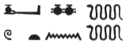

## Esna 244 {-}  
  
 

- Location: Column 6
- Date: Trajan
- [Hieroglyphic Text](https://www.ifao.egnet.net/uploads/publications/enligne/Temples-Esna003.pdf#page=165){target="_blank"}  
- Bibliography: See [Tempeltexte 2.0](http://www.tempeltexte.uni-tuebingen.de/portal/#/text-detail/1030){target="_blank"}  

#### Formula {-}

  
  
^1^ *[...] wn [...]*  
    
^1^ [...]  

#### The King {-}

  
  
^2^ *nsw.t-bỉty*  
*nb tȝ.wy*  
*(ȝwtwkrdwr kysrs)|*  
^3^ *zȝ Rʿ*  
*nb ḫʿ.w*  
*(dryns nty-ḫwỉ)|*  
   
^4^ *nsw.t n nbw*  
*[...]*  
   
^5^ *nṯr nfr*   
*snw n sbȝ-n-nỉw.t*  
*ỉwn-ḥʿʿ n tȝ.wy sṯỉ*  
*wdpw nn wš=f*  
*ḥr ḏs[r?....]*  
*[...]*  
*tfn nṯry*  
*šw m snb*  
*ỉr ḫʿỉ(?)*  
*m nb(.t) wpy*  
*mzỉ tḫ*  
*n ʿšȝ(?) ḥb.w*  
*nb ḥʿʿ*   
*(dr[yn]s nty-ḫwỉ)|*  

^2^ The King of Upper and Lower Egypt,  
Lord of the Two Lands,   
(Autokrator Caesar)|  
^3^ Son of Re,   
Lord of Appearances,   
(Trajan Augustus)|   
  
^4^ King of the Golden one  
[...]   
  
^5^ The good god,  
second of the Star of the City,[^fn-244-1]    
moon of the Asiatic lands,  
butler, who never fails,  
while conse[crating?...]  
[...]  
joyful of heart,    
free from illness.    
He who makes processions    
for the Lady of *wpy*-festival,    
who offers inebriation  
for the One numerous of festivals:  
Lord of jubilation,  
(Tra[jan] Augustus)|  
  

[^fn-244-1]: Curious divine epithet (not included in *LGG*), recalling the royal nomen of Psusennes.  

#### Nebtu {-}

  
  
^6^ *ḏd-mdw n [Nb.t-ww]*  
*nb(.t) tȝ-sn.t*  
*nṯr.t ʿȝ.t*  
*ḫnt(.t) pr-nṯr*  
*Tm.t [...]*  
*[...]*   
^7^ *sk=s mḥ*    
*ḥnk.tw ỉrp*    
*n kȝ=s*  

^9^ Words spoken by [Nebtu],  
Lady of Esna,  
great goddess,  
foremost of Per-netjer,  
Temet [...]  
[...]  
^7^ she banishes all cares,   
and one offers wine  
to her Ka.[^fn-244-2]  

[^fn-244-2]: {width=15%} - The spelling of "Ka" with a single serpent occurs later in the epithets of Heka (244, 8), as well as frequently in the divine name "Heka", and other texts, e.g. *Esna* VII, 630, 9; 633 (p. 228, line 2) = [Esna 330], 4.  

#### Heka {-} 

^8^ *ḏd-mdw n Ḥkȝ pȝ ẖrd*  
*ʿȝ wr tpy n ẖnmw*  
*kȝ n Rʿ*  
*wḥm.n=f [ms.w]*  
*[ỉry-pȝ.t]* ^9^ *nṯr.w*  
*ỉty wr*  
*nsw.t n Bȝq.t*  
*bỉty*  
*ḥqȝ n šnw n [ỉtn]*  
   
^8^ Words spoken by Heka the Child,    
the very great, first-born of Khnum,    
Ka of Re  
when he repeated [births],  
[nobleman] ^9^ of the gods,[^fn-244-3]     
great sovereign,    
*nsw.t-*King of Egypt,    
*bỉty*-king,    
ruler of the circuit of the [sundisk].  

[^fn-244-3]: For the restoration, cf. [Esna 381], 11.