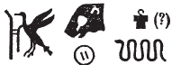
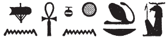

# Column 7 (247-256) {-}

## Esna 247 {-}  
  
  

- Location: Column 7
- Date: Probably Hadrian 
- [Hieroglyphic Text](https://www.ifao.egnet.net/uploads/publications/enligne/Temples-Esna003.pdf#page=171){target="_blank"}  
- Bibliography: None. See LGG references in [Tempeltexte 2.0](http://www.tempeltexte.uni-tuebingen.de/portal/#/text-detail/1037){target="_blank"} 

  

^A^ *nsw.t-bỉty  *   
*ỉt-ỉt.w  *  
*mw.t-mw.wt  *  
*Rnn.t wsr.t  *  
*ḥnw.t nṯr.w-nṯry.t  *  
   
*Km-ȝ.t=s(?)  *  
*ỉr(.t) nn r-ȝw  *  
*ḫpr(.t)*   
*nỉ ḫpr ḫprw  *  
*ỉt mw.t n nṯr nb   *  
*[...] m ḥw.t-ỉt [...]  *  
   
^A^ The King of Upper and Lower Egypt,  
Father of fathers,  
mother of mothers,  
mighty Renenutet,  
mistress of gods and goddesses.  
  
Kemates(?),[^fn-247-1]  
who made all this in its entirety,  
who came into existence,  
before existence existed,  
father and mother of every god   
[...] in the Temple of the Father [...]  

[^fn-247-1]: {width=18%} - The penultimate sign is uncertain, but this appears to be a gender-correct variant of Kematef, the initial primeval serpent usually linked to Atum and Amun, but also elsewhere to Neith (e.g. [Esna 255], A).

  

^B^ *nsw.t-bỉty  *   
*Ptḥ pn   *  
*qmȝ ḥmw.w   *  
*ḥr-ỉb ṯpḥ.t-ḏȝ.t  *  
*ḏfn mnḫ  *  
*nb nṯr.w rmṯ  *  
*ṯȝw n ʿnḫ n nṯr nb  *  
  
^B^ The King of Upper and Lower Egypt,  
this Ptah,  
who created the craftsmen  
within the Blocked Cavern;  
beneficent ancestor,  
lord of gods and people,  
breath of life for every god.[^fn-247-2]

[^fn-247-2]: {width=22%} - It is unclear whether the final sign is an ideogram for Khnum, a determinative to this final epithet, or part of an acrophonic spelling of Khnum. Elsewhere, Khnum is written with the *nb*-basket and lion sign, so this might alternatively write: "Breath of life, Khnum."