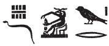
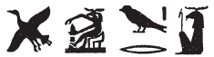
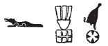
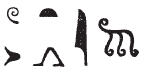

## Esna 249 {-}  

 
  
- Location: Column 7
- Date: Hadrian 
- [Hieroglyphic Text](https://www.ifao.egnet.net/uploads/publications/enligne/Temples-Esna003.pdf#page=173){target="_blank"}  
- Bibliography: @sauneron-5, pp. 88-90; @leitz-loeffler, pp. 50-51; see also [Tempeltexte 2.0](http://www.tempeltexte.uni-tuebingen.de/portal/#/text-detail/1041){target="_blank"} 

NB: This hymn continues from [Esna 318]

**§14bis**

*rs=k nfr*  
*p(ȝ) qd wr*  
*ẖnmw-Rʿ nb tȝ-sn.t*  
  
*grg tȝ*   
*m r'-ʿ.wy=f*  
*wbȝ nḥp*  
*qmȝ msḫn.wt*  
*Šȝỉ Rnn.t*  
*ỉr wḏ*  
*ẖnmw ỉr ẖnmw.w*  
   
Awake beautifully,   
Great Builder[^fn-249-1],  
Khnum-Re Lord of Esna!  

He who populates the earth  
with his handiwork,  
who opens the potter's wheel,  
who creates the birth-bricks,   
Shai and Renenet,   
who makes the decree:  
Khnum, who made the Khnums.  

[^fn-249-1]: {width=16%} - @sauneron-5, p. 91, n. w, tentatively read this epithet as *pȝwty*, "primeval one." Yet the alternate version in [Esna 318], 11, §14, simply writes: {width=20%}. @leitz-loeffler, p. 50, n. 181, assumed both versions write *pȝ nḥp wr*, arguing the present writing with the snake could represent *nḥp* < *(n)ḥf* < *ḥfȝw*, "snake." However, the ideogram of Khnum at the potter's wheel generally writes *qd*, not *nḥp*. In the following text - [Esna 350], 6 - the cobra writes *d(wȝ)*, "hymn." Perhaps here the term *qd*, was intended to have a small *q*-sign, omitted or hard to identify.    

**§15**

   
*rs=k nfr*  
*nb ww*  
*qd swḥ*  
*sʿnḫ ṯȝw*  
*ỉr=f ṯȝw*  
*r fnḏ nb*  
*ʿnḫ=sn r mȝȝ=f*  
*ỉr zȝ*   
*ḥr s.t ỉt=f*  
   
Awake beautifully,   
Lord of the agricultural domain!  
He who builds the egg,   
and enlivens the chick,   
as he makes air  
for every nose;  
they live in order to see him.  
He who makes a son  
in the place of his father.  

**§16**

*rs=k nfr*  
*ḥry nḥp*  
*nḥp nṯr.w*  
*ẖnm ḥr(.w) nb*  
*ḥr nḥp=f*  
*m rn=f n ẖnmw*  
*nb Ỉwny.t*  
*ḫnty Pr-ʿnḫ*  
   
*sḫt-šzp=f*  
*sḥḏ snk*  
*dr šzp=f* ^2^ *ʿ-kkw*  
*sšm ẖ.t m ḏbʿ.w=f*  
*m rn=f pfy *  
*n ẖnmw-Rʿ nb tȝ-sn.t*  
*ḫnty ỉtr.t-šmʿ *  
   
Awake beautifully,  
Chief of the Potter's Wheel!  
Who fashioned the gods,   
and formed everybody  
upon his potter's wheel,   
in his name of Khnum,  
Lord of Iunyt,  
foremost of Per-ankh.   
  
He who weaves his light,   
who illumines darkness,  
whose radiance repels ^2^ obscurity,  
who guides the body with his fingers,  
in this his name  
of Khnum-Re, Lord of Esna,  
foremost of the Chapel of Upper Egypt.[^fn-249-2]

[^fn-249-2]: {width=13%} - @sauneron-5, p. 92, n. cc, suggested the middle group was a corrupted version of a scarab, thus writing *ḫnty tȝ-šmʿ*. Yet the sign more closely resembles the classic serpent stone hieroglyph, yielding the known epithet "foremost of the Upper Egyptian shrine" (*LGG* V, 790b-c). Note that Khnum is also called *ḫnty ỉtr.ty* in *Esna* II, 17, 54; 113, 8.  

**§17**

  

*rs ḥry nḥp*  
*ḥr qdỉ rmṯ.w ʿw.t mnmn.t*  
*ḥrr.w rm.w ȝpd.w*  
*wp ʿ(.t)*  
*rw.ty ỉnm*  
*pnʿ ns r mdw*  
  
Awake, Chief of the Potter's wheel![^fn-249-2b]  
Building humans, all livestock,  
serpents, fish, fowl;  
he who separates each limb,   
surrounds (them with) skin,[^fn-249-3]  
and distinguished tongues to speak.  

[^fn-249-2b]: Note that here the hymn switches from *rs=k nfr*, to simply *rs* + Noun.

[^fn-249-3]: {width=12%} - @sauneron-langues, p. 37; @sauneron-5, p. 89, translated this group as "(celui qui) colore le(s) peau(x)", without further comment. @leitz-loeffler, pp. 16, 42, 51, transcribed it as *wtr*, "färben", an otherwise unattested verb, apparently related to *(w)tr*, "blood; red color." While this translation makes sense and belongs to a general theme, the main problem is the determinative. Instead, one might compare the compound preposition *(r)-rwty*, "outside of; surrounding", which often has this determinative. Rather than describing different skin colors, this epithet would refer to Khnum manually adding skin to his creatures. Compare [Esna 250], 9: "he who fashions skin upon the limbs (*nbỉ ỉnm ḥr ʿ.wt*)." 

**§18**

*rs kȝ ẖr.wy*  
*sḫp(r) nty*  
*ḥr wbȝ ỉd.t*  
*ỉr mw m qs.w*  
   
Awake, bull with testicles!  
He who creates what is,  
while opening the womb;   
who makes semen in bones. 

**§19**

*rs kȝ sṯỉ*  
*ḥry nfr.w*  
*ws(n) pfy*  
*ỉr nḏmnḏm*  
   
*sṯȝ* ^3^ *z.t=f*  
*ḥr ṯpḥ.t*  
*ḥȝy Ḥʿpỉ*  
*ḥr bʿḥ ȝḫ.t*  
   
Awaken, ejaculating bull!   
who mounts the beautiful ones,     
this lusty ram,    
who makes sexual pleasure.   
  
He who draws back his door-bolt  
from the grotto,  
so that Hapi floods,  
inundating the field.

**§20**

*rs kȝ ḫrwy*  
*ḥr sḫr sbỉ.w*  
*hd bdš.w*   
*m nḫt.w=f*  
   
Awaken, warrior bull!  
striking down the rebels,   
destroying the disaffected  
with his might.  

**§21**

*rs ẖnmw-Rʿ nb tȝ-sn.t*  
*nṯr ʿȝ nb sḫ.t*  
*nb ʿnḫ*  
*ḫnty nb-ʿnḫ*  
*rdỉ ḫ.t-n-ʿnḫ*   
*n ʿnḫ.w*  
  
*kȝ.w m-ḫ.t=f*  
*[ḏfȝ.w ḥr?] ʿ.wy=f*  
*ỉr ẖr.wt tȝ*  
*m ỉḫt=f*  
   
Awake, Khnum-Re Lord of Esna,  
great god, Lord of the Field,  
Lord of life (*nb ʿnḫ*),  
foremost of Neb-ankh (*nb-ʿnḫ*),  
who gives the wood-of-life (*ḫ.t-n-ʿnḫ*)  
to the living (*ʿnḫ.w*).  
  
The Kas follow him,   
[provisions are upon?] his arms,  
making nourishment for the earth  
through his food.  

  

**§22**

*rs=k nfr*  
*Šw ṯmȝ-ʿ*  
*ḫnty Pr-nṯr*  
^4^ *pḏ nmt.wt*  
*ḫnty sḫ.t=f*  
*ḥwỉ ʿȝpp*  
*smȝ sbỉ.w n ỉt=f*  
   
*sȝḥ Bȝq.t*  
*ỉn ẖȝ(.w)t*  
*m grḥ wʿ*  
*ʿq pr=f m nḏm-ỉb*  
*m rn=f pfy*  
*n nb sḫ.t*  
    
Awaken beautifully,   
Shu, valiant of arm,  
foremost of Per-netjer!  
^4^ Broad of steps  
within his field,  
who slays Apophis,  
and kills the rebels of his father.  
  
He who reaches Egypt,  
and attains the lagoons (of the Delta)    
in a single night;  
who joyously returns to his domain  
in this his name,  
of Lord of the Field.

  

**§23**

*rs=k nfr(?)*  
*[...] ḥr swḏȝ swḥ.t*  
*ḫwỉ nỉw.t=f*  
*nh nỉwty.w=f*  
*ỉr zȝ pr=f rʿ-nb*  
*qmȝ ḥmw.w*  
*ḥry-ỉb ṯpḥ(.t)-ḏȝ.t*  
  
Awake beautifully(?),  
[...] keeping the egg healthy,  
he who protects his city,  
and guards his citizens,  
and protects his domain, every day.  
He who creates the artisans  
within the Blocked Cavern.  
  

  

**§24**

*rs=k nfr m ḥtp*  
*Šw wr*  
*ḫnty Ỉwny.t*  
*ṯȝw n ʿnḫ*  
*n fnḏ nb*  
   
Awake beautifully in peace,  
Shu the great,   
foremost of Iunyt,  
breath of life  
to every nose.  

  

**§25**

*rs Tfn.t*  
^5^ *ḥtp.tw r-ḥnʿ=k*  
*m rn=s n Mnḥy.t-Nb.t-ww*  
*ṯȝ.wy n Rʿ*  
*dmḏ(.w) m zp wʿ*  
   
*N.t mw.t-nṯr Rʿ*  
*ḥr qmȝ ḏ.t=tn*  
*šd=s ḥʿw=tn*  
*m ḥḏ.t=s*   
  
May Tefnut awake,   
^5^ dwelling beside you,  
in her name of Menhyt-Nebtu:  
the children of Re,   
united as one.  
  
Neith, the divine mother of Re,   
creates your bodies,  
she nourishes your flesh  
with her milk.  
  

  

**§26**

*rs=tn m ḥtp*  
   
*rs ẖnmw Mnḥy.t*  
*rs=tn ḥtp.tw*  
*rs.tw m ḥtp*  
   
*rs ẖnmw Nb.t-ww m ḥtp*  
*rs.tw ḥtp.tw*  
*rs.tw m ḥtp*  
   
*rs Šw tfn.t*  
*rs.tw ḥtp.tw*  
   
*rs ṯȝ.wy n Rʿ m ḥtp*  
*rs.tw ḥtp.tw*  
   
*rs zȝ.ty Ỉtm m ḥtp*  
*rs.tw ḥtp.tw*  
   
*rs zȝ.ty ỉr.ty m ḥtp*  
*rs.tw ḥtp.tw*  
   
*rs rw.ty*  
^6^ *nṯr.w pȝwty.w*  
*ms.w tȝ-ṯnn*  
*ḫp(r.w) m Rʿ*  
*Ỉtm ḥnʿ ṯȝ.ty=f*  
*Ḥʿpỉ ḥnʿ sḫ.t*  
*m rn=sn n ẖnmw Nb.t-ww*  
*nṯr.w ʿȝ.w m kȝ=tn*  
*dmḏ ḏ.t=tn*  

*rs mw.t-nṯr*  
*ḥtp.tw r-ḥnʿ=tn*  
*nỉ ḥrỉ=s r=t(n) rʿ-nb*  
    
May you awake in peace!  
  
May Khnum and Menhyt awake,  
may you awake having rested,  
awake in peace!  
  
May Khnum and Nebtu awake in peace,  
awake having rested,  
awake in peace!  
  
May Shu and Tefnut awake,  
awake having rested!  
  
May the kids of Re awake in peace,  
awake having rested!  
  
May the children of Atum awake in peace,  
awake having rested!  
  
May the children-eyes awake in peace,  
awake having rested!  
  
May the two lions awake,  
^6^ the primeval gods,   
whom Tatenen bore,   
who came about from Re,  
Atum with his kids,   
Hapi and the Field,  
in their names of Khnum and Nebtu.  
'The Great Gods' in your name,  
as your bodies are united.  
  
May the Mother of God awake,  
dwelling beside you,  
she never leaves you, ever.

  

**§27**

*ỉw zȝ Rʿ*  
*(pr-ʿȝ ʿnḫ(.w) ḏ.t)|*  
*ḫr=tn*  
*dỉ=tn n=f *  
*ṯȝw nḏm r fnḏ=f*  
*Mnḥy.t mn.tw m ḥȝ.t*  
*ỉw[=f] m ḫwỉ *  
*n.t rnp.t tn*  
*nḥm=s tw*   
*m-ʿ ỉḫt nb ḏw*  
  
The Son of Re,  
(Pharaoh living eternally)|   
is before all of you.  
May you grant him  
sweet air to his nose;  
Menhyt installed on (his) brow,  
so [he] is protected  
from this year,  
as she preserves him   
from all evil things.  
 

  

