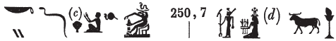
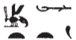
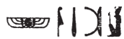

## Esna 250 {-}  
  
  

- Location: Column 7
- Date: Hadrian 
- [Hieroglyphic Text](https://www.ifao.egnet.net/uploads/publications/enligne/Temples-Esna003.pdf#page=181){target="_blank"}
- Bibliography: @sauneron-5, pp. 95-107; @mathieu-esna; @leitz-loeffler, pp. 38-40, 52-54 and elsewhere; see also [Tempeltexte 2.0](http://www.tempeltexte.uni-tuebingen.de/portal/#/text-detail/1040){target="_blank"}   

**§1. Khnum, artisan of the human body**  

  

^6^ *ky dwȝ ẖnmw-Rʿ*  
*ḥry-^7^-nḥp*  
*grg.n=f tȝ*  
*m r'-ʿ.wy=f*  
  
^6^ Another hymn of Khnum-Re,  
Chief of ^7^ the potter's wheel,[^fn-250-1]  
he having populated the earth  
through his activity.

[^fn-250-1]: {width=40%} - The beginning has been explained differently over the years, see @leitz-loeffler, p. 52, n. 188. The present translation follows the suggestion by @sauneron-3, p. 130, n. c, that the *ḥr*-sign should be read after the ideogram of Khnum the potter, forming his epithet *ḥry-nḥp*, "chief of the potter's wheel", which is much more common at Esna than simple *nḥp*, "the Potter."

*qȝs ḫnty štȝ.t*  
*ḫwzỉ ms ṯȝ.wy*  
*sʿnḫ.n=f ṯȝ.w*  
*m nfw n rȝ=f*  
  
*sȝp.n=f tȝ pn*  
*ẖr Nwn*  
*šn-wr pẖr-wr [m-]pẖr=f*  
  
*qdỉ.n=f nṯr.w rmṯ.w*  
*snb.n=f ʿ.wt mn(mn.t)*  
*ỉr.n=f ȝpd.w m-ʿb ḫn[n.w]*  
*sỉpỉ.n=f kȝ.w*  
*ms.n=f ỉd.wt*  
   
He who assembles within the womb,   
who builds while keeping chicks healthy,    
having enlivened children  
with the breath of his mouth.  
  
He constructed[^fn-250-2] this planet,    
including Nun,  
as the *šn-wr* and *pẖr-wr* seas surrounded him.  
  
He modeled gods and humans,  
he fashioned all livestock,  
he made birds along with fi[sh],  
he constructed bulls,   
and he birthed cows.

[^fn-250-2]: Despite the reservations by @sauneron-5, p. 97, n. c, this is most likely the verb *sȝp/sỉpỉ*, "to erect a building," rather than "to flood."  

*ṯz^8^.n=f ḥpt wtr*  
*m qs.w*  
*nbỉ ḫnty bd.t*  
*m r'-ʿ.wy=f*  

*ỉsk swḥ n ʿnḫ*  
*m-ḫnt ỉḫt nb*  
*ḥwỉ wtr twt(.w)*  
*m-ʿb mw m qs.w*  
*r nḫb ȝḫȝḫ.w=f m šȝʿ*  
   
*bẖ.n=f ḥm.t*  
*ỉw ẖ.t r dmḏy.t=s*  
*r wp(.t) [...] *  
   
He ^8^ stitched the circulation of blood     
to bones,   
fashioning within the womb[^fn-250-3]    
through his activity.  
  
The breath, moreover, of life  
within all things:  
he who strikes congealed[^fn-250-3b] blood  
together with semen from the bones   
to assemble a skeleton in the beginning.  
     
And he made the woman give birth,    
when the womb reaches its time,    
to open [...]  

[^fn-250-3]: {width=11%}
- Again, despite the misleading wood determinative in this term, which led @sauneron-5, p. 98, n. i, to render this as *ʿfd.t*, "chest", this is more likely to be read *bd.t*, "womb", a term which occurs elsewhere in this hymn and at Esna: @sauneron-rde15, pp. 57-60; @meeks-delta, p. 113, n. 350. See the similar passage above in column 7: *qȝs ḫnty štȝ.t*. Different reading by @leitz-loeffler, pp. 38-39.

[^fn-250-3b]: Based on the syntax, the *tỉt*-sign most likely represents an adjective modifying *wtr*, "blood", rather than a second direct object, such as *tỉt*, "image; form". For other interpretations, see @leitz-loeffler, pp. 39-40.

*[...] šw.t*   
*r-mr=f*  
*sʿnḏ.n=f ḫw *  
*r dd-ỉb=f*  
*(ḥr) snḏm* ^9^ *ẖ.wt*  
*m srq-ḥty.t*  
*r sʿnḫ ṯȝ.wy*  
*ḫnt bd.t*  
   
[He ...] all assistants  
as he desires,  
and he reduced all cares   
as his heart dictates;  
making bodies ^9^ pleasant,  
for those who breathe,  
in order to enliven chicks  
within the womb.

*sȝḫȝḫ.n=f dbn*  
*srwḏ.n=f sȝr*  
*(ḥr) nbỉ ỉnmw ḥr ʿ.wt *  
  
*ḫwz.n=f hnn*  
*nbỉ.n=f mnḏ.t*  
*r ʿpr ỉrw n smnw.w*  
  
*zš.n=f ỉr.ty*  
*wbȝ.n=f ʿnḫ.wy*  
*snsn.n=f ẖ.t*  
*m ỉgb*  
  
As he made hair thrive,  
so he made fur grow,  
fashioning skin over limbs.   
  
He constructed a head,  
then he fashioned a face,  
to endow 'statues' (humans) with forms.  
  
As he opened (space for) eyes,  
so he dug out ears,   
having let the body breathe  
through air.  

^10^ *ỉr.n=f r' r wnm*  
*msn.t r sʿm*  
*ḥwỉ(?)=f šsȝw ỉsk*  
*ḥr ḫnỉ*  
*ʿr.ty ḥr p(ȝ)ḫd*  
*ḥngg.t ḥr sʿm*  
*qȝb.t ḥr ʿm m-ʿb bš*  
  
*b[k]sw ḥr rmn*  
*bỉk ḥr dbdb*  
*msḫt(yw) m kȝ.t pr-ʿ*  
*ʿr.t ḥr ỉr(.t) kȝ.t *  
*ḥn.t ḥr ȝm*  
*ḏr.ty* ^11^ *ỉry *  
*ḥr ỉr(.t) bȝk=sn*  
  
^10^ He made the mouth for eating,    
the oral cavity[^fn-250-5] for swallowing,  
and he sets the tongue in motion  
while speaking/singing;  
the jaws chew,  
the esophagus swallows,  
and the throat swallows and vomits.  
    
The spine carries,  
and the shoulders support;  
the upper arm performs heroic work,   
the elbow does (other) work,   
the palm graps,  
and the hands ^11^ likewise  
perform their service.  
  

[^fn-250-5]: For this group, scholars have proposed various terms meaning "teeth" or "rows of teeth." None of these are convincing, since *ʿm/sʿm* means "to swallow." Rather, this is probably a metaphorical use of *msn.t*, "foundation pit", here referring to the oral cavity.   

*nṯry ḥr sšm*  
*zmȝ ḥr rmn *  
*wtṯ ỉsk ḥr sṯỉ*  
   
*ỉwf n ḥȝ.t *  
*ḥr ndb ỉḫt nb*  
*ỉwf n pḥwy *  
*ḥr snsn *  
*ỉmy.w ẖ.t mỉt.t*  
*ḥr ḥms-m-wḥʿ*  
*ḥr sʿnḫ štȝ.wt*  
*m rk-kkw*  
  
The divine-heart leads,  
the lungs support,  
while the penis ejaculates.  
   
The (female) 'front parts' (lit. flesh)    
absorb everything;    
the 'rear part' (lit. flesh)   
vents (lit. let breathe)   
the internal organs,  
both while dining,  
and while keeping embryos alive   
in the 'time of darkness' (i.e. pregnancy)[^fn-250-7].
  

  
[^fn-250-7]: The 'front parts' refer specifically to female genitalia. The second part of this section seems to reflect a belief that internal organs, including the embryo in the womb, needed to exhale through the rear.   

*ḥʿw-ʿnḫ ḥr sṯỉ*  
*bd.t ḥr šzp*  
*ḥr swr ḏȝm[.w] m ḫt-mn*  
   
*špty.t ḥr* ^12^ *ỉfn*  
*ỉw ỉmy-ʿnḫ ḥr bš*  
*ḥr swr*  
*zḫn m mn.ty*  
   
The phallus ejaculates,   
and the womb receives,  
increasing generation[s] in the world.  
  
The bladder ^12^ pours out liquid,    
but the penis ejaculates (semen)  
while growing bigger   
and uniting with the loins.[^fn-250-9]   

[^fn-250-9]: @leitz-loeffler, pp. 34-36, dubbed this section one of the most difficult sections of the hymn. The present translation closely follows Sauneron, but other interpretations are certainly possible.

*sbq.wy ḥr sqd*  
*ỉḥ.ty ḥr ḫnd*  
*ḥḏ.w ỉry ḥr ỉrw=sn*  
  
*ỉw=sn ȝ (r)-ȝw*   
*n ỉb*  
^12^ *nḥp=sn (r)-ḏr=w*  
*ḥr nḥp=f*  
    
The calves move around,  
the thighs travel,    
all bones are in their functions:  
   
Indeed all these things, in their entirety,  
are from the mind[^fn-250-10]   
^12^ of He who modeled them all
upon his potter's wheel

[^fn-250-10]: Following the translation by @mathieu-esna, p. 515, n. ll, who sees in this a conclusion to the entire creation account. @leitz-loeffler, p. 54, translated: "wobei sie (all Knochen) in der Ausdehnung (= unter der Kontrolle?) des Herzens sind," but it is unclear how the bones specifically might be controlled by the heart. Sauneron, and subsequent editions, split the text at the end of column 11, but then the subsequent phrase must be translated as a passive. Instead, the heart at the end of col. 11 belongs to the form of Khnum mentioned at the beginning of col. 12. 

**§2. Khnum, creator of diversity**  

  

*pnʿ=sn wḥm*  
*n spȝ.t nb r k.t*  
*šd(.t) ḏȝr *  
*r ỉdb.w-Ḥr*   

*qmȝ^13^.n=f bỉȝ.wt *  
*m-ẖnw tȝ=sn*  
*ḥr fȝỉ bȝk=sn ỉry*  
*(r) rw.t wr(.t)*  
   
*nḥp sw ỉt=sn tȝ-ṯnn*  
*(ḥr) sḫp(r) wnn.t nb.w*  
*ḥr-zȝṯw=sn*  
*ỉr=sn ẖr.t*  
*m ỉrw rmṯ.w*  
*nw tȝ-Ỉbh(?)*  
*r šd.t ḥʿw=sn*  
*m-ʿb ms.w=sn*  
   
They change their language  
from one region to the next,  
when one compares (them)  
to Egypt.    
  
He ^13^ created marvelous products   
within their lands,  
thus carrying all their tribute   
(to) the Great Gate.  
     
Their father, Tatenen, modeled them,    
he who creates all that exists   
upon their soil,  
so they might make food (thereby),  
in the manner of people   
from the Land of Ibhat (Wadi Allaqi),[^fn-250-11]  
in order to nourish their bodies,  
along with (those) of their children.  

[^fn-250-11]: This is an unexpectedly specific allusion to a mining region in the Eastern desert of Lower Nubia. Perhaps it is evoked here because of the previous mention of "marvelous products (*bỉȝ.t*)." Alternatively, maybe the inhabitants were assumed to be hunter-gatherers, subsisting from the foods Tatenen created for them "upon their soil", rather than from agriculture.

*ỉšš.n r'=f*  
*ḫp(r)=sn ḥr-ʿ*  
*nn whn*   
*šȝỉ nḥp*  
*ỉw=f* ^14^ *ḥr dbn rʿ-nb*  
  
His mouth spat out  
and they came about immediately;  
what the potter's wheel has fated  
can never fail,  
it (the wheel) ^14^ spins every day.  

*ỉr.n=k nb*  
*ḥr dwȝ n=k nṯr*  
*twt Ptḥ-tȝ-ṯnn*  
*qmȝ qmȝ.w*  
*sḫp(r).n=f nty nb*  
*m-ẖnw Ỉwny.t*  
   
*šd.n=f ṯȝ.wy*   
*m mḥn *  
*r dmḏy.t=f*  
*sbš.n=f ỉd.t*  
*r pẖry.t=s*  
  
All whom your made  
praise god for you,  
you are Ptah-Tatenen,  
who created the creators,  
having produced all that is   
within Iunyt.  
  
As he nourished the chicks    
in the womb  
until its appointed time,  
so he made the uterus expel (the baby)      
at its proper time.  

*qd.n=f rmṯ.w*  
*ms.n=f nṯr.w*  
*ỉr.n=f ʿ.wt mnmnm.t*  
^15^ *qmȝ.n=f pȝy.w ḫnn.w *  
*ḥrr.w nb*  
*shrp.n=f ḫḏ.w*   
*(m)-qȝb n.t*  
*m qr.ty r-ḫt=f*  
*r sḏfȝ nṯr.w*   
*r nw=f*  
  
*sḫp(r).n=f ỉdḥ.w*  
*m-ẖnw sḫ.t*  
*sṯḥn.n=f ỉdb.w*  
*m ḥrr.w*  
*qnn.n=f np(ry)*  
*n ḫ.t-n-ʿnḫ*  
*ḥr ỉr(.t) dỉ.t pȝww.t*  
*n nṯr.w rmṯ.w*  
   
^16^ *ptḥ.n=f ʿȝ.wt*  
*n.w ẖ.wt *  
*sqȝʿ.n=f štȝ.wt*  
*m-ẖnw=sn*  
  
As he modeled humans,   
so he birthed the gods,   
and made all livestock,    
^15^ and created birds and fish,    
and all serpents;    
he stirred up the fish   
within the *n.t*-waters,[^fn-250-12]  
from the grottos in his wake,    
to provision the gods  
at his season.
  
He created marsh plants  
within the field,  
and he made the banks shine  
with flowers;  
he made grains fatten  
from the 'wood-of-life',  
causing food to be given   
to gods and humans.  
  
^16^ He created the precious stones  
in the quarries,  
and he made mines spit (them) out  
from their interiors.  

[^fn-250-12]: This difficult passage is read thanks to close parallel in *Esna* II, 17, 37 and *Hibis* III, Pl. 32, col. 19-20; see @klotz-ram, p. 153, Pl. 24.

**§3. Different forms of Khnum**

^16^ *ỉw=f m ḥȝ.t-nỉw.wt*  
*m bȝ n Rʿ*  
*ḥr qdỉ rmṯ.w m-ḫt tȝ pn*  
   
*wnn=f m tȝ-sn.t*  
*(m) bȝ ʿnḫ n Šw*  
*ḥr ẖnm ḥr.w-nb.w*  
*ḥr nḥp=f*  
*qd.n=f rmṯ.w*  
*ms.n=f nṯr.w*  
*ʿnḫ=n m pr ỉm=f*  
*snsn.n=f ḥtp(ty.w)*  
*m* ^17^ *ỉs-nȝw*  
  
*ỉw=f m šȝʿ=s-ḥtp*  
*m bȝ n Wsỉr*  
*ḥr qdỉ ʿw.t nb*  
*m r'-ʿ.wy=f*  
   
*ỉw=f m ḥr-wr*  
*m bȝ n Gbb*  
*ḥr qdỉ wnn.t nb(.t)*  
*m tȝ pn*  
  
^16^ He is in First of the Cities         
(Elephantine) as the Ba of Re,[^fn-250-15]     
modeling humans throughout this land.    
  
When he is in Esna,  
(as) the living Ba of Shu,   
modeling all people  
upon his potter's wheel;  
as he formed humans,  
so he birthed the gods,  
and he lives from what comes from him;   
he allowed the blessed (dead) to breathe   
as ^17^ a pleasant wind.  
  
He is in Shas-hotep,  
as the Ba of Osiris,   
building all animals   
through his activity.  
  
He is in Her-wer,  
as the Ba of Geb,  
modeling all that exists  
in this earth.  

[^fn-250-15]: As elsewhere at Esna, Khnum is here identified with the four Mendesian rams, and the four gods of the Ennead: Re-Atum, Shu, Geb, and Osiris.  

*ỉw=f m nb mȝʿ-ḫrw*  
*m smn-Ḥr*  
*ḥr ỉr(.t) ȝpd.w *  
*m fd.t n ḥʿw=f*  
   
*wḥm.n=f qd=f*  
^18^ *m ḫnty sḥ-nṯr*  
*ḥr stwḫ Wsỉr*  
*m wʿb.t*  
*qd.n=f ỉḫt nb*  
*m-ẖnw ʿ.wy=f*  
*ḥr zȝ Wsỉr*  
*m-gs=f wnmy*  
   
*mk sw m Qbḥw*  
*m zȝ.ty-ỉr.ty*  
*ḥr zȝ nsw.t-bỉty*  
*m gs=f ỉȝbty*  
*ʿnḫ.tw ḏ.t*  
   
*wḥm.n=f ḫprw=f*  
*m swȝḏ-bȝ (m) Pr-nṯr*  
*ỉr.n=f ỉḫt nb*  
*m-ẖnw sḫ.t*^19^*=f*  
*srwḏ.n=f šny.w-tȝ*  
*swr.n=f np(ry)*  
*r sʿnḫ ḥr-nb*  
*m ỉḫt=f*  
  
*pnʿ.n=f qd=f*  
*m ḏf(n) mnḫ*  
*m-ẖnw ỉȝ.t-ṯȝ.wy*  
*ḥr qdỉ rmṯ.w ʿw.t nb*  
  
He is Lord of Justification[^fn-250-19]    
in Semenhor,  
making birds  
through the sweat of his body.  
  
He changed his form  
^18^ as Foremost of the Divine Tent,  
mummifying Osiris  
in the emblaming hall;  
he made all things   
within his hands,  
protecting Osiris   
on his right side.  
    
Look, he is in the First Cataract,  
as the two eye-children,    
protecting the King,     
on his left side,  
living eternally.  
  
He changed his manifestation again   
as Souadj-ba (in) Per-netjer;   
he made all things  
within his ^19^ field:  
he made plants grow,  
and he increased grain,   
to sustain everybody  
with his products.  
  
He transformed again  
as the beneficent ancestor,  
within Mount of the Chicks,  
modeling humans and all animals.

[^fn-250-19]: {width=15%} - @sauneron-5, p. 106, n. a, tentatively proposed understanding this group as "Metjenu", a form of Horus from Semenhor, but could not explain why. Instead, this phrase is most likely just a standard divine epithet, "lord of justification", with the winged scarab substituting for the similarly-shaped *nb*-basket.

*sḫp(r)=sn*  
*msḫn.t 4.t ỉry r-gs=sn*  
*ḥr wʿf sḫr.w n ḏw *  
*m ḥknw*  
   
*ʿḥʿ=sn m nb*  
*ḫnty ỉtr.ty šmʿ mḥw*  
*ḥr s.t*  
*ỉr nty*   
*qmȝ* ^20^ *wnn.t*  
*ȝḫw*  
*sḥtp-ỉb*  
*ḫw-ḥʿw*  
*ʿpr m r'*  
*ʿrf tȝ.wy*  
   
*dmḏ=sn qd=sn*  
*ḫp(r).n ḥry-tȝ n tȝ-ṯnn*  
*ḏr ḥȝ.t*  
*wḥm=sn ḫprw=sn*  
*m nḫb ḥr-sȝ=f*  
*m pẖr-ns.t*  
*n ḏḏ.w m šȝʿ*  
  
They are busy creating,  
the 4 birth-bricks beside them,  
thwarting any evil designs    
through praise.  
   
They stand up as Lord,  
foremost of the dual chapels of Egypt,  
upon the throne of:  
He who made what is   
and created ^20^ what exists;   
The effective one;   
He who satisfied the heart;   
He who protects the body;   
He who is equipped of utterance;   
He who binds the two lands.[^fn-250-20]    
   
They unite their forms,  
so came about the heir of Tatenen,  
since the beginning;  
they changed their manifestation again,  
in the lotus after him,  
being the successor   
of the Djedu-spirits in the beginning.
  

[^fn-250-20]: As @sauneron-5, p. 106, n. d, observed, each of the preceding epithets are determined by the seated Khnum sign, suggesting they are individual forms or attributes. There are only six enumerated here, so they do not appear to be variants of the 7 Khnums. Before this section, 9 other Khnums were listed (Ba of Re to Beneficent Ancestor).  

*nỉ sk.n kȝ=sn*  
*nỉ thỉ.n drf.w*^21^*=sn*  
*nn tp-šw *  
*m ỉr.n=f nb*  
   
*ỉw=sn dḫn.tw *  
*ḫnty srq.w-ḥty.t*  
*ḥr sḫp(r) wnn.t nb*  
*m ḏr.w-nṯr.w*  
   
*wn=sn ʿnḫ.tw ḏd.tw*  
*mỉ Rʿ*  
*ḥr wbn ḥtp*  
   
*ḥtp ḥr=k nfr*  
*n (pr-ʿȝ ʿnḫ ḏ.t)|*  
  
What they plan cannot perish,  
their guidance ^21^ cannot be ignored,  
nothing they have made  
is lacking something.  
   
They are concealed  
from before all mortals,  
producing all that exists  
since the limits of the gods.  
    
They exist, living and enduring  
like Re,  
rising and setting.  
  
May your beautiful face be kind,   
to the (Pharaoh living forever)|!

