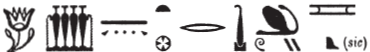
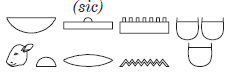

## Esna 251 {-}  
  
  

- Location: Column 7
- Date: Hadrian 
- [Hieroglyphic Text](https://www.ifao.egnet.net/uploads/publications/enligne/Temples-Esna003.pdf#page=181){target="_blank"}  
- Bibliography: @sauneron-5, pp. 107-110; @troy-mut, pp. 310-313;  see also [Tempeltexte 2.0](http://www.tempeltexte.uni-tuebingen.de/portal/#/text-detail/1042){target="_blank"} 

  

^21^ *dỉ(.t) ỉȝw n Mnḥy.t*  
*ḏd-mdw*  
  
^21^ Giving praise to Menhyt.  
Words spoken:

#### §1 {-}

  

*tw.t Rʿ.t*  
*sḥḏ.t tȝ.wy*  
*mn=s* ^22^ *ḥȝ=s*  
*m tp Rʿ*  
  
You are Rayet,  
who illumines the two lands,[^fn-251-0]    
she remains (*mn*) ^22^ and shines (*ḥȝ*)  
on the head of Re,  
in this her name of Menhyt (*Mnḥy.t*).

[^fn-251-0]: Same epithets of Menhyt in her litany: [Esna 233], 18, §20; also [Esna 371], ; 14; *Esna* VI, 489, 12.

#### §2 {-}

  

*tw.t nt ỉr(.t) nty*  
*qmȝ(.t) wnn.t*  
*mw.t-nṯr*  
*qmȝ(.t) nṯr.w*  
*Mnḥy.t*  
*ḥȝy n Ḥʿpỉ*  
*tmȝ.t wr.t*  
*šȝʿ(.t) ṯz pr.t*  
*ỉr(.t) nty*  
*qmȝ(.t) ỉḫt nb*  
*m rn=t pf n N.t*  
  
You are the *nt*-waters who made what is (*nty*),  
and created what exists (*wnn.t*);  
Mother of God,  
who created the gods;   
Menhyt,[^fn-251-1]    
the surging of Hapi;  
the great Mother,  
who began the binding of seeds,  
who made what is (*nty*),  
and created all things,  
in this your name of Neith (*N.t*).

[^fn-251-1]: {width=18%} - This spelling uses the same signs as *ḥȝy*, "to flood; surge" used in the subsequent phrase. @sauneron-5, pp. 107, 108, n. c, translated: "à la fois Vent et Inondation", assuming that despite the spelling of the first term, it should actually be the homophonous *ḥȝy*, "wind." Rather, while §1 refers to Menhyt as the sun, this section is entirely about Menhyt-Neith as creator and primeval *nt*-waters, so it makes sense that she is the feminine "flooding (*ḥȝy*)" aspect of the Inundation. Compare the litany to Menhyt, [Esna 233], 17, §14: "for Menhyt, who surges as Hapi (*ḥȝy m Ḥʿpỉ*)"; also *Esna* VII, 552, 6-7.

#### §3 {-}

  

*tw.t šps.t wsr.t*  
*ršw Rʿ n mȝȝ=s*  
*ʿȝ mrw.t*  
*Bȝst.t *  
^23^ *nṯr.t ʿȝ wpy*  
*šȝʿ.tw n=s nhm*  

*sḏ.t ỉr(.t) tmȝ.t*  
*n qmȝ \<sy\>*  
*m rn=s pfy n Mw.t*
  
You are the great, august one,  
whom Re rejoices to see;[^fn-251-2]    
great of love,  
Bastet,  
^23^ the goddess great of *wpy*-festival,  
for whom rejoicing was invented.  
  
The girl who acted as mother (*tmȝ.t*)  
for he who created \<her\>,[^fn-251-3]    
in this her name of Mut (*Mw.t*).  

[^fn-251-2]: Same sequence of epithets in [Esna 239], B.
[^fn-251-3]: Without emendation, this could also read "who acted as mother for the Creator" (so @sauneron-5, pp. 108, 109, n. f); the present restoration was inspired by similar epithets of Mut, daughter who acted as mother for her father Re: @klotz-caesar, p. 170, n. 1097.

#### §4 {-}

 

*tw.t msw.t*  
*ỉr n=s ỉt=s Rʿ*  
*ȝḫ.t ns.t*  
*ḥqȝ=f nswy.t=f*  
*m p.t tȝ*  
*r ỉr(.t) ḥtp=s ỉm*  
*m rn=s (n) Nb.t-ḥtp.t*  
  
You are the replica,  
for whom her father Re made:  
the Akhet, the throne,  
his rule, his kingship  
on heaven and earth,  
in order to make her satisfied (*ḥtp*),  
in her name of Nebet-hetepet (*Nb.t-ḥtp.t*).

#### §5 {-}

 

*tw.t wr.t-ḥkȝw*  
*ʿȝ bȝ.w n psḏ.t*  
*ḥnw.t šps.wt*  
*nb(.t) hrw ȝbd.w*  
*ỉr.tw n=s ḥb n tr rnp.t*  
*r sḥtp=s *  
*m rn=s pfy n Sḫm.t*  
  
You are Weret-hekau,  
great of power in the Ennead,  
mistress of the *šps.wt*,  
Lady of days and months,[^fn-251-5]  
for whom one holds annual festivals  
in order to appease her,[^fn-251-6]  
in this her name of Sakhmet.  

[^fn-251-5]: For Sakhmet presiding over all days, compare her famous retinue of statues from the Mut Temple complex, and her connection to the daily Chronokrator Genies: @yoyotte-litanie.
[^fn-251-6]: For this ritual of appeasing Sakhmet, see @goyon-shtp.

#### §6 {-}

*tw.t ḥnw.t *  
*ṯnỉ(.tw) ḫnt nṯr.yt*  
*wbn(.t) mḥn.t m tp*  
*n ỉt=s Rʿ*  
*m rn=s* ^24^ *n Mḥy.t*  
    
You are the mistress,  
most distinguished of goddesses,  
who rises and coils (*mḥn*) upon the head  
of her father, Re,  
in her name ^24^ of Mehyt (*Mḥy.t*).[^fn-251-7] 

[^fn-251-7]: For the goddess Mehyt of Abydos/Thinis, similar in many respects to Menhyt, see @cauville-mehyt. Ignore the suggestion by @sauneron-5, p. 110, n. l, to correct this to "Mehenet."

#### §7 {-}

*tw.t nb(.t) ʿgny*  
*ỉqḥ(.t) Wȝs.t m mȝfd.t*  
*bẖ(.t) šww*  
*m ḥw.t-mw.t*  
*ỉr.t-Rʿ*  
*ʿq(.t) ḥqȝ-ʿnḏ m snw.t*  
*m rn=s pfy n Ḥw.t-ḥr *  
  
You are the Lady of 'Agny,[^fn-251-8]  
who enters Thebes as a panther,[^fn-251-8b]  
and gives birth to the sun  
in the Mut Temple;  
Eye of Re,  
who enters Heliopolis on the 6th day,  
in this her name of Hathor.  

[^fn-251-8]: Hathor Lady of 'Agny was a major goddess from the region around Esna, and is mentioned multiple times throughout the temple.  
[^fn-251-8b]: For Menhyt as a panther, see also [Esna 233], 22, §44, and possibly *Esna* II, 127, 7.

#### §8 {-}

*tw.t ỉʿrr.t ʿnḫ(.t)*  
*ḥnw.t ʿḥ*  
*nb(.t) p.t*  
*sšm(.t) tȝ.wy *  
*ʿȝ sḫr.w m s.t nb*  
*m rn=s pfy n Ỉs.t*  
  
You are the living uraeus,  
mistress of the palace,  
Lady of heaven,  
guide of the two lands,  
great of plans in all places (*s.t*),  
in this her name of Isis (*Ỉs.t*).

#### §9 {-}

*tw.t nb.t Qbḥ.w*  
*r-mn pḥw.w*  
*ʿnḫ.t m bỉȝ*  
*rdỉ sḫn n bnw*  
*sṯ(.t) Ḥʿpỉ m qr.ty*  
*ḥr* ^25^ *bʿḥ.n=f tȝ.wy*  
*r tr=f*  
*m rn=s pfy n Spd.t*  
   
You are the Lady of Edge of the Land   
all the way to the *pehus* (of the Delta);[^fn-251-9]  
living serpent in the sky,  
who makes a conjunction with Benu (Venus),[^fn-251-9b]    
and shoots out Hapi from the grottos,  
when ^25^ he floods (*sṯ.t*) the two lands  
at his season,  
in this her name of Sothis (*Spd.t*).

  

[^fn-251-9]: {width=28%} - @sauneron-5, pp. 108, 110, n. p, refrained from translating the first sign. Nonetheless, this epithet is paralleled in the Menhyt litany, [Esna 233], 25, §60: {width=32%}, and again in a water offering scene for Menhyt, *Esna* VII, 552, 7: {width=20%}. Based on the context, the first toponym does not seem to be Khent-ta, the usual cult center of Menhyt, but a homonymous designation for the southern border of Egypt (*Wb* III, 306, 6-7). For Menhyt as Sothis, see also [Esna 233], 17, §13; *Esna* II, 31, 55-56, and cf. @pichel, pp. 134-135.
[^fn-251-9b]: Agreeing with the translation of @sauneron-5, p. 108, this would appear to refer to a conjunction of Sothis and Venus, in relation to the New Year Inundation. Nonetheless, a parallel to this whole verse occurs in a water offering scene for Menhyt, where the term bnw, "Phoenix", is replaced with *tȝ*, "earth," suggesting one also understand *bnw*, "earth" here. If that is correct, the verb *sḫn* would have some different connotation here.

#### §10 {-} 

*tw.t nbw.t*  
*ḥnw.t sḫ.t*  
*Rnn.t wȝdy.t*  
*sḫpr(.t) ỉḫt nb.w*  
*m wḏȝ=s (r) ȝḫ.t*  
*grg(.t) spȝ.wt nỉw.wt*  
*m qmȝ.n=s*  
*m rn=s pfy n Nb.t-ww*  
  
You are the Golden one,  
Mistress of the Field,  
Renenutet, Wadjyt,[^fn-251-10]  
who produces all things,  
when she goes (to) the field;  
who populates districts and cities  
with that which she created,  
in this her name of Nebtu.

[^fn-251-10]: Or is this "Green Renenutet"? See examples from Esna and elsewhere in *LGG* IV, 689-690; and possibly *Esna* II, 115, 8.

 

*ḥtp ḥr=t nfr *  
*n nsw.t-bỉty*  
*nb-tȝ.wy*  
*(pr-ʿȝ ʿnḫ ḏ.t)|*  
*zȝ-Rʿ nb-ḫʿ.w*  
*(ʿtrʿny ḫwỉ)|*  
*sqr=f wdn.w*  
*n kȝ=t ḏ.t*  
  
May you good face be kind  
to the Kind of Upper and Lower Egypt,  
Lord of the Two Lands,  
(Pharaoh Living Eternally)|  
Son of Re, Lord of Appearances,  
(Hadrian Augustus)|  
May he consecrate litanies   
for your Ka, eternally.  

