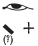
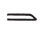
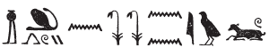
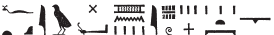
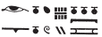
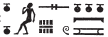
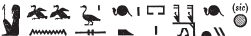
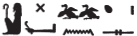

## Esna 252 {-}  
  
  

- Location: Column 7
- Date: Hadrian 
- [Hieroglyphic Text](https://www.ifao.egnet.net/uploads/publications/enligne/Temples-Esna003.pdf#page=182){target="_blank"}  
- Bibliography: @sauneron-5, pp. 110-111; see also [Tempeltexte 2.0](http://www.tempeltexte.uni-tuebingen.de/portal/#/text-detail/1043){target="_blank"} 

  

^25^ *dwȝ N.t*  
*[ḏd-mdw]*  
  
^25^ Hymn to Neith.  
[Words spoken:]

#### §1 {-}

  

*tw.t nb(.t) Zȝw*  
*ṯnn pw*  
*2/3=s m ṯȝy*  
*1/3=s m tmȝ.t*  
*štȝ.t ʿȝ.t*  
*šȝʿ(.t) ḫp(r) m ḥȝ.t*  
*šȝʿ(.t) ỉḫt nb*  
  
You are the Lady of Sais.  
That means Tatenen:  
2/3 of her is male,  
1/3 is female.  
The great Mysterious one,  
who began existence in the beginning,  
she who began everything.  

#### §2 {-}

  

*tw.t gb.t* ^26^ *ȝy *  
*ʿ.t ỉm=s*  
*ms.n=s ḫȝbs.w r-ȝw=sn*  
*sʿr=s(n) m-ḏr dmy=sn*  
   
*swḥ sqfn tȝ *  
*m nbỉ.t nt ỉr.ty=s*  
*m hh pr m rȝ=s*  
   
*mw.t-nṯr Rʿ*  
*wbn(.t) m ȝḫ.t*  
*štȝ.t sšp(.t) m ḥḏḏ.w=s*  
  
You are she, moreover,  
of whom the firmament ^26^ is just one part.  
She birthed all the decan stars,  
they rise then they set.[^fn-252-1]  
  
The (hot) wind, who cooks the earth,  
with the flame of her eyes,  
and the blaze that emerged from her mouth.[^fn-252-1a]  
  
Divine mother of Re,  
who shines from the Akhet,  
Mysterious one who illumines with her rays.  

[^fn-252-1]: For this entire passage, see @klotz-articulata. Parallels occur in *Esna* II, 28, 14; *Esna* VII, 633.
[^fn-252-1a]: Same set of epithets in *Esna* VII, 633. 

#### §3 {-}

  

*tw.t tp.t*  
*ḫp(r.t) m ḥȝ.t ỉry*  
*nḏ.t n tȝ r-ȝw=f*  
*šȝʿ(.t) ḫp(r)*  
*nỉ ḫp(r) ḫp(r)*  
*ḫp(r) ḫp(r.w) *  
*m-ḫt ḫp(r)=s*  
*m[wt?] ẖr s.t-ḥr=s*  
*[...]*  
  
You are the initial uraeus,  
who came about at the start of it all;[^fn-252-2]  
Guardian of the entire earth;  
she who began existence,  
before existence existed;  
all creation came into being  
after she came into being.  
D[eath?][^fn-252-3] is under her authority  
[...]

[^fn-252-2]: Same sequence of epithets in [Esna 317], 2.
[^fn-252-3]: For the restoration, see @sauneron-5, pp. 113-114, n. g.

#### §4 {-}

 

*tw.t ỉr(.t) dwȝ.t*  
*m ỉrw=s*  
*ỉn(.t) (?)* ^27^ *pḥwy *  
*n nn r-ȝw*  
*m ḏ.t=s n mtr*  
*m rn=s n ḏ.t*  
   
*nb(.t) mrḥ.t m-ʿb mnḫ.t*  
*fdq(.t) mr=s*  
*n 5 ỉpw *  
*ỉmy.w p.t tȝ*  
  
You are she who made the Duat  
as her visible form;  
she who reaches(?) ^27^ the end  
of this in its entirety,[^fn-252-2b]  
in her corporeal form of *mtr*-waters,[^fn-252-3b]  
in her name of linear *ḏ.t*-eternity.  
  
Lady of ointment and linen,  
who apportions (thereof) as she desires  
to those 5 beings  
who are in heaven and earth.[^fn-252-4]

[^fn-252-2b]: {width=4%}{width=4%}{width=25%} - As @sauneron-5, p. 114, n. h, the variant from another hymn to Neith makes more sense, cf. [Esna 317], 2: {width=28%}{width=9%}. However, a similar epithet occurs in [Esna 216], 5, §24, where the same eye-sign occurs, albeit in a damaged section.
[^fn-252-3b]: The book determinative here suggests *mtr* is an adjective, but the parallel in [Esna 317], 3, has the water classifier. For Neith identified with the *mtr*-waters (similar to her association with the *nt*-flood), see also: [Esna 216], 3, §11, which is probably to be read *mtr* (< *mṯ + ḏ* + determinative), rather than *ḏ.t* (*contra* @sauneron-5, p. 114, n. i).
[^fn-252-4]: {width=30%} - This unusual epithet, along with the previous phrase, has an exact parallel in [Esna 317], 6: {width=30%}. Very curiously, @sauneron-5, p. 114, n. l, assumed this referred to the invention of weaving by Neith, and thus interpreted the common *mr*-sign with the exceptional value of *mr*, "reed (of a loom)" (followed by *LGG* III, 197a). Instead, this can simply refer to Neith apportioning linen and ointment as she pleases. Who the five (or four, in *Esna* III 317, 6) recipients of these gifts are remains a mystery.

#### §5 {-}

 

*tw.t nt*  
*ỉr tȝ*  
*nnw=s pw Nwn*  
*pr nty nb*  
*m pʿpʿ.n=s*  
  
*sṯ(.t) Ḥʿpỉ r nw=f*  
*rnp(.t) wḥm-ʿnḫ r tr=f*  
*srwḏ(.t) rwḏ*  
*sḫpr(.t) ḫ.t-n-ʿnḫ n ʿnḫ.w*     
  
*twȝ(.t) [zȝ=s Rʿ]*  
*[ỉmỉ.tw wp.t=s]*  
*[ḏȝ(.t)] Nwn [ẖ]r=f*   
*m Mḥ.t-wr.t *  
*[sḥr=s] sbỉ *  
*ḥr [ḥr mw=f...]*  
  
You are the flood water,  
who made the earth,   
whose child is Nun:[^fn-252-5]  
all that is came forth  
as something which she conceived.  
   
She who shoots out Hapi at his time,  
who rejuvenates *wḥm-ʿnḫ* at his season,[^fn-252-6]  
who makes plants flourish,  
and creates the "wood of life" for the living.  
  
She who lifts up [her son Re]  
[upon her horns],  
[she travel across] Nun [be]aring him  
as Mehet-weret;  
[and she drives away] the rebel  
from [those upon his water ...][^fn-252-7]   

[^fn-252-5]: {width=16%} - @sauneron-5, p. 111, translated this as "qui fit Tanen et qui fit le Noun." Nonetheless, the parallel in [Esna 317], 1, establishes the correct reading: {width=16%} (@sauneron-5, pp. 281, 283, n. d, translated that example: "est c'est son enfant qui est le Noun"). Note that in [Esna 216], 2, §5, Neith is "the flood waters who made the earth (*nt ỉr(.t) tȝ*)", distinct from the subsequent epithes: "Irita-Tatenen" (§6) and "Tatenen who made the earth (*ṯnn ỉr tȝ*)" (§7). For Neith's link to Nun, compare also *Esna* II, 71, 7, although the reading there is uncertain.  
[^fn-252-6]: These epithets also occur in [Esna 216], 12, §§53-54.
[^fn-252-7]: Although largely damaged, the traces can be restored thanks to [Esna 216], 11, §50.

#### §6 {-}

*tw.t nb(.t) tȝ-sn.t*  
*ḥr(.t)-ỉb sḫ.t štȝ.t*  
*mḥy.t n ỉȝ.t-ṯȝ.wy*  
*rr(.t) n sbk.wy*  
*m rn=sn Šw ḥnʿ tfn.t*  
   
*Rs(.t)-ḥw.wt=s*  
*ḥpt ḫḫ N.t*  
*sbk.wy m ʿ.wy=s*  
*Rʿ pw ḥnʿ Wsỉr*  
   
*zȝ(.t) ṯȝ.wy n zȝ=s *  
*m Pr-sȝḥw-Rʿ*  
*dỉ(.t) ḥtp-nṯr n nṯr.w nṯry.t *  
  
You are the Lady of Esna,  
within the Mysterious Field,  
North of Nome of the Chicks.[^fn-252-8]  
Nurse of the two crocodiles,  
by name: Shu and Tefnut.  
  
*Rs.t-ḥw.wt=s*:  
she who embraces the 'throat of Neith',[^fn-252-9]  
with two crocodiles in her hands,  
that means: Re and Osiris.  
  
She who protects the children of her son,[^fn-252-10]  
in Per-sahure;  
who gives offerings to gods and goddesses.

[^fn-252-8]: For this passage, see @sauneron-5, p. 115, n. p. For Neith going to the "mysterious" tomb of the ancestors in the field north of Esna, see also *Esna* II, 81, 2-3; 163, 26-28.
[^fn-252-9]: *Rs.t-ḥw.wt=s* is the official name of the crocodile-headed Neith who nurses to baby reptiles: @thiers-tanent, pp. 312-314, n. ac. As @thiers-tanent, p. 313, n. 65, noted, "throat of Neith" here is a general nickname for crocodiles.
[^fn-252-10]: {width=28%} - @sauneron-5, p. 111, did not translate the first sign, apparently assuming it was a second determinative to Osiris, but that translation seems to imply Re and Osiris are equated with Shu and Tefnut as the children of Re! The correct reading of this sign is apparent in the close parallel, [Esna 216], 14, §61: {width=17%}.

#### §7 {-}

*tw.t nb.t *[...]  
  
You are the *nb.t*-cow [...][^fn-252-11]

[^fn-252-11]: There is a sizeable lacuna here, then the hymn continues in [Esna 330]. The present verse might be restored: "You are the *nb.t*-cow, mistress of *nb.t*-cows": [Esna 216], 15, §68; *Esna* IV, 424, 2. For Neith as this cow, see also *Esna* II, 26, 11; *Esna* IV, 442, 1; *Esna* VII, 579, 11. 