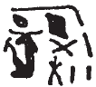

## Esna 254 {-}  
  
  

- Location: Column 7
- Date: Hadrian 
- [Hieroglyphic Text](https://www.ifao.egnet.net/uploads/publications/enligne/Temples-Esna003.pdf#page=187){target="_blank"}  
- Bibliography: @leitz-loeffler, pp. 89-96.

#### Formula {-}

  

^1^ *ḥnk nḥp*  
*n Nḥp*  
*ỉqr ḏbʿ.w m twt wr*  
*ḏd-mdw*  
   
*[ỉỉ.n]=ỉ ḫr=k*  
^2^ *ỉt=ỉ ẖnmw-Rʿ*  
*ỉnk ỉr m ʿ.wy=k*  
   
*ỉn=ỉ n=k nḥp pfy*  
*mrỉ ỉb=k*  
*ỉn kȝ.t=k *  
*[grg] tȝ.wy ḫȝs.wt *  
   
^1^ Offering the potter's wheel  
to the Potter:  
the (god) excellent of fingers  
in a great image.   
  
I [have come] before you,  
^2^ my father, Khnum-Re:  
I am one made by your hands.[^fn-254-0]  
  
I bring to you this potter's wheel,  
which your heart loves:  
it is your work  
which [populates] all lands.  

[^fn-254-0]: @leitz-loeffler, pp. 89, 92, n. e, emended the pronouns in this passage, but it makes perfect sense as is. Compare the similar scene *Esna* II, 15, 2-3, where the king brings the wheel to Khnum, telling him "you built me upon it." In both texts, the king emphasizes that Khnum personally created him. 

#### The King {-}

^3^ *nsw.t-bỉty*  
*nb tȝ.wy*  
*(ȝwtwkrtwr ksrs)|*  
  
^4^ *zȝ Rʿ*  
*nb ḫʿ.w*  
*(ȝtrỉns nty-ḫwỉ)|*  
   
^5^ *ỉwʿʿ ʿȝ*  
*n wr r nṯr.w*  
*nb nḥp n psḏ.t*  
   
^6^ *nṯr nfr*  
*qdỉ n ẖnmw-Rʿ*  
*nbỉ n nb (tȝ)-sn.t*  
*ḫp(r) n ḫnty pr[-ʿnḫ]*  
*(m) ȝ.t nt ḫntš*  
   
*sṯnỉ.tw=f *  
*m ḥw.t-ỉt*  
*ỉmỉ.tw pr nb ḥr nḥp=f*  
*r ỉr(.t) nsw(.t)*  
*m fdw n Nw.t*  
*[...] n ḫnty ỉtr.ty šmʿ-mḥw*  
*(ỉtr[nỉs nty]-ḫwỉ)|*  
   
^3^ The King of Upper and Lower Egypt,  
Lord of the Two Lands,  
(Autokrator Caesar)|  
^4^ Son of Re,  
Lord of Appearances,  
(Hadrian Augustus)|  
  
^5^ Great heir  
of Greatest of the gods,  
Lord of the potter's wheel of the Ennead.  
  
^6^ The good god,  
constructed by Khnum-Re,  
fashioned by Lord of Esna,  
who came about   
from Foremost of the House of [Life],[^fn-254-1]  
at the moment of rejoicing.  
  
He was distinguished  
in the Temple of the Father,  
among all those who came forth   
upon his potter's wheel,  
to serve as King  
in the four corners of the sky,  
[...] of Foremost of the Dual Chapels  
(Hadr[ian Augus]tus)|  
  

[^fn-254-1]: Restoration based on *Esna* II, 15, 13; [Esna 395], 7;  *Esna* VI, 537, 18. @leitz-loeffler, p. 92, n. i, restored *pr-[nṯr]*, "Per-[netjer]", but that toponym usually has a city determinative.

#### Khnum-Re Lord of Esna {-}

^7^ *ḏd-mdw n ẖnmw-Rʿ *   
*nb tȝ-sn.t*  
*nsw.t nṯr.w*  
*grg bw nb *  
*[ḫnt]* ^8^ *ḥw.t-ỉt*  
*Ptḥ-tȝ-ṯnn*  
*ḫnty [ʿ]-rsy*  
*qmȝ ḥmw.w*  
*ḥry-ỉb* ^9^ *ṯpḥ.t-ḏȝ.t*  
*qd nsw.t ḥr nḥp nt nḥḥ *  
*[m kȝ.t]* ^10^ *mnḫ.t nt ḏ.t*  
*ḥrỉ r ṯȝ.w=f*  
*m nỉw.wt 7*  
*m rn=f n ẖnmw*  
   
^11^ *[...]*  
*grg.n=k tȝ pn*  
*[...]*  
   
^7^ Words spoken by Khnum-Re,  
Lord of Esna,  
King of the Gods,  
who populates every place  
[from within] ^8^ the Temple of the Father.  
Ptah-Tatenen,  
who created the artisans  
within ^9^ the Blocked Grotto;  
who builds the king   
upon the eternal potter's wheel,  
[as an] effective ^10^ work of eternity;  
who separates from his children  
in 7 different cities(?)[^fn-254-2]  
in his name of Khnum.  
  
^11^ [...]  
you have populated this earth  
[...]

[^fn-254-2]: For this unusual epithet, see the discussion of @leitz-loeffler, pp. 93-94, n. r. As noted there, this passage seems to allude to Khnum-Re creating the 7 Khnums, even though those gods are not usually associated with specific cities.

#### Menhyt {-}

  

^12^ *ḏd-mdw n Mnḥ.t wr.t*  
*nb.t ḫnt-tȝ*  
*sḫm.t ʿȝ.t mr.t Ptḥ*  
*mḥn.t ḥr tp n nṯr nb*  
   
*Nbw.t* ^13^ *wr.t n tȝ-ṯnn*  
*ḥr.t-tp n nṯr.w pȝwty.w*  
*ṯz(.t) ỉwʿʿ=s*  
*grg(.t) tȝ.wy*  
*ḥnʿ Nḥp*  
   
*qrḥ.t r=f*  
^14^ *nt nb rr.t *  
*[...] msḫn.t [...]*  
   
^15^ *dỉ[=ỉ n=k]*  
*ṯz ḏȝm.w [...]*  
*ḫr ẖnmw*  
*r pr-ẖnmw*  
    
^12^ Words spoken by Menhyt the great,  
Lady of Khent-ta,  
Great Sakhmet, beloved of Ptah,  
uraeus on the head of every god;  
  
Great ^13^ Golden one of Tatenen,  
uraeus of the primeval gods,  
who assembles her heir,  
and populates the two lands,  
together with the Potter.  
  
The *qrḥ.t*-serpent, meanwhile,  
^14^ Of the Lord of Renenet,  
[...] of the birth-brick [...]  
  
^15^ [I] cause [for you]  
that generations are created   
[...]  
before Khnum at Per-Khnum.    

#### Behind the Divinities {-} 

^16^ *[nsw.t bỉty] *  
*qd r mr=f*  
*nṯr ỉr nṯr*  
*pȝwty tpy*  
*ḫp(r) m ḥȝ.t*  
*[?] ỉn wnn.t*  
*[...] tȝ.wy*  
*qmȝ wnn.t*  
*rwḏ ʿ.wy [ḫr] bw nb*  
*šȝʿ ʿnḫ n Km.t*  
*ỉmy-rȝ/ḥry ẖnmw wr.w 7*  
  
^16^ [The King of Upper and Lower Egypt],  
He who builds as his desires,  
the god who made (every) god;  
the First Primeval one,  
who came about in the beginning,  
[??] by what exists   
[...] the two lands;  
who created what exists,  
firm of arms [before] all people,  
who began life for Egypt,  
Chief of the Seven Great Khnums.[^fn-254-4]    
  

[^fn-254-4]: {width=8%} - @sauneron-3, p. 144, n. a, only left this handcopy in a footnote, noting the sign-order is very confused. Similarly, @leitz-loeffler, p. 95, n. bb, noted the poor condition of the signs, and refrained from offering any suggestions. Nonetheless, it is quite simple to recognize the ram-head with a solar disk, followed by the x-sign, as "the great Khnums" (*Esna* II, 16, 1; 58, 3; *Esna* VI, 474; [Esna 395], 12). The number seven, meanwhile, is composed of 5 (star) + 2. 