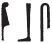

## Esna 259 {-}  
  
  

- Location: Column 8
- Date: Antoninus Pius 
- [Hieroglyphic Text](https://www.ifao.egnet.net/uploads/publications/enligne/Temples-Esna003.pdf#page=202){target="_blank"}  
- Bibliography: @sauneron-1, pp. 103-104; @sauneron-5, pp. 356-358; see also [Tempeltexte 2.0](http://www.tempeltexte.uni-tuebingen.de/portal/#/text-detail/1054){target="_blank"}

  

^1^ *ȝbd 3 šmw sw 20*  
*ḥb ṯȝy ʿwn(.t*  
*ḥb qn n ẖnmw ḫr.tw r=f*  
   
*dwȝ nt sḫʿ *  
*ḥqȝ mnỉw.w*  
*ỉr(.t) ʿbw *  
*ỉn ẖry-ḥb ḥry-tp*  
*ʿq r-ḫnt n Pr-nṯr*  
*ỉsk sw ẖkr.tw m ẖkr.w=f*  
*ḥby.t m ʿ=f*  
*n ḥb pn*  
   
*ʿḥʿ r ḫft=ḥr *  
*n Pr-Šw*  
*r-gs dwȝ.t štȝ.t nt.t ỉm*  
*ỉw ḥr=f r zȝ-nb-ẖnn*  
^2^ *rs nṯr šps ỉm=f*  
*ḏd-mdw*  
  
^1^ III Shomu 20 ( [Epiphi 20](https://bookdown.org/shemanefer/Esna2/calendar-ii-77.html#epiphi-20) )  
Festival of Taking the Baton,  
also called the Victory Festival of Khnum.  
  
Morning of the procession   
of the Ruler of Herdsmen;  
performing purifications   
by the Chief Lector Priest.  
Enter inside Per-netjer,  
while he is adorned in his ceremonial clothes;  
the festival papyrus in his hand,  
for this festival.   
  
Stop on the dromos  
of the Temple of Shu,  
beside the mysterious Duat which is there,  
his face toward the *zȝ-nb-ẖnn*-lake;[^fn-259-1]  
awakening the august god [^fn-259-2] within it.  
Words spoken:  
 

[^fn-259-1]: For the sacred lake of North Esna, see @sauneron-5, pp. 325-326, n. c.
[^fn-259-2]: {width=18%}{width=5%} - The interpretation of this passage is complicated. The crocodile very often writes the word nTr, "god", at Esna, without any indication it is referring to a reptilian manifestation. Yet for this text, @sauneron-1, p. 103, translated the hieroglyph as "crocodile"; @leitz-rams, p. 254, built upon this interpretation and argued the crocodile was a standard manifestation of Khnum Lord of the Field, thus explaining the choice of this sign in the famous crocodile hymn, *Esna* II, 126. It is true that Khnum can be invoked in hymns as a bull, lion, or crocodile (cf. @leitz-rams, p. 254, n. 17; see also [Esna 262], 20, §§8-9). While it is tempting to assume an actual crocodile was revered inside the sacred lake of North Esna, the corresponding festival text from the calendar *Esna* II, 77, 17, only mentions that funerary offerings are performed in this location for deceased gods such as Atum.

#### § 1 {-}

*rs=k nfr m ḥtp*  
*rs ỉtn=k m p.t*  
*stw.t=k m ȝḫ.ty*  
*sḥḏ tȝ.wy m mȝwy=k*  
*m ḥtp*  
*rs=k ḥtp.tw*  
  
May you awake well!  
May your solar disk in heaven awake,  
and your rays in the Akhet-eyes,  
you who illumine the two lands with your light,  
in peace.  
May you awake having rested!  

#### § 2 {-}

*rs twȝ Nw.t*  
*wȝḥ tȝ n Gbb*  
*ḫʿ nty nb.w*  
*šȝʿ tȝ*  
*m ḥtp*  
*rs=k htp.tw*  
  
May he who lifts up Nut awaken,  
who lays down the earth for Geb,  
so that all things appear,  
he who began the earth,  
in peace!  
May you awaken having rested!

#### § 3 {-}

*rs ẖnmw*  
*qdỉ rmṯ.w*  
*ms nṯr.w*  
*wtṯ ỉr.t nb.w ʿnḫ*  
  
May Khnum awaken,  
he who built humans,  
and birthed the gods,  
who begat every living creature.  

#### § 4 {-}

*rs ṯnn Nwn wr*  
*ms wȝḏ-wr *  
*sḫp(r) nw(d) rḏw-nṯr*  
*ỉr ḥʿw=f*  
  
May Tatenen, great Nun awaken!  
He who made the Great Green,  
who created the flowing of divine efflux,  
and made his body. 

#### § 5 {-}

*rs bȝ n Šw ḫnt Ỉwny.t*  
*ṯȝw n ʿnḫ *  
*n srq ḥty.t*  
*m nf pr m rȝ=f*  
   
May the Ba of Shu within Iunyt awaken!  
Breath of life,  
for making throats breathe  
with the breath which emerges from his mouth.

#### § 6 {-}

*rs Nwn wr*  
*sḫp(r) ḥtp.w*  
*ẖnmw ḫnt sḫ.t*  
*srwḏ rnp.w*  
*sḫpr pr.t nb*  
*n qmȝ.n=f*  
  
May great Nun awaken!  
He who created offerings,  
Khnum foremost of the Field,  
who causes fresh plants to grow,  
who produces all seeds  
for those whom he created.

#### § 7 {-}

*rs sḏm spr.w*  
*nỉs n=f ỉr.t-nb.w*  
*sdȝdȝ n=f ḥȝ.w-nb.w*  
*ʿȝ bȝw=f r bwt*  
*m ḥtp*  
*rs=k ḥtp.tw*  
   
May he who hears prayers awaken,  
all creatures call out to him,  
and those beyond the shores tremble for him,  
his power is great against the abomination,  
in peace!  
May you awaken having rested!

