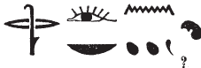

## Esna 263 {-}  
  
  

- Location: Column 8
- Date: Antoninus Pius 
- [Hieroglyphic Text](https://www.ifao.egnet.net/uploads/publications/enligne/Temples-Esna003.pdf#page=206){target="_blank"}  
- Bibliography: @sauneron-5, pp. 370-371.

  

^24^ *dwȝ ẖnmw  *  
*ḏd-mdw  *  
   
*ỉnḏ-ḥr=k  *  
*ẖnmw-Rʿ nb sḫ.t  *  
*Šw zȝ-Rʿ  *  
*psḏ=f m ẖ.t   *  
*n mw.t=f Nw.t  *  
*(r) sḥḏ tȝ  *  
    
*ỉw=k rs.tw  *  
*twt ʿȝ-ms.w  *  
*qmȝ ḏ.t rn=k  *  
*mn(.w) r nḥḥ  *  
      
*ḏȝỉ=k ḥr.t  *  
*ẖnm=k nṯr.t  *  
*psḏ=k   *  
*ḫsr.n=k kkw  *  
  
*nṯr.w rmṯ ḥʿʿ.w  *  
*m wbn=k  *  
*ʿ.wt nb.w m ršrš  *

^24^ Hymn (to) Khnum.  
Words spoken:  
  
Greetings,  
Khnum-Re Lord of the Field,  
Shu, son of Re,  
as he shines from the belly  
of his mother Nut,  
(in order to) illumine the earth  
  
You are awake!  
You are great of radiance,  
'He who creates Eternity' is your name,  
enduring forever.  
  
As you sail across heaven,  
so you join with the divine eye,  
so you might shine,  
having driven away darkness.    
  
Gods and people rejoice  
from your shining;  
all animals are in ecstacy.   

*ntk nb nḥḥ  *  
*ỉrỉ ḏ.t  *  
*wʿ ỉwty sn=f   *  
*m-m nṯr.w  *  
    
*psḏ.t (ḥr) ỉr(.t) n=k ỉȝw  *  
*ʿ.wt nb (ḥr) ỉr(.t) n=k* ^25^ *hn  *  
     
*wn(.w) n=k ʿ.wy   *  
*m ȝḫ.t ỉȝbt.t  *  
*sḥḏ.n=k bȝ.w ỉmnty.w  *  
     
*ḥtp ḥr=k nfr   *  
*n (antnyns nty-ḫwỉ)|  *  
*dỉ=k n=f (p)tr nb   *  
*n ỉr.ty=k  *  
  
You are the lord of cyclical eternity,  
who made linear eternity.  
The unique one, without his peer  
among the gods.  
  
The Ennead makes adoration for you,  
all animals make hn-praise ^25^ for you.  
  
The doors are open for you  
in the Eastern Horizon,  
as you have illumined the Western Bas.  
  
May your goodly face be king  
for (Antoninus Augustus)|!  
May you give him all sight  
of your own two eyes.[^fn-263-1]  

[^fn-263-1]: 
{width=25%} - @sauneron-5, p. 371, rendered the conclusion as: "Accorde lui que tout œil voie grâce à .........(?)!" The text is quite simple, and requests the Emperor might have the same range of vision as Khnum.
