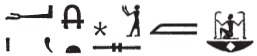
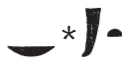

## Esna 264 {-}  
  
  

- Location: Column 8
- Date: Antoninus Pius 
- [Hieroglyphic Text](https://www.ifao.egnet.net/uploads/publications/enligne/Temples-Esna003.pdf#page=207){target="_blank"}  
- Bibliography: @sauneron-5, pp. 371-372.

  

^25^ *ky dwȝ ẖnmw  *  
*ḏd-mdw  *  
     
*ỉnḏ-ḥr=k  *  
*ẖnmw-Rʿ nb sḫ.t  *  
*sḥḏ.n Rʿ  *  
*zȝ smsw n Ỉtm  *  
*pȝwty tpy  *  
*ḥqȝ m šȝʿ  *  
*ʿȝ šfy.t   *  
*ḥqȝ tȝ.wy  *  
      
*ẖnmw qdỉ  *  
*šȝʿ ỉḫt nb.w  *  
*Ptḥ ỉr ḥmw.w  *  
     
*rmn štȝ.t  *  
*twȝ s(y) m ḥḥ  *  
*wbn nṯr ỉm=f  *  
     
*nb mʿbȝ qȝ-ʿ  *  
*sḫr ḫfty  *  
^26^ *m ḫ.t n sḫ.t  *  
  
^25^ Another hymn of Khnum.  
Words spoken:  
  
Greeting to you,  
Khnum-Re Lord of the Field!  
He whom Re illumined,  
eldest son of Atum,  
the First Primeval one,  
ruler in the beginning,  
great of prestige,  
ruler of the Two Lands.  
  
Khnum the Builder,  
who began all things;  
Ptah who made the handiworkers.   
  
He who supports the mysterious sky,  
and who lifts it up as Heh,[^fn-264-1]  
through whom the god rises.  
  
Lord of the Harpoon, Tall of arm,  
who fells the enemy  
^26^ with a stick of the field.[^fn-264-2]  

[^fn-264-1]: {width=22%} - @sauneron-5, p. 271, translated this passaage as "La cabine (*ʿfd.t* ??) l'adore sous la forme de Héh", noting "Texte sans doute corrompu." However, if *štȝ.t*, here without determinative, is the same word frequently used for "sky" at Esna (cf. a similar spelling in [Esna 372, 15]), then the following verb could be a phonetic variant *dwȝ* for *twȝ*, "to lift up." All these actions are of course appropriate for Khnum Lord of the Field as Shu, the main theme of the hymns on Column 8.
[^fn-264-2]: This sequence of epithets also occurs in [Esna 194], B. It refers to the ritual of "seizing the baton" by Khnum Lord of the Field on Epiphi 20, as commemorated throughout Column 8; see especially [Esna 259].

*nb ḫbz.wt  *  
*ʿȝ wrr.t  *  
*ḥqȝ.n=f tȝ.wy  *  
*m nḫt=f  *  
     
*wr pḥty  *  
*ỉṯ m sḫm=f  *  
*bȝ nḫt  *  
*ḥwỉ ḫrwy.w=f  *  
      
*sḥḏ m ỉwn-ḥʿʿ  *  
*rnp=f r nw=f  *  
*ỉʿḥ wp r'.w=sn  *  
*ḫʿỉ m bỉȝ  *  
*ḥȝy m grḥ  *  
      
*Šw zȝ-Rʿ  *  
*ỉr psḏ.t  *  
      
*ḥtp ḥr=k nfr   *  
*n nsw.t-bỉty  *  
*(ȝntnyns ḫwỉ)|  *  
*mr=k  *  
*dỉ=k n=f qn *  
*r-ʿ stw.t=k  *  
  
Lord of the divine beard,[^fn-264-3]   
great of double crown,  
having ruled the two lands  
through his victory.  
  
Great of strength,  
who seizes through his power,  
mighty Ba,  
who strikes his opponents.  
  
He who illumines as the moon,  
and rejuvenates at his time:  
moon who divides their fractions,[^fn-264-4]  
who appears in the firmament,  
ahd shines in the night.  
  
Shu, son of Re,  
who made the Ennead.  
  
May your face be kind  
to the King of Upper and Lower Egypt  
(Antoninus Augustus)|  
whom you love;  
give him victory   
to the extent of your solar rays.

[^fn-264-3]: {width=12%} - @sauneron-5, p. 371, n. 3, declined to translate this group. However, the curved sign is just an ideogram for *ḫbz.wt*, "beard", and this epithet also occurs in *Esna* II, 12, 14; *Esna* IV, 454, 2; *Esna* VII, 554, 16. The same sign writes *ḫȝbs.w*, "decan stars" elsewhere in *Esna* II, 106, 3; 147, a fact which probably explains the star hieroglyph here.
[^fn-264-4: This statement probably alludes to the fractional notation used to designate festival dates on calendars.

