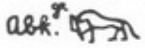

## Esna 268 {-}  
  
  

- Location: Column 8
- Date: Hadrian or Antoninus Pius 
- [Hieroglyphic Text](https://www.ifao.egnet.net/uploads/publications/enligne/Temples-Esna003.pdf#page=215){target="_blank"}  
- Bibliography: Cf. entries in [Tempeltexte 2.0](http://www.tempeltexte.uni-tuebingen.de/portal/#/text-detail/1072){target="_blank"}

  

^A^ *nṯr nfr  *  
*bỉk nṯry  *  
*ḥqȝ m srḫ   *  
*[...]  *  
*[sḥ]r sbỉ.w   *  
*r Pr-nṯr  *  
  
*khb nḫt  *  
*ḥzȝ mds ky.w  *  
*m-ḫnt sḫ.t  *  
   
*Mnḥwy ʿšȝ-dm  *  
*nb ḥw.t-ḥtp  *  
*ḥr-ỉb ḥw.t-bȝ.w  *  
*ḥqs tp.w sbỉ(.w)  *

^A^ The good god,  
divine falcon,  
ruler on the *serekh*  
[...]  
[who rep]els rebels   
awar from Per-netjer.  
  
The strong warrior,  
fierce one, who wounds[^fn-268-1] the enemies  
within The Field.  
  
Menehwy, numerous of knives,  
Lord of Hut-hetep,  
within Temple of the Bas,  
who decapitates the rebel(s).  

[^fn-268-1]: {width=7%} - Apparently a variant of the lion (*mȝỉ*) carrying a knife (*ds*) to write *mds*, as recorded for this word in *Wb* II, 183, 10-11: {width=12%}

^B^ *nṯr nfr  *  
*sr ʿȝ wr šps  *  
*rdỉ ṯȝw *  
*n bw mr=f  *  
    
*ḏȝỉ p.t tȝ *   
*m hh=f  *  
*snsn fnḏ.w nb.w ỉm=f  *  
*rwḏ rwḏ.w nb.w m fd.t=f   *  
*ʿnḫ.w m mȝwy=f  *  
   
*ẖnmw-Šw   *  
*nb ʿnḫ ḫnt Pr-nṯr  *  
  
^B^ The good god,  
the very great, august ram,  
who gives air   
to whomever he likes.  
  
Who sails across heaven and earth  
with his own breath (as wind),  
all noses breath from it,  
all plants thrive from his sweat,  
and one lives from his rays:  
  
Khnum-Shu,  
Lord of Life within Per-netjer.  

