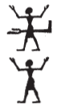
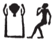

## Esna 271 {-}  

- Location: Column 5
- Date: Domitian 
- [Hieroglyphic Text](https://www.ifao.egnet.net/uploads/publications/enligne/Temples-Esna003.pdf#page=217){target="_blank"}  
- Bibliography: None

Cartouches of Heka, before Khnum. Conventional spellings.

Heka's name is spelled:  
  
{width=6%}&nbsp;&nbsp;2, 6; {width=9%}&nbsp;&nbsp;4, 8;
