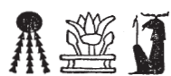

## Esna 272 {-}  
  
  

- Location: Column 9
- Date: Domitian 
- [Hieroglyphic Text](https://www.ifao.egnet.net/uploads/publications/enligne/Temples-Esna003.pdf#page=219){target="_blank"}
- Bibliography: @sauneron-5, pp. 142-144; see also [Tempeltexte 2.0](http://www.tempeltexte.uni-tuebingen.de/portal/#/text-detail/1085){target="_blank"}

  

^1^ *ḥnk sšn n š*  
*ḏd-mdw*  
   
*ẖnmw-Rʿ nb tȝ-sn.t*  
*mn n=k nḫb ʿnḫ*  
*prỉ m š ʿȝ n Ḫmnw*  
*ỉr n mw Ḫmny.w*  
*m qȝy qȝ*  
*m šȝʿ ḫp(r)*  
   
*ỉnm=f m nbw*  
*gȝb.wt=f m ḫsbḏ n mȝʿ.t*  
*ʿr šps n mw.t=f* ^2^ *ỉh.t*  
*wbn=f m ḥwnw=f*  
*šps ḥʿw=f m Nfr-tm*  
   
*wn=f ỉr.t=f*  
*ḫrs.n=f kkw*  
*sḫpr.n=f wnn.t nb*  
*m tȝ pn*  
*Ḫmny.w m ỉȝw n ḥr=f nfr*  
   
*šȝʿ.n=f kȝ.t*  
*m zp tpy*  
*rmy=f ḫpr rmṯ.w*  
*twt=s(n) n=f m mšʿ*  
^3^ *zbṯ=f ḫp(r) nṯr.w*  
*ẖmn.n=f psḏ.t dmḏ*  
  
^1^ Offering the lotus of the lake.  
Words spoken:  
  
O Khnum-Re,[^fn-272-1] Lord of Esna,  
receive the living lotus blossom,  
which comes from the Great Lake in Hermopolis,  
made with the seed of the Ogdoad  
in the high mound,  
at the beginning of existence.  
  
Its color is gold,  
and its petals are true lapis lazuli.  
The august bud of his mother, ^2^ the Ihet cow,  
he rose during his rejuvenation,  
and his body is august as Nefertem.  
  
As he opens his eye,  
he dispelled the darkness,  
and created all that exists  
in this earth.  
The Ogdoad are in praise of his good face.  
  
He began works  
in the initial moment:  
as he cried (*rmy*), so came about people (*rmṯ*)  
they belong to him as an army.  
^3^ As he laughed, so came about gods,[^fn-272-2]    
he modeled the complete Ennead.  

  

[^fn-272-1]: {width=12%} - Note the remarkable spelling of Khnum's name here, evoking the blossoming of the primeval lotus from the Great Lake of Hermopolis at sunrise. The same symbols appear in this spelling of Esna as well.

[^fn-272-2]: The wordplay in this verse is not as clear as with the etymology of "humans (*rmṯ*)" above. An explanation can be found in the Neith cosmogony, [Esna 206], 9: when Re laughs, the gods (*nṯr.w*) come into existence from the spittle (*ntt/nṯnṯ*) on his lips. Cf. also *Esna* II, 163, 16-17.

*ḫtỉ(?) n=f tȝ-ṯnn mnẖ*  
*(ḥr) nḫb n=f nswy.t=f*  
*(ḥt) ṯnỉ rn=f ẖnm.n=f*  
*ḥtp=f (ḥr) s.t=f*  
   
*ḫns=f r ỉw-ds.wy*  
*ỉw stwt=f ỉm r sḫ.t-ẖnmw*  
*ỉw=f m bȝ n ȝḫ šps*  
*m ḥr n sr*  
*qs.w=f m ḥḏ*  
*ỉwf=f* ^4^ *m nbw*  
*ḥry-tp=f m ḫsbḏ n mȝʿ.t*  
   
*ẖnmw-Rʿ nb tȝ-sn.t*  
*wbn=k m ȝḫ.t*  
*ḏȝỉ=k p.t m ḥtp*  
*wbn=k m wỉȝ n ḥḥ*  
*dỉ.n=k wnn.t nb*  
*pr m ỉr.t=k*  
*ḥrr.w nb*  
*pr m ȝḫ.ty=k*  
   
*ẖnmw-Rʿ nb tȝ-sn.t*  
*mn n=k ỉr.t Ḥr*  
*ḫnm nty Nfr-tm*  
^5^ *zȝ mnḫ n Ḫmny.w*  
*ỉwʿʿ ʿnḫ pr m Nwn*  
*wtṯ n ṯȝy 4*  
*ms n ỉd.wt 4*  
   
*ȝḫty šps*   
*pr m N.t*  
*sḫm nfr ḫnty sḫ.t*  
*pr m š n ỉdḥ.w *   
*m ʿr *  
*pr ỉm=f ḥr s.t *  
*n.t mw.t=f ỉh.t*  
  
Tatenen inscribes(?) a cartouche for him,  
assigning him his kingship,  
distinguishing his name which he fashioned,  
so he might rest (upon) his throne.  
  
Then he goes to the Lake of Knives  
(that place resembles the Field of Khnum),  
he has the visible form of the August Ba,  
with a ram head,  
his bones are silver,  
his flesh ^4^ is gold,  
and his hair is true lapis lazuli.  
  
Khnum-Re Lord of Esna:  
may you rise in the Akhet,  
and travel the sky in peace.  
You shine in the bark of millions,  
having given all that exists,  
which came from your eye(s);  
all flowers  
which came from your luminous eyes.  
  
Khnum-Re Lord of Esna:  
receive the Eye of Horus,  
the scent of Nefertem,[^fn-272-3]  
^5^ beneficent child of the Ogdoad,  
living heir who emerged from Nun,  
begotten by the Four Males,  
and born of the Four Females.    
  
August one of the horizon,  
who came forth from Neith,  
good power, foremost of the Field,  
who emerged from the lake of reeds   
as a bud,  
from which he emerged upon the throne  
of his mother, the Ihet cow.  

[^fn-272-3]: Compare [Esna 273], 7.

*ẖnmw-Rʿ nb tȝ-sn.t*  
*mn n=k ỉr.t Ḫr*  
*ỉn n=k ỉt=k Nwn*  
^6^ *sšn šps*  
*nḏm sṯỉ*  
*fd.t nṯr*  
*pr m Qbḥw*  
   
*ḥnk st n=k Ḏḥwty m Mȝʿ.t*  
*sȝḫ=f tw *  
*m dwȝ.w štȝ.w*  
*nḏm=f fnḏ=f*  
*m ẖr.t-hrw nt rʿ-nb*  
  
*nfr ỉb=k*  
*ẖnmw-Rʿ nb tȝ-sn.t*  
*smȝʿ-ḫrw=k r ḫfty.[w=k]*  
  
Khnum-Re Lord of Esna:  
receive the Eye of Horus,  
which your father Nun brings to you,  
^6^ the august lotus blossom,  
sweet of smell,  
the divine efflux,  
which came forth from Qebehu.[^fn-272-4]   
  
Thoth offers them to you as Maat,  
and he transfigures you  
with mysterious hymns;[^fn-272-5]  
he sweetens your nose,  
in the course of every day.  
  
May your heart be glad,  
Khnum-Re Lord of Esna.  
your are justified over [your] enem[ies].  

[^fn-272-4]: Compare [Esna 274], 7-8.
[^fn-272-5]: Note that the creator hymn to Amun-Re from Hibis, which is recited by the Ogdoad and contains multiple similarities to this text, is also called "the great, mysterious hymn": *Hibis* III, Pl. 32, col. 1; @klotz-ram, p. 136.