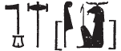
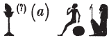
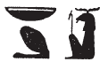
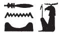
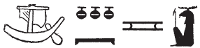
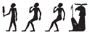
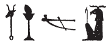
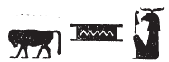
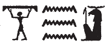

## Esna 277 {-}  

  

- Location: Column 9
- Date: Domitian 
- [Hieroglyphic Text](https://www.ifao.egnet.net/uploads/publications/enligne/Temples-Esna003.pdf#page=228){target="_blank"}  
- Bibliography: @sauneron-5, pp. 163-164; @ruter, pp. 65-69; see also [Tempeltexte 2.0](http://www.tempeltexte.uni-tuebingen.de/portal/#/text-detail/1090){target="_blank"}  

NB: This hymn continues in [Esna 366] and [Esna 355].

^19^ *r'.w n(.w) rdỉ.t snḏ*  
*n bȝ wr-šfy.t*  
*ḥr sqȝ bȝw=f*  
*r nṯr.w rmṯ.w*  
*ḏd-mdw*  
    
^19^ Verses of creating fear  
for the Ba, Great of Prestige  
while elevating his power,  
above gods and humans.  
Words spoken:

**§1** &nbsp;&nbsp; {width=14%} 

*snḏ n ẖnmw*  
*ỉmy.w p.t*  
*wḏȝ n wṯz.t*   
*r-ʿ=f*  
  
*[ntf twȝ Nw].t *  
^20^ *m ḫprw=f*  
*sȝḥ ẖr hȝy.ty*  
*m sʿr rʿ-nb*  
   
Have fear for Khnum,  
those within the sky!  
The well-being of the sky  
is in his control.  
  
[He is the one who lifts up Nu]t,  
^20^ in his form,  
who arrives bearing the firmaments,  
as the rising-wind, every day.  

**§2** &nbsp;&nbsp; {width=12%} 

  

*snḏ n ẖnmw*  
*ỉmy.w tȝ*  
*grg n ḫt-mn*  
*ẖr ḏr.t=f*  
  
*ntf nb nḥp*  
*qdỉ qmȝ*  
*r ḏr-ỉb=f*  
*r nḥḥ*  
   
Have fear for Khnum,    
those within the earth.  
The populating of the world  
is in under his control.  
  
He is Lord of the Potter's Wheel,  
the builder who creates   
according to his heart,  
for eternity. 
 

**§3** &nbsp;&nbsp; {width=12%} 

*snḏ n ẖnmw*  
*[ỉmy.w dwȝ.t]*  
*[srq ḥty.t(?)]*  
^21^ *m ỉd.t=f*  
  
*ntf nṯr ʿȝ*  
*štȝ šps m ḥw.t-ʿȝ.t*  
*ỉs-nỉȝ*  
*sʿnḫ s(ʿ)ḥ *  
*m ḏ.t=f ḏ.t*  
   
Have fear for Khnum,  
[those within the Duat]  
[throats breathe(?)]  
^21^ through his divine scent.    
      
He is the great god,  
remote and august in the *ḥw.t-ʿȝ.t*,  
a sweet breath of air  
who enlivens the mummy   
in his body, eternally.[^fn-277-1]
 

[^fn-277-1]: Similar terminology refers specifically to Khnum the Good Protector in [Esna 196], 10-11. There, in his form of Shu of Per-Khnum of the Field, he takes care of Atum, Osiris, and other Heliopolitan dead through his sweet breath.

**§4**  &nbsp;&nbsp; {width=12%} 

*snḏ n ẖnmw*  
*m grḥ*   
  
*ntf [wr?] bỉȝ.t*  
*sr ỉỉ*  
*ỉwn n bỉȝ*  
*rdỉ zḫn n tȝ*   
*[...]*  
  
Have fear for Khnum  
during the night!  
  
He is [great?] of oracles,  
who announces what will happen.  
Moon of the sky,  
who causes astral influence[^fn-277-2] on earth  
[...]

[^fn-277-2]: For this nuances of the word zxn, see @quack-monumental, p. 116, n. k.

**§5**  &nbsp;&nbsp; {width=13%} 

  

^22^ *snḏ n ẖnmw*  
*m hrw*  
   
*ntf bȝ šfy.t ḥȝ.t*  
*m-m psḏ.t*  
*ʿȝ nbỉ.t ḫnty ȝḫ.t*  
*nb wḏ*  
*ḏd ḫp(r)*  
*m rn=f pfy n nḥḥ(?) *  
  
^22^ Have fear for Khnum  
during the day!  
   
He is the ram-headed Ba  
among the Ennead,  
great of flame within the Akhet;  
Lord of command,  
who says what will happen,  
in this his name of Eternity(?).[^fn-277-3]  

[^fn-277-3]: {width=15%} - Reading suggested by @ruter, p. 66. Alternatively, since this verse refers to Khnum as imperious sun during the day, one might alternatively suggest reading *ʿḥʿy*, "he of the mid-day," an epithet of Re that occurs in [Esna 331], 13: {width=14%}.

**§6**  &nbsp;&nbsp; {width=7%} 

*snḏ n ẖnmw*  
*m ȝ.t nb.w*  
   
*ntf nb dndn*  
*mḥr ȝ.t*  
*ʿȝ.wy bȝw=f*  
*r Sḫm.t m sḫm=s*  
*nš[n...]*  
  
Have fear for Khnum    
at all times (*ȝ.t*)!  
    
He is the lord of rage,  
fierce of moment (*ȝ.t*):  
how much greater is his force  
than Sakhmet in her strength![^fn-277-4]  
Ragi[ng of ...]  

[^fn-277-4]: Despite the apparent spelling of *ʿȝ*, and the alternative suggestion by @sauneron-5, p. 167, n. j, this reading of this horizontal sign as *sḫm* is based on the parallel epithets in [Esna 375], A; [Esna 392], 20.

**§7**  &nbsp;&nbsp; {width=7%} 

^23^ *snḏ n ẖnmw*  
*ḏw.w m ỉnr *  
*m-ʿb ʿȝ.wt nb.w*  
*pr=tn ỉm=f r-ȝw=tn*  
   
*ntf ỉr ḥmw*  
*ỉqr pḥty=tn*   
*m mnw.w=f*  
   
^23^ Have fear for Khnum  
mountains, of minerals,   
and of all precious stones!  
All of you come forth from him.    
  
He is the one who acts as artisan,  
and your strength is excellent  
being his statues.  

**§8**  &nbsp;&nbsp; {width=20%} 

*snḏ n ẖnmw*  
*n(ȝ)y nt(t) m wȝḏ-wr*  
*ṯȝw wn(.w) r-ʿ=f*  
*[...]*  
   
^24^ *ntf ỉry-ḥmw nfr*  
*n dỉ s(w) m ỉb=f*  
*spr swȝš=f*  
*r ʿnḏ-wḏȝ*  
     
Have fear for Khnum,    
those who are in the Sea,  
for air depends on him   
[...]  
  
^24^ He is a good oarsman,[^fn-277-5]  
for whomever puts him in his heart;  
all his worshippers    
arrive safe and sound.  
  

[^fn-277-5]: This is another common epithet of Khnum the Good Protector of North Esna: *LGG* I, 408c-409a.

**§9**  &nbsp;&nbsp; {width=13%} 

*snḏ n ẖnmw*  
*srq.w-ḥty.t*  
*ḥr ỉr(.t) kȝ.t=sn*  
   
*ntf tȝ-ṯnn pfy*  
*ʿȝ ỉrw*  
*Ptḥ msỉ ḥmw.w*  
*nn kȝ.t ḥr tȝ*  
*m ḫm kȝ=f*  
    
Have fear for Khnum,  
all mortals (lit. breathing necks)[^fn-277-6]  
carrying out their jobs!  
  
He is this Tatenen,  
great of form;  
Ptah, who birthed the artisans.  
There is no work on earth  
of which his Ka is ignorant.

[^fn-277-6]: Following the interpretation by @sauneron-5, p. 169 (*contra* @ruter, p. 68, n. 320), this seems to be a phrase designating humans, perhaps in contrast to the common phrase at Esna: *gȝ.w-ḥty.t*, "those with closed throats (= fetuses in the womb)." For more examples of this phrase, see [Esna 250], 21; [Esna 259], 3 (5); [Esna 371], 19; and possibly *Esna* II, 17, 39; [Esna 387], 5. See similarly @pichel, p. 65, n. a.

**§10**  

*snḏ [n ẖnm]w*  
*ʿnḫ.w nw tȝ nb*  
   
^25^ *ntf nb tȝ-sn.t*  
*ẖnm=tn ḥr nḥp=f*  
*ỉr=f n=tn ʿ.wy=f*  
*r sḫr.w=tn*  
*m ỉḫt nb tp tȝ*  
    
Have fear [for Khnu]m,  
those living in all lands!  
  
^25^ He is the Lord of Esna,  
who models you upon his wheel;  
his moves his hands for you  
to (make) your conditions,  
from all things upon earth.  

  

**§11**  &nbsp;&nbsp; {width=13%} 

*snḏ n ẖnmw*  
*n(ȝ) nty ỉb=sn r ʿnḫ*  
   
*ntf bȝ pfy*  
*wr bȝw*  
*nb ṯȝW*  
*ʿnḫ mwt ẖr s.t-r'=f*  
*šw r=f *  
*wšr snf ỉm=f*  
   
Have fear for Khnum,  
all who desire life!  
    
He is this Ba,  
great of power,  
Lord of air,  
life and death are in his control.  
Whoever lacks him:    
his blood dries up.    

**§12**  &nbsp;&nbsp; {width=8%} 

^26^ *snḏ n ẖnmw*   
*nȝ nty wnm bš*  
   
*ntf bȝ m kȝr=f*  
*ḫnt sḥ n wnm*  
*nb mẖr.t*  
*sš mẖt.w r-ȝw*  
  
^26^ Have fear for Khnum,  
all who eat and excrete!  
    
He is the Ba in his shrine,    
foremost of the dining hall,    
lord of food,    
who keeps all digestive organs clear.  

**§13** &nbsp;&nbsp; {width=15%} 

*snḏ n ẖnmw*     
*ḫȝsty.w nty(.w) ʿnḫ=sn *  
*m ḥȝy.t n(.t) ḥr.t*  
*ṯȝw ȝm(.w) m ḫfʿ=f*  
   
*ntf ỉnỉ ṯȝw*  
*ỉn n=tn kȝpw*  
^27^ *r gp qȝy.wt=tn*
  
Have fear for Khnum,    
foreigners who live  
from the rain of the sky:  
(for) wind is held in his grasp.  
  
He (himself) is the wind,  
which brings to you rain clouds,  
^27^ to flood your high grounds.  

**§14**  &nbsp;&nbsp; {width=15%} 

*snḏ n ẖnmw*     
*nȝ nty ỉȝd(.w) m ỉȝd.t*  
   
*sbḥ n=f*  
*nṯr pfy ẖr p.t*  
*wbȝ=f n=tn zȝ.t=f Nw.t*  
*m fd.t ȝb=tn*  
   
*mȝȝ r p(ȝ) wḫȝ n ḫft-ḥr*  
*n rsy.t-ỉmnty.t*   
   
Have fear for Khnum,  
those who lack moisture!  
  
Cry unto him,   
this god bearing the sky:  
he will open his daughter Nut for you,  
with the rain (lit. sweat) you desire.  
   
(Look to the column of the forecourt  
to the south-west [Esna 366]).  
  

   

