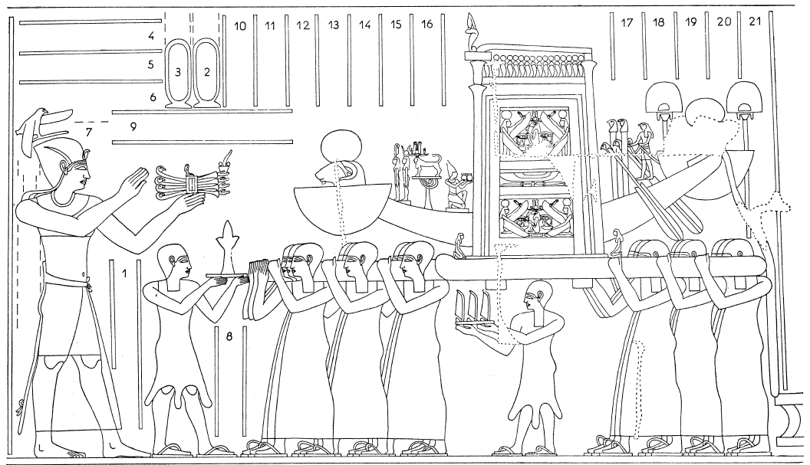

## Esna 284 {-}  
  
  

- Location: Column 10
- Date: Domitian 
- [Hieroglyphic Text](https://www.ifao.egnet.net/uploads/publications/enligne/Temples-Esna003.pdf#page=239){target="_blank"}
- Bibliography: @sauneron-5, pp. 127-135; see also [Tempeltexte 2.0](http://www.tempeltexte.uni-tuebingen.de/portal/#/text-detail/1104){target="_blank"} 

  

^1^ *ỉr m-ḫt wnw.t 3.t*  
*ỉỉ(.tw) m hrw*  
*nỉs n ỉmy-p.t*  
*swʿb ỉn ḥm.w-nṯr.w*  
*m š wʿb n r-pr pn*  
*ỉỉ m ʿbw*  
   
*nỉs nty-ʿ n ḫʿ*  
*ỉn ẖry-ḥb ḥry-tp*  
   
*sr nṯr ḏsr wȝ.t*  
*ỉn p(ȝ) sš mḏȝ.t-nṯr*  
   
*sḫʿ nṯr pn šps*  
*ẖnmw-Rʿ nb tȝ-sn.t*  
*m ḥḏ=f r rwty*  
  
^1^ Now after the third hour    
has arrived in the day,    
the star-watching priest announces (it);   
the prophets are purified   
in the sacred lake of this temple,    
and arrive in purity.  
   
Recite the ritual of appearance    
by the Chief Lector Priest.  
  
Announce the god, sancitfy the path,    
by the Scribe of the God's Book.  
  
Procession of this august god,   
Khnum-Re Lord of Esna,  
from his shrine to the outside.  

*rmn nḥp ẖr-ḥȝ.t=f*  
*ỉn ḥȝty-ʿ wr*  
*šm ỉmỉ.tw bqnqn.w*  
*ẖnm ỉtn*  
*ỉn nṯr pn ʿȝ*  
   
*ỉsk wʿ nb ḥr ỉrw=f*  
*wr.wy mȝȝ m mr.t*  
*nn wbȝ.tw ỉmn.w*  
   
*wr.wy ḏsr ḥm=f n bỉȝ.t*  
*ẖnm=f pr=f *  
^3^ *m-m šms.w=f*  
  
*ḥtp ỉn ḥm n nṯr pn*  
*ẖr hȝy(.t)*  
*m ʿq pr=f*  
*nfry.t r wnw.t 9.t*  
*m tpy n.t 3.nw n pr.t*  
  
Carrying the potter's wheel before him    
by the Great Governor;[^fn-284-0]      
travel among the guardian deities,[^fn-284-1]    
union with the sundisk,     
by this great god.    
    
Meanwhile everybody performs their role.  
How great is it to behold in the streets!  
But without revealing any hidden parts.  
  
How great is the sanctity of his Majesty   
while on the sacred road,   
until he unites with his temple  
^3^ among his follower.  
  
This god comes to a stop  
underneath the kiosk;  
do not enter his temple   
until the 9th hour  
of III Peret 1 (= [Phamenoth 1](https://bookdown.org/shemanefer/Esna2/calendar-ii-77.html#phamenoth-1)).  

[^fn-284-0]: As @sauneron-5, p. 127, n. 2, noted, a similar ritual is depicted elsewhere in *Esna* VI, 543: {width=35%}
[^fn-284-1]: These are the protective divinities on standards who clear the path during processions, as depicted in [Esna 52](https://bookdown.org/shemanefer/Esna2/north-anta-71-76.html?q=pr-wr#above-the-gods-on-the-standards), 17 and [Esna 74](https://bookdown.org/shemanefer/Esna2/north-anta-71-76.html?q=pr-wr#above-the-gods-on-the-standards), 33.

*smn nḥp=f*  
*ẖr ʿ n ỉfdw=f*  
*n bw nb wnn=f ỉm*    

*zȝ.tw r=f*  
*r rdỉ(.t) rwỉ=f r=f*  
*ḥr-nty qmȝ.n=f grg-tȝ ỉm=f*  
^4^ *ḥr.tw ḥr=s wr zp-snw*  
   
*nṯr pn pw*  
*grg tȝ m kȝ.t=f*  
*Ptḥ pn*  
*qmȝ ḥmw.w*  
*ḥry-ỉb ṯpḥ.t-ḏȝ.t*  
  
Set up his potter's wheel  
in each of his four corners,  
of all place where he might be.   
  
Be very careful,    
lest it slip away from him,    
because he created -  
populating the earth - by means of it.  
^4^ Avoid it very greatly!  
  
For he is this god,   
who populates the earth through his work,   
this Ptah,[^fn-284-2]    
who creates the artisans   
within the Blocked Cavern (of Memphis).

[^fn-284-2]: During this festival of "Lifting up Heaven", Khnum is first associated with Ptah (artisan who uses the potter's wheel), and then Shu-Heh who hold up the sky (identified here with the kiosk's roof). The separation of heaven from earth by Heh (sportively alluded to in the spelling of Ptah's name) is the preliminary step of creation, and the cosmic potter's wheel supporting the sky then produces all living beings. For this complex network of religious concepts, see primarily @berlandini-1995.

*ỉw.tw ḥtp kȝ=f*  
*ẖr hȝy.t ḥr rn=s*  
*ỉw wn=f ẖr ḥr.t*  
*m zp tpy*  
*Šw pw nty ẖr=s*  
*r-ḥn.ty*  
*m ḫprw=f pfy n Ḥḥ*  
   
^5^ *ỉw bȝ=f m bỉȝ.t*  
*ḥr ʿḫm=f n tȝ*  
*ḫnỉ ḥm=f ḥr bs=f*  
*n-mrw.t grg tȝ pn*  
  
His Ka then rests    
beneath the aforementioned kiosk,   
since he was once under the sky  
in the First Moment.   
It is Shu who is under it (the sky)   
for the limits of eternity,    
in his manifestation of Heh.  
  
^5^ His Ba arrives from the sky,   
upon his terrestrial image,    
his Majesty alights upon his statue,    
from the desire to populate this earth.
   

*wn=f m s.t=f*  
*ḥr qdỉ rmṯ.w*  
*(ḥr) ỉr(.t) ỉḫt nb*  
   
*ḥʿʿ ḥry-mk.t=f*  
*ḥr mȝȝ bw-nfr*  
*rwḏ ʿ.wy=f*  
*m nbỉ swḥ.t ḥr nḥp=f*  
*rʿ-nb*  
   
*qd.n=f rmṯ.w*  
^6^ *ms.n=f nṯr.w*  
  
*sṯnỉ.n=f nsw(.t) m ẖ.t*  
*ḥr sšm=f*  
*n-mrw.t sḥn n=f ỉḫt-mn*  
*r-ʿ nḥḥ*    
*nỉs.tw r=f*  
*m rn=f n zȝ-Rʿ*  
*(tmtyns ḫwỉ)|*  
*mry=f*  
  
He is on his throne,  
building humans,   
and making all things.   
  
His heart rejoices  
to see goodness;    
his hands are firm    
fashioning the egg upon his wheel,   
every day.  
  
As he modeled humans,   
^6^ so he birthed gods.  
  
He distinguished the king in the womb,   
guiding him,    
in order to confer the world to him,      
to the limit of cyclical eternity.    
He is called   
by his name of Son of Re,   
(Domitian Augustus)|,  
his beloved.
  

[^fn-284-3]: Throughout this text, a phrase that looks like *m-ʿ* occurs multiple times. Sauneron translated the examples as "in the hands of; along with", but this does not seem to make sense in every attestation. I assume this is a variant of *m-dỉ* for *m-ḏr*, "when; then." It might also be *mỉ*, a variant of the imperative *ỉmy*, "let; cause!"

*sḫʿ nṯr.w nty ḫʿỉ*  
*ḥnʿ nṯr pn*  
*ḥr ỉr(.t) ỉrw=sn*  
*n ỉr(.t) [qȝ?] šfy.t=f*  
*ỉw psḏ.t=f ḥtp(.w)*  
*ḥr wnmy ỉȝbty n nṯr [p]n*  
^7^ *ḥr-sȝ ẖnm ỉtn*  
  
Procession of the gods who appear  
alongside this god;  
performing their rites,  
of making [great?] his prestige;  
his Ennead rests   
to the right and left of [th]is god,  
^7^ after the union with the sun disk.

*ỉr ỉw wnw.t 4.t m hrw*  
*ỉỉ.ḫr ỉmy-p.t*  
*n pr pn*  
*nỉs.n=f ḥm.w šnʿ*  
*ḫrp ḥtp.w-nṯr.w fȝỉ ỉḫt*  
*m ḫft-ḥr n nṯr pn *  
*m t-nfr dnỉ.t ʿšȝ*  
*ḫȝḫ pz dnỉ.t ʿšȝ*  
   
^8^ *ʿtḫ.w(?) ẖr ds nt ḥnq.t *  
*ds ỉrp qby tỉrṯ.t*  
*ḥʿw n stp.w*  
*m-dỉ ỉn.tw=sn rnp.w*  
*mzy.w ʿšȝ*  
*sm.w ḥtp.w*  
  
Now when the 4th hour of the day comes,    
then the sky-watching priest   
of the temple arrives;    
he summons the servants of the storehouse:  
consecrating offerings, elevating food    
in the dromos of this god,  
consisting of many baskets of good bread,   
many baskets of *khakh*-bread and *pez*-bread.  
  
^8^ The brewers(?) bring jugs of beer,   
jugs of wine, situlae of milk,  
meet from choice cuts;  
and[^fn-284-3] they bring fresh plants,  
numerous bouquets,    
vegetables and plant offerings.  

*ỉmy-p.t ẖr-ḥȝ.t=sn*  
*ḥr sʿš m mrỉ.t nb*  
*n.t ḥw.t-nṯr*  
   
*ỉw ỉmy-rȝ ḥz.w*  
^9^ *m-sȝ ỉmy-p.t*  
*ḥr šzp dḫn.w*  
   
*ỉw kȝr.w ẖr rnp.w mzy.w*  
*ḥr-sȝ dḫ(n).w*  
   
*ỉw fȝỉ-mhr ẖr qby.w n ỉrṯ.t*  
*ḥr-sȝ kȝr.w*  
   
*ỉḥ.w ỉpn*  
*m-dỉ ỉn.tw=sn ḥr-sȝ [fȝỉ-mhr]*  

*mn[..] ʿnḫ.w*  
*m-dỉ ỉn.tw=sn mnḥ[wy.w] nn*  
^10^ *ẖr ʿ n stp.w *  
*ḥr-sȝ=sn*  
   
The sky-watching priest is before them,  
calling out in every avenue  
of the temple.  
  
The Overseer of Singers  
^9^ is after the sky-watching priest,  
conducting the musicians.  
   
Gardeners carrying fresh plants and bouquets  
are after the musicians.    
   
The situla-holder  
carrying jugs of milk,  
is after the gardeners.  
  
These animals   
they are brought after [the situla-holder].  
  
Living [...]  
then the butch[ers] are brought   
^10^ carrying limbs of choice cuts    
after them.   

*ḥm-nṯr ẖr sḥtpy*  
*ḥr swʿb m snṯr*  
*ḥr-sȝ=s(n)*  
   
*wdpw ẖr qby.w nty ỉrp*  
*ḥr-sȝ=f*  
   
*ʿtḫ.w(?) ẖr ds nty ḥnq.t*  
*ḥr-sȝ=f*  
   
*dnỉ.t ẖr ḫȝḫ*  
*m-ʿ ḥm.w šnʿ*  
*ḥr-sȝ=f*  
   
*dnỉ.t ẖr t-nfr*  
*mʿ ḥm.w šnʿ*  
^11^ *ḥr-sȝ=f*   
  
A prophet carrying a censer    
purifies with incense,  
after them.  
  
A waiter with jugs of wine  
after him;  
  
brewers(?) with jugs of beer  
after him.
   
Baskets with *khakh*-bread  
held by servants of the storehouse  
after him.  
    
Baskets with good bread    
held by servants of the storehouse  
^11^ after him.  

*ẖry-ḥb ḥry-tp*  
*sẖkr.w m ỉns wȝḏ*  
*ỉwn n ȝbw ḥr=f*  
*mnỉ.t n.t nbw r ḫḫ=f*  
*m tp n šfy.t*  
*mḏḥ(.w) m šw.t nỉȝ*  
*m tp=f*  
*qnỉ ḏȝỉ.w ḥr rmn=f*  
*ȝms ḥby.t*   
*m ʿ.wy=f*  
*ḥr nỉs* ^12^ *dbḥ.w ḥtp.w*  
*ḥr-sȝ=sn ȝw.w*  
   
*ntf sšm=sn*  
*ỉs ỉmy-r' gs-pr*  
*n pr pn*  
*sd.(w) m sd=f *  
*ḏsr m-ʿ=f*  
*ḥr ḫrp ỉȝwty.w ỉpn*  
   
The Chief Lector Priest,  
adorned in red and green cloth,  
a leopard skin draped over him,  
a golden menat around his neck,  
with an ornamental ram's head,   
crowned with ostrich plumes    
on his head,    
a sash fastened on his shoulder,    
the *ȝms*-scepter and festival papyrus   
in his hands,    
reciting the offering requests    
after all the others.  
  
It is he who leads them,  
that is the Overseer of the Temple   
of this temple,    
clothed in his outfit,  
a *ḏsr*-scepter in his hand,  
conducting these functionaries.  

*ỉw.tw (ḥr) ỉr(.t) qd pn*  
*zp fdw*  
*fȝỉ ỉḫt *  
*zp fdw*  
*šzp ỉḫt ʿšȝ bnr*  
*m ḫft-ḥr n nṯr pn *  
*m r' n hȝy.t*     
     
^13^ *ʿȝb.t*   
*ḥr ḥtpw ʿȝ wʿb*  
*m ḫft-ḥr*   
*n nb-nḥp*  
*sḏfȝ ḫȝ.wt*  
*m ỉḥ.w ȝpd.w*  
*ỉm-ḥḏ gḥs.w *  
*ṯȝy n nỉȝ.w*  
   
*qȝḥ-ʿ m ỉḫt nb.w nfr*  
*n kȝ n nb Ỉwny.t*  
*m-ʿb psḏ.t=f*  
   
One performs this circuit   
four times;  
elevate offerings  
four times;  
receive numerous, sweet offerings  
on the dromos of this god   
at the door of the kiosk.  
  
^13^ Great composite offering  
upon the great, pure offering altar,    
on the dromos  
of the lord of the Potter's Wheel;  
provision the altars    
with cattle, fowl,  
oryx, gazelle,  
and male antilope.  
   
Bend the arm with all good things,   
for the Ka of the Lord of Iunyt,   
along with his Ennead.

*sšm ḫz [m] hrw pn*  
*mzỉ dbḥ.w m-^14^-dbn*  
*n pȝ ḥtpw-nṯr*  
*m ḫȝw.t nms.t*  
   
*ʿȝb pȝ ḥtpw*  
*m t-nfr ḫȝḫ*  
*ỉrp ḥnq.t ỉrṯ.t*  
*stp.w rnp.w*  
*sṯȝ ḥtp.w*  
*ʿb ḥtp.w*  
*ʿȝb pȝw.t*  
*mỉ nty r-ḥȝ.t*  
   
Conduct the ritual [on] this day,    
bring requirements all ^14^ around    
the divine altar,  
on offering stands and vessels.   
    
Compose offerings on the great altar    
with good bread, *khakh*-bread,  
wine, beer, milk,   
choice cuts, fresh plants;    
drag in the offerings,   
assemble the offerings;    
offer the *pȝw.t*-bread   
just as described above.

