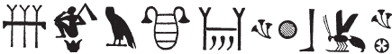
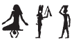
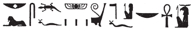

# Column 11 (298-314) {-}

## Esna 298 {-}  
  
  

- Location: Column 11
- Date: Trajan 
- [Hieroglyphic Text](https://www.ifao.egnet.net/uploads/publications/enligne/Temples-Esna003.pdf#page=257){target="_blank"}
- Bibliography: @leitz-loeffler, pp. 99, 104, n. jj (298, A)

**NB**: The first text is quite difficult, so it is produced here. This translation involves confusion between the similarly-shaped baskets (*nb, ḥb*) and the winged scarab (*ʿpy*, *ʿ*), attested throughout Esna. 
  
{width=50%}  
  

{width=13%}{width=48%}   

  

^A^ *ʿnḫ nṯr nfr  *  
*ṯḥn ḫʿ   *  
*m ỉdḥw(?) ȝḫ-bỉ.t  *  
*ms.tw=f r nb  *  
*sʿšȝ=f ḥb.w n nṯr=f  *  
*nb ʿnḫ  *  
  
*nb-tȝ.wy  *  
*(ȝwtwkrdr kysrs)|  *  
*mry ẖnmw-Rʿ nb sḫ.t  *  
  
^A^ Live the good god,  
scintillating of appearances  
in the marshes(?)[^fn-298-1] of Chemmis.  
He who was [^fn-298-2] born to be [^fn-298-3] Lord,  
so he might multiply festivals for his god,  
the Lord of Life (Khnum).  
  
Lord of the Two Lands,  
(Autkorator Caesar)|  
beloved of Khnum-Re Lord of the Field.  

[^fn-298-1]: Reading uncertain. The determinative, context, and final phonetic signs (*ḥ* < *ḥʿw*) suggests the term *ỉdḥw*, but it is unclear how the other signs function in this word.
[^fn-298-2]: The passive *tw* seems to be written with an ithyphallic, ram-headed god. Elsewhere at Esna, similar figures of Min write *m*, or *kȝ* (< Kamutef). Perhaps the phonetic value derives from *ṯȝy*, "(virile) male"?
[^fn-298-3]: The *ḥb*-basket seems to be confused for the winged sundisk (*ʿpy*), which can write the preposition *r* < *ʿ* < *ʿpy*. The subsequent winged sundisk sign, meanwhile, writes *ḥb* via similar confusion.

^B^ *ʿnḫ nṯr nfr  *  
*qd Mnḥy.t ẖnmw  *  
*nbỉ.n nb nḥp  *  
*sṯnỉ.n=f sw ỉmy ẖ.t  *  
*m-m qmȝ n grg-tȝ-pn  *  
*r nḥḥ  *  
*nsw.t-bỉty  *  
*nb-tȝ.wy  *  
*(tryns ḫwỉ)|  *  
*mry ẖnmw-Rʿ nb tȝ-sn.t  *  
  
^B^ Live the good god,  
product [^fn-298-4] of Menhyt[^fn-298-5] and Khnum,  
fashioned by Lord of the Potter's Wheel,  
having distinguished him in the womb  
among those the Founder of this Earth created  
for eternity.    
  
King of Upper and Lower Egypt,  
Lord of the Two Lands,  
(Trajan Augustus)|  
beloved of Khnum-Re Lord of Esna.

[^fn-298-4]: {width=5%} - Alternatively, this could be an unconventional phonetic spelling of *qd*, "to build," which fits the general syntax of this epithets better.
[^fn-298-5]: {width=15%} - As noted in @leitz-loeffler, p. 104, n. jj, the first sign likely writes *mn* < *mȝn*, "to see", and second writes *ḥ < ḥḥ*, "Heh." Thus *mn+ḥ+t*, "Menhyt."