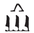

## Esna 299 {-}  

- Location: Column 11
- Date: Trajan
- [Hieroglyphic Text](https://www.ifao.egnet.net/uploads/publications/enligne/Temples-Esna003.pdf#page=258){target="_blank"}  
- Bibliography: None

Cartouches of Heka, before Khnum and Behedety. 

Heka's name is spelled:  
  
{width=6%}&nbsp;&nbsp;2 (*hȝỉ* + *qȝy*, "cultivatable field", evoking Heka as god of the harvest "descending to the field"); cf. @sauneron-8, p. 157, No. 212)   
{width=5%}&nbsp;&nbsp;5 (**H**orus + **G**eb; Heka as divine child is both Horus and Geb)  

{width=5%}&nbsp;&nbsp;8 (*ḥȝy*, "to shine" + *kȝ*)  
  
{width=6%}&nbsp;&nbsp;11 (*ḥwnw*, "child" + *kȝr*, "shrine"; depiction of Heka within his naos)
