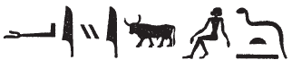

## Esna 304 {-}  
  
  

- Location: Column 11
- Date: Trajan 
- [Hieroglyphic Text](https://www.ifao.egnet.net/uploads/publications/enligne/Temples-Esna003.pdf#page=265){target="_blank"}
- Bibliography: @sauneron-5, p. 201; see also [Tempeltexte 2.0](http://www.tempeltexte.uni-tuebingen.de/portal/#/text-detail/1170){target="_blank"}

  

^16^ *ḏd.ỉn Mnḥy.t wr.t  *  
*nb.t ḫnt-tȝ  *  
*ḫr ẖnmw*   
*nb nḥp  *  
     
*nfr.wy nn ỉr.w.n=k  *  
*qdỉ.n=k nb n Km.t  *  
*sḫpr.n=f ỉty  *  
*ḥr ṯz(.t)=ỉ r ḥȝ.t=f  *  
   
*mḥn=ỉ ḥr tp=f  *  
*m rn=ỉ n* ^17^ *Mnḥy.t  *  
    
*ỉnk ḥḏ.t   *  
*m ỉrw=s n nr.t  *  
*ỉnk n.t  *  
*m sḫr.w=s n ỉʿrr.t  *  
*wn=ỉ m Wnw.t  *  
*ỉmỉ.tw wp.t nb mr=f  *  
*r nḥḥ  *  
   
*dỉ=ỉ sšm=f ḫwỉ(.w)(?)  *  
*r ỉr.n=k nb.w  *  
*m tȝ  *  
*r km(?) n ḏ.t  *  
   
^16^ Then Menhyt the great,  
Lady of Khent-ta,  
speaks before Khnum,   
Lord of the Potter's Wheel:  
  
How beautiful is that which you have done:  
as you modelled the lord of Egypt,  
so you have created the sovereign,  
lifting me up upon his forehead.  
  
I shall coil upon his head  
in my name of ^17^ Menhyt.[^fn-304-1]  
  
I am the white crown,  
in its form of a vulture;  
I am the red crown,  
in its condition of a uraeus;  
I exist as Wenut,  
upon the brow of the lord whom you love,  
for all cyclical eternity.  
  
I cause that his image is protected(?)  
from all those you have created[^fn-304-2]  
on earth,  
until the completion(?) of eternity.[^fn-304-3]

[^fn-304-1]: {width=14%} - This spelling evokes Menhyt's promise to "remain upon (*mn ḥr*)" the head of the king.
[^fn-304-2]: {width=16%} - @sauneron-5, p. 201, read the first verb as "placé" (*rdỉ*), but the preceding word suggests restoring an arm holding a flail to write *ḫwỉ*, considering the common phrase *sšm-ḫwỉ*, "protected image."
[^fn-304-3]: {width=22%} - @sauneron-5, p. 201, translated this phrase without comment as: "et pour toute le durée de l'éternité." Presumably the bull writes *k < kȝ*, and the seated man could write *m < nn*. One might compare the unusual alphabetic writings noted in @sauneron-1, p. 47.