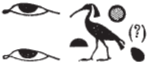

## Esna 306 {-}  
  
  

- Location: Column 11
- Date: Trajan 
- [Hieroglyphic Text](https://www.ifao.egnet.net/uploads/publications/enligne/Temples-Esna003.pdf#page=267){target="_blank"}- Bibliography: @sauneron-5, pp. 203-204; see also [Tempeltexte 2.0](http://www.tempeltexte.uni-tuebingen.de/portal/#/text-detail/1161){target="_blank"}

  

^20^ *ḏd-mdw n Nb.t-ww  *  
*ḥnw.t Ỉwny.t  *  
    
*ỉnk nb(.t)-ww   *  
*Rnn.t Wȝḏy.t   *  
*ḥnw.t sḫ.t  *  
    
*ỉnk šps.t wsr.t   *  
*ḫnt.t pr-ẖnmw  *  
*nb.t ʿḥ   *  
    
*mȝȝ ȝḫ.t=(ỉ)  *  
*ỉr.n=ỉ s.t-Nwn  *  
*m ỉw=f  *  
*m rn=ỉ pfy n Ỉs.t  *  
     
*rwḏ.n=ỉ (ḥr) ṯḥn  *  
*sḫpr.n=ỉ ỉḫt nb.t  *  
^21^ *ḥr šd ỉm=sn  *  
*r sʿnḫ ỉr.t nb.w  *  
*m-ḫt=k  *  
    
*zȝ=ỉ mr=ỉ  *  
*(pr-ʿȝ ʿnḫ ḏ.t)|  *  
*ỉw n=k sḫ.t  *  
*ẖr bw-nfr  *  
*sʿšȝ=ỉ nfrw   *  
*m rk=k ḏ.t  *
   
^20^ Words spoken by Nebtu,  
Mistresss of Iunyt:  
  
I am Nebtu,  
Renenutet-Wadjet,  
Mistress of the Field.[^fn-306-0]  
  
I am the august and mighty one,  
foremost of Per-Khnum;  
Lady of the Palace.  
  
Look at (my) excellent deed(s)![^fn-306-1]  
I made a place (*s.t*) for Nun  
at his arrival,  
in this my name of Isis (*Ỉs.t*).  
  
That which I have made grow sparkles,  
as I have produced all things,  
^21^ deriving nourishment thereof  
to enliven everybody   
in your following.  
  
My beloved son,  
(Pharaoh living eternally)|:  
the field belongs to you,  
bearing goodness;  
I have multipled good things  
in your time, forever.  

[^fn-306-0]: {width=18%} - Unetymological spelling of this word, probably inspired by the puns on "Isis" (*Ỉs.t*) and place (*s.t*) later in this text.
[^fn-306-1]: {width=14%} - Following the reading by @sauneron-5, p. 203. Alternatively, this could be a sportive writing of "Menhyt", with the two eyes writing *mn* < *mȝn*, "to see" (infinitive form); @sauneron-8, p. 126, 66.