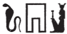

## Esna 307^bis^ {-}  
  
  

- Location: Column 11
- Date: Trajan 
- [Hieroglyphic Text](https://www.ifao.egnet.net/uploads/publications/enligne/Temples-Esna003.pdf#page=268){target="_blank"}
- Bibliography: @sauneron-5, pp. 207-208; see also [Tempeltexte 2.0](http://www.tempeltexte.uni-tuebingen.de/portal/#/text-detail/1166){target="_blank"}

  

^23^ *ḏd.ỉn Ỉs.t nb.t Ỉwny.t*  
*ḥnw.t ʿḥ *  
*ḥr(.t-ỉb) ḥw.t-bȝ.w*  
   
*ỉnk Ỉs.t sḫ.t*  
*nb.t sḫ.t*  
*ȝḫ.t mnḫ.t*  
*m-ẖnw pr-ẖnmw*  
*mr rn=ỉ (n) Nb.t-ww*  
   
*ỉnk ḥnw.t nṯr.w*  
*ḫnty pr-(?) *  
^24^ *nbty.t-rḫy.t*  
*ḫnt.t pr-ʿnḫ*  
   
*ỉnk sšȝ.t wr.t *  
*ḫnt(.t) pr-mḏȝ.t*  
*wr.t-ḥkȝw ḥnw.t pr-nsw.t*  
   
*ỉnk ḥqȝ.t n Bȝq.t*  
*ỉṯ.n=ỉ ḫȝs.wt m ḥsb*  
   
^23^ Spoken by Isis,[^fn-307b-1] Lady of Iunyt,  
Mistress of the palace,  
with(in) the Temple of the Bas:  
  
I am Isis, the Field,  
Lady of the Field,  
excellent and beneficent  
within Per-Khnum,  
in my name (of) Nebtu.   
  
I am mistress of gods,  
foremost of Per-(?);  
^24^ Lady of the People,  
foremost of the House of Life.  
  
I am Seshat the great,   
foremost of the House of Books,  
Weret-hekau, Mistres of the Palace.   
  
I am the ruler of Egypt,  
having seized the foreign lands as tribute.

[^fn-307b-1]: {width=10%} - The name is spelled as *ỉ(ʿrr.t)*, "uraeus" + *s(rḫ)*, "serekh", evoking the image of protective uraei on the frieze of a palace.

*ỉnk mw.t-nsw.t*  
*mw.t-nṯr Ḥr*  
*ḥmw.t-nsw.t*  
*sn.t-nsw.t*  
*(Wn-nfr nb)|*  
   
*ỉr(=ỉ) n=k tȝ.wy nb*  
*ḫȝs.wt nb*  
*zȝ=ỉ Ḥr*  
*(pr-ʿȝ mry=ỉ)|*  
   
*ỉw n=k mks ỉmỉ.t-pr*  
*nw tȝ-r-ḏr=f*  
*grb ʿrq.tw m mȝʿ-ḫrw*  
   
*ỉ(w) n=k ỉfd*  
*n tȝ ḥr ndb.t=f*  
*nswy(.t) ʿȝ(.t) wr(t) *  
*rnp.wt ḫw.w m ḥtp*  
*m ȝw ḏ.t nḥḥ*  
    
I am the the King's Mother,  
Divine Mother of Horus,  
King's Mistress,  
King's Sister (of)  
(Wennefer the Lord)|    
  
I make for you all lands,  
all foreign lands,  
my son Horus,  
(Pharaoh whom I love)|[^fn-307b-2]    
  
Unto you is the mekes and property document  
of the entire earth,  
the inheritance deed completed in justification;[^fn-307b-3]   

unto you are the four corners,
of the earth upon its foundations;
a very great kingship,  
and many years protected in peace,  
for the span of all eternity.  

 

[^fn-307b-2]: The cartouche is written as if it were "(Pharaoh beloved of Isis)|". But because Isis herself is speaking, I prefer to take the divine ideogram as a suffix pronoun, just as in the preceding phrase. Most of the divinities address the king as "my beloved son (*zȝ=ỉ mry=ỉ*)" in this group of texts: [Esna 305], 19; [Esna 306], 21; [Esna 308], 26; [Esna 310], 29.
[^fn-307b-3]: These statements are repeated almost verbatim in the *mks*-offering scene featuring Isis: *Esna* VI, 525, 1-2.
