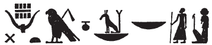
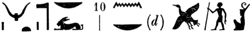

## Esna 309 {-}  
  
  

- Location: Column 11
- Date: Trajan 
- [Hieroglyphic Text](https://www.ifao.egnet.net/uploads/publications/enligne/Temples-Esna003.pdf#page=270){target="_blank"}
- Bibliography: @sauneron-5, p. 219; @recklinghausen-fremden, pp. 539-541; see also [Tempeltexte 2.0](http://www.tempeltexte.uni-tuebingen.de/portal/#/text-detail/1157){target="_blank"}
- Parallels: Very close text in *Esna* VI, 493, 7-11.

  

^26^ *ḏd-mdw ỉn zẖ(ȝ) Ḏḥwty  *  
*ḥr-ỉb tȝ-sn.t  *  
     
*ỉnk Ḏḥwty  *  
^27^ *ỉb n Rʿ  *  
*nb mȝʿ.t  *  
*ʿnḫ=f ỉm=s  *  
    
*ỉnk wʿ n ḫmt  *  
*sšm sn.w  *  
     
*ỉnk mtr n snw  *  
*wp nb.wy  *  
*sr nb ḥr-tp psḏ.t  *  
    
*ỉnk nb sš.w   *  
*ḥsb ʿḥʿ r-mr=f  *  
    
*šzp.n=ỉ ʿ-n-Ỉr  *  
*ȝm.n=ỉ ʿr.w  *  
^28^ *spẖr=ỉ n=k   *  
*ḥb.w-sd.w ʿšȝ.w wr.w  *  
    
*zȝ=ỉ (pr-ʿȝ ʿnḫ ḏ.t)|  *  
*nḫb=ỉ nswy.t ḥr rn=k  *  
*m ȝw n nḥḥ  *  
*ʿḥʿ=k pw ḏrw ḏ.t  *  
   
^26^ Words spoken by the scribe,[^fn-309-1]   
Thoth within Esna:  
  
I am Thoth,  
^27^ the heart of Re,  
Lord of Maat,  
who lives from her.  
  
I am one of the three,  
who guides the two.[^fn-309-2]  
  
I am witness of the two,[^fn-309-3]  
who judges the two lords (Horus + Seth),  
prince, lord, chief of the Ennead.[^fn-309-3b]   
  
I am lord of writing,  
who assigns lifetimes as he likes.  
  
As I have picked up the palette of *Ỉr*,[^fn-309-4]  
so have I grasped my pens,  
^28^ so I might register for you  
very numerous Sed Festivals.  
  
My son, (Pharaoh living eternally)|  
I inscribe kingship in your name  
for the length of all time:  
your lifetime is the limit of eternity.  

[^fn-309-1]: {width=6%} - @sauneron-5, p. 219, translated this group as "l'Annaliste" without further comment. Since the crocodile - even with a straight tail -  sometimes writes *s* (e.g. [Esna 250], 13, in *sḫpr*), this most likely is a phonetic spelling of *zḫȝw*, "scribe", spelled *sḫ(ȝ)*, as in many other sportive writings: @klotz-brown, p. 283, n. i. For the term "scribe" spelled with this determinative, see also @jw-scribe.
[^fn-309-2]: For these epithets of Thoth from North Esna, see *Esna* II, 80, 4; VI, 493, 9.
[^fn-309-3]: The two gods, Horus and Seth, are here written with sun and moon.
[^fn-309-3b]: {width=26%} - @sauneron-5, p. 219, translated this group as: "qui sépare Horus de Seth, maître ...... (?) dieu lune." Instead, I assume here that Horus and Seth are the two lord (*nb.wy*), thus explaining the two baskets. In the parallel *Esna* VI, 493, 10, the Seth animal appears to have been confused as a rabbit sign: {width=35%}.  The final sign uses the rare value of a moon or Khonsu to write *nb*, derived from its frequent use in the expression *rʿ-nb*, "daily." 
[^fn-309-4]: Cf. @cauville-scribe, p. 186.