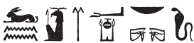

## Esna 310 {-}  
  
  

- Location: Column 11
- Date: Trajan 
- [Hieroglyphic Text](https://www.ifao.egnet.net/uploads/publications/enligne/Temples-Esna003.pdf#page=271){target="_blank"}
- Bibliography: @sauneron-5, pp. 222-223; see also [Tempeltexte 2.0](http://www.tempeltexte.uni-tuebingen.de/portal/#/text-detail/1157){target="_blank"}

  

^28^ *ḏd-mdw ỉn ẖnmw p(ȝ) nḫy nfr  *  
   
*ỉnk sšm=k*   
*ḫnty sḫm.w  *  
*nt nb nḥp  *  
   
^29^ *ỉnk nb ʿnḫ  *  
*m ỉrw=f   *  
*ḥwnw nḫt  *  
    
*ỉnk nḫy nfr  *  
*ỉr zȝ qd.n=f   *  
*ẖnm ỉr.w.n=f m ʿnḫ  *  
*m kȝ=ỉ pfy n ẖnmw  *  
    
*wnn=ỉ m ʿq n mȝȝ=k  *  
*zȝ=ỉ mry=ỉ  *  
*(pr-ʿȝ ʿnḫ ḏ.t)|  *  
    
*dỉ=ỉ ʿ.wy=ỉ ḥȝ=k  *  
*ḫwỉ=ỉ ḥʿw=k  *  
*ẖnm(=ỉ) t(w) m ʿnḫ ḏ.t  *  
   
^28^ Words spoken by Khnum[^fn-310-1] the Good Protector:  
  
It is I who leads you   
foremost of the images  
of the Lord of the Potter's Wheel.  
  
^29^ I am the Lord of Life,  
in his physical form,  
a mighty youth.  
  
I am the good protector,  
who guards what he built,  
who endows (*ẖnm*) what he made with life,  
in this my name of Khnum (*ẖnmw*).  
  
I am in festival from seeing you,[^fn-310-2]  
my beloved son,  
(Pharaoh Living Eternally)|.  
  
I place my arms around you,  
so I might protect your body  
and endow (*ẖnm*) you with life, eternally.

[^fn-310-1]: {width=12%} - @sauneron-5, p. 127, n. g, had originally interpreted this spelling as an alternate name of Khnum, "Népeh" (followed by P*WL*, p. 512). Later, @sauneron-8, pp. 83-84, acknowledged this could be just a variant writing of "Khnum." Given the context in which this occurs, including the present name of Khnum the Good Protector, only the latter option makes sense. Presumably the back part of the lion (Gard. F22) substitutes for the goat skin sign (F26), and the signs are written in reverse. Thus: *ẖn + nb < ẖnb < ẖnmw*, "Khnum" (cf. Greek: Khnoubis; @sauneron-8, p. 83).
[^fn-310-2]: {width=26%} - @sauneron-5, p. 223, n. c, read this quite differently. I interpret the apparent *nb*-basket as a determinative to *ʿq*, "festival" (spelled: *ʿ* + *kȝ*, as elsewhere at Esna; e.g. *Esna* II, 71, 9; 184, 26). Note that while the uraues most often writes *nb* at Esna, it frequently has the uniliteral value *k* in the birth ritual texts from Column 11.
