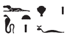
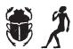
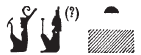

## Esna 311 {-}  

 

- Location: Column 11
- Date: Nerva
- [Hieroglyphic Text](https://www.ifao.egnet.net/uploads/publications/enligne/Temples-Esna003.pdf#page=272){target="_blank"}
- Bibliography: @leitz-loeffler, pp. 97-104; see also [Tempeltexte 2.0](http://www.tempeltexte.uni-tuebingen.de/portal/#/text-detail/1176){target="_blank"}

#### Formula {-} 

  
^1^ *ḥnk nḥp*  
*ḏd-mdw*  
   
*ỉn(=ỉ) n=k nḥp pfy*  
*mry ỉb=k*  
*gr[g=k] tȝ.wy nb*  
*m* ^2^ *kȝ.t=f*  
*mn(.w) mnḫ(.w) rwḏ(.w)*  
*nbỉ=k tw=ỉ ḥr=f*  
*r ỉwʿʿ tȝ.wy*  
*nn [kȝ.t nb] ỉr.tw*   
*m ḫm=k*  
   
^1^ Offering the potter's wheel.[^fn-311-1]  
Words spoken:  
  
I bring to you this wheel,  
which your heart loves,    
so [you] might popul[ate] all lands  
with ^2^ its work:[^fn-311-2]   
enduring, effective, and firm.    
You fashion me upon it[^fn-311-3]    
to be heir of the two lands.  
There is no [work] performed    
without your knowing.  

  
[^fn-311-1]: {width=13%} - @leitz-loeffler, pp. 99-100, n. a, suggested reading the double plumes as *p < psš-kf*, the similarly shaped implement from the Opening of the Mouth ritual. Alternatively, it might represent the biliteral value *ḥp*, derived from the *ḥpty*-crown, a special object that also features double plumes and ram horns.
  
[^fn-311-2]: {width=5%} - This unique spelling of *kȝ.t*, "work" (clear from the context and parallel offering scenes), is derived from *kȝr*, "shrine", and the horizontal *tȝ*-sign ("earth"). 
  
[^fn-311-3]: {width=13%} - @leitz-loeffler, pp. 97-98, alternatively translated "die Gott und Göttin fest werden lässt auf ihr. Oh, Erbe der beiden Länder! (*rwḏ nṯrw nṯrwt ḥr.f, jȝ jwʿ tȝwy*)." However, the king seems more likely to inherit the two lands, so a different translation is proposed here. The crocodile writes the verb *nbỉ*, "to fashion", in the related offering scene [Esna 395], 1, and the same sign stands for *nb*, "all; lord" elsewhere at Esna. Furthermore, the spelling of the first-person dependent pronoun is standard: @kurth-2, p. 600. 
  
#### The King {-}
  

^3^ *nsw.t-bỉty*  
*nb tȝ.wy*  
*(ȝwtwkrtr kysrs)|*  
^4^ *zȝ Rʿ*  
*nb ḫʿ.w*  
*(nrwis nty-ḫwỉ)|*  
^5^ *sḏty n Nḥp*  
*nbỉ [...] m nḏm-ỉb*  
   
^6^ *nṯr nfr*     
*snn n Rʿ*  
*ḫnty n Šw*  
*šzp-ʿnḫ n zȝ Ỉs.t*  
*nbỉ n ẖnmw*  
*m ʿ.wy=f ḏs=f*  
*sṯnỉ šȝỉ=f*   
*ḥr msḫn.t*  
*mṯn.tw=f [...]*

^3^ The King of Upper and Lower Egypt,  
Lord of the Two Lands,  
(Autokrator Caesar)|  
^4^ Son of Re,  
Lord of Appearances,  
(Nerva Augustus)|   
^5^ child of the Potter,  
fashioned [...] in happiness.    
  
^6^ The good god,      
likeness of Re,   
statue of Shu,  
living image of the Son of Isis,  
fashioned by Khnum  
with his own hands,  
who distinguished his Shai  
upon the birthbrick;  
he was guided [...]   

#### Khnum-Re {-}
  

^7^ *ḏd-mdw n ẖnmw-Rʿ *  
*ḥry nḥp*  
*nṯr ʿȝ nb tȝ-sn.t*  
*ḥmww n ʿnḫ n ʿnḫ.w*  
^8^ *wr bỉȝ.wt*  
*m tȝ.wy ḫȝs.wt*  
*nḥp [...]*  
*rrỉ* ^9^ *msw.t*   
*ḥr msḫn.t*  
*swr kȝ n mr=f*  
*ḥr sn[...]=f*  
*r-gs* ^10^ *ḥmw.t*  
*r'-ʿ.wy=f pw m ḫnt=s*  
   
^11^ *dỉ(=ỉ) n=k*  
*ʿḥʿ n nḥḥ*  
*m bỉty p.t*  
*nswy.t mỉ Šw*  
*rʿ-nb r ȝw [ḏ.t]*  
  
^7^ Words spoken by Khnum-Re,    
chief of the potter's wheel,    
great god, Lord of Esna.  
Artisan of life for the living,   
^8^ great of marvels  
in all lands.  
Potter [...]  
who nurtures ^9^ the child  
on the birthbrick,  
who magnifies the Ka of whom he loves  
while [...]  
beside ^10^ the woman,    
since his handiwork is within her.  
  
^11^ I give to you[^fn-311-4]  
the lifetime of the Eternal (Re),  
as *bỉty*-king of heaven;[^fn-311-5]    
and the *nsw*-kingship of Shu,  
every day for all [eternity].  

[^fn-311-4]: {width=8%}{width=3.5%} - @leitz-loeffler, p. 98, understood this as an additional epithet of Khnum: "der die Lebenzeit als *nḥḥ*-Ewigkeit des Re emporhebt (*ʿḫ ʿḥʿw n nḥḥ Rʿ*)." However, based on the position of this text, one expects a speech by Khnum to the king, detailing what he gives in return for the offering. Presumably the scarab writes *dỉ < tȝ*, "earth", and the suffix pronoun *=k* derives from *qȝ*, "to be high."  *Nḥḥ*, "eternal one", is a frequent epithet of Re: *Wb* II, 302, 10. 

[^fn-311-5]: {width=15%} - Presumably Neith is an error for the masculine *bỉty*-king, while the ideogram of Isis writes *p.t*, "sky": @kurth-1, p. 165, n. 636 (with references). @leitz-loeffler, p. 101, n. n, assumed these were uniliteral values for the following word *nswy.t*, "kingship."

#### The Four Meskhenet Goddesses {-}
  

^12^ *ḏd-mdw n tȝ 4.t msḫn.t*  
*ỉmy.w Ỉwny.t *  
*[msḫ]n.t wr.t Tfn.t*  
^13^ *msḫn.t ʿȝ.t Nw.t*  
*msḫn.t nfr.t Ỉs.t*  
*msḫn.t mnḫ.t Nb.t-ḥw.t*  
^14^ *ỉry-rd.wy*  
*n nb nḥp*  
*r sʿnḫ ỉwr.t*  
*r ḥsb rnp.wt *  
*n* ^15^ *[...]*  
*[r dỉ.t] wȝ.t*  
*n gȝw-ḥty.t*  
^16^ *dỉ(.w) ršw*  
*m ỉb.w ỉnd.w*  
*ṯḥḥ n bw.w nb.w *  
*ẖr=sn*  
   
^17^ *ntsn ḥsb ʿḥȝ nb*  
*šȝỉ rnn.t*  
*wḏ(.w) ḫp(r)*  
*sgȝ(.w) mnḥ*  
*snfr [...]*  
  
*wd(?) ḥr-tb ndb.t*  
*ḥr tȝ 4.t ḏb.t*  
*qdỉ [...]*  
   
^18^ *sṯnỉ=n šȝỉ=k*  
*ḫr nb nḥp*  
*r ṯz hȝy.w=k m [tȝ pn]*  
     
^12^ Words spoken by the Four Meskhenets  
within Iunyt:  
the great Meskhenet, Tefnut;  
^13^ the great Meskhenet, Nut;  
the good Meskhenet, Isis;  
the beneficent Meskhenet, Nephthys.  
^14^ Attendants  
of the Lord of the Potter's Wheel (Khnum),  
to keep alive the pregnant woman,   
to reckon years  
for ^15^ [...],  
[to give] a path  
for the not-yet-breathing (the fetus).  
^16^ They who cause rejoicing  
in saddened hearts,   
everybody is jubilant  
with them.   
  
^17^ It is they who reckon every lifetime,  
Shai and Renenet,   
who decree what happens,   
who shrink the wax figures,    
who make good [...]  
  
[?] upon the earth,   
on the four bricks,   
who build [...]  
  
^18^ We distinguish your Shai  
before the Lord of the Potter's Wheel,  
to assemble your family  
in [this land.]

#### Behind the Divinities {-}

^19^ *nsw.t bỉty*  
*qdỉ m šȝʿ*  
*grg tȝ m r'-ʿ.wy=f*  
*bȝ sṯỉ*  
*ỉr mw m qs.w*  
*nḥp wr*  
*ṯz ḥʿw m swȝ.w=s*  
*smn m ḏbʿ.w*  
*ḥr bnn.t m ḥmw.t*  
*ỉr bw.w nb.w m ʿ.wy=f*  
*ḫntỉ [...]*  
*[...] ḥw.t-ỉt*  
    
^19^ The King of Upper and Lower Egypt,    
the Builder in the beginning,   
who populated the earth  
through his handiwork,   
who makes semen in bones,    
the Great Potter,   
who assembles flesh all around it,   
so it is affixed by hand   
upon the womb in the woman.  
He who makes everybody with his hands  
foremost [...]  
[...] the Temple of the Father.

