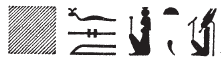
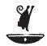
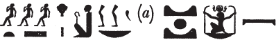
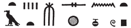
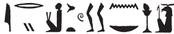

## Esna 313 {-}  

 

- Location: Column 11
- Date: Domitian
- [Hieroglyphic Text](https://www.ifao.egnet.net/uploads/publications/enligne/Temples-Esna003.pdf#page=278){target="_blank"}
- Bibliography: @leitz-loeffler, pp. 99, 103 (313, A); see also [Tempeltexte 2.0](http://www.tempeltexte.uni-tuebingen.de/portal/#/text-detail/1179){target="_blank"}

^A^ *[...]*  
*[...].n=f s(w)*  
*m Nw.t*  
*ỉt=f Ỉmn wḏ=f n=f*  
*nswy.t m tȝ.wy ḫȝs.wt*  
   
*nḥp.n=f rmṯ.w nṯr.w*  
*ʿ.wt mnmn.wt*  
*pȝy.w rm.w ḥrr.w*  
*qmȝ.n=f wnn.t nb.w*  
*m tȝ pn*  
*(ḥr) ṯnỉ Šȝỉ rnn.t*  
*fd.t msḫn(.wt) *  
*ḥr ỉry-rd.wy nb nḥp*  
    
^A^ [...]    
he [...] it   
as Nut[^fn-313-1];  
his father Amun, decress for him  
kingship[^fn-313-2] in domestic and foreign lands.  
  
As he fashioned people, gods,  
small and large livestock,  
birds, fish, and serpents,  
so did he create all that exists  
in this earth;  
distinguishing Shai and Renenet,  
while the four birth-bricks  
attend upon the Lord of the Potter's Wheel.[^fn-313-3]
  

[^fn-313-1]: {width=18%} - @leitz-loeffler, p. 99, parsed this section differently: *m njwt Jmn*, "in der Stadt des Amun", but that does not explain the suffix pronoun. While that interpetation of the goddess ideogram is possible, one might instead see a connection to the 4 birth-bricks mentioned in the related offering scene, since one of them is identified directly with Nut: [Esna 311], 13.
[^fn-313-2]: {width=6%} - @leitz-loeffler, p. 103, n. ff, read this sign as *sḫm* (< *sḫm.ty*, "Pschent crown"), citing also [Esna 300], 6. Both examples also make sense as the verb *nsw*, "to rule as king."
[^fn-313-3]: {width=7%}{width=34%} - @leitz-loeffler, p. 99, read this section slightly differently. The most remarkable feature is the phonetic spelling of *fd.t*, "four" as *f-t-tȝ*. The entire phrase finds an interesting parallel in the related scene [Esna 311], 11 and 14 (not mentioned by @leitz-loeffler, p. 99): {width=22%} **(...)** {width=22%}. The four birth-bricks act on behalf of the "Lord of the Potter's Wheel (*nb nḥp*)" again in [Esna 311], 18 (translated differently by @leitz-loeffler, p. 99).

  

^B^ *[...]*  
*m-ẖnw ʿbȝ*  
*ʿn qd*  
*nfr.t m-ʿ nṯr.w*  
*ʿq=s pr-ẖnmw*  
*m tr n rnp.t*  
*nb(.t) tḫ*  
*ḥb.t(w) n kȝ=s*  
  
^B^ [...]    
within Aba;[^fn-313-4]  
Pleasant of body (Anukis),[^fn-313-5]  
beautiful among the gods,  
she enters Per-Khnum  
at the (proper) time of year;[^fn-313-6]  
Lady of drunkenness,  
for whose Ka one holds festival.  

[^fn-313-4]: This first, damaged epithet apparently refers to Nephthys, represented in [Esna 312], and who is said to take care of Osiris in Aba in [Esna 278], 9.
[^fn-313-5]: The same pun on the name Anukis (*ʿnq.t*) and "pleasant of body" (*ʿn qd*) occurs in the related scene [Esna 312], 6.
[^fn-313-6]: This seems to be an allusion to the visit by Nephthy of Komir to Esna during the festival of Khoiak: [Khoiak 1-6](https://bookdown.org/shemanefer/Esna2/calendar-i-55.html#khoiak-1-6), as mentioned in the calendar *Esna* II, 55, 5.