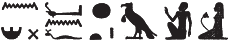

# Column 12 (315-327) {-}

## Esna 315 {-}  
  
  

- Location: Column 12
- Date: Trajan 
- [Hieroglyphic Text](https://www.ifao.egnet.net/uploads/publications/enligne/Temples-Esna003.pdf#page=281){target="_blank"}
- Bibliography: @sayed-neith, II, p. 661, Doc. 1090 (A only, partial translation). See also [Tempeltexte 2.0](http://www.tempeltexte.uni-tuebingen.de/portal/#/text-detail/1191){target="_blank"}

  

^A^ *nsw.t-bỉty  *  
*tmȝ.t wr.t  *  
*zḫn(.t) m ỉt(?)  *  
   
*štȝ.t   *  
*ḫpr(.t) ḫnt  *  
*ỉt-ỉt.w mw.t-mw.wt   *  
*[...]  *   
  
^A^ King of Upper and Lower Egypt,  
the great Mother,  
who unites with the father(?).[^fn-315-1]  
  
The mysterious serpent,  
who came about before,  
father of fathers, mother of mothers  
[...]  

[^fn-315-1]: {width=18%} - Reading uncertain. @sayed-neith, II, p. 661, Doc. 1090, translated "qui se pose sur la butte," but one would expect a different preposition. These readings suppose the sundisk is an error for the embracing arm determintive more typical for *zḫn*. Alternatively, if multiple signs were copied incorrectly, this could be something like: "who shines in the Akhet."

  

^B^ *nsw.t-bỉty  *  
*nb sḫ.t m ḥwnw rnp  *  
     
*nḏ.n=f z nb  *  
*nty m nỉw.t=f  *  
*ḥr sḫr.w=sn  *  
*nḥm.n=f nỉwty.w   *  
    
*ẖnmw  *  
*dỉ ṯȝw n ʿnḫ  *  
  
^B^ The King of Upper and Lower Egypt,  
Lord of the Field as a rejuvenated youth.  
   
As he protected every man  
who is in his city  
because of their condition,  
so he rescued[^fn-315-2] the citizens.  
  
Khnum,  
who gives the breath of life.  
  

[^fn-315-2]: {width=28%} - Emended after a parallel epithet in [Esna 325], 15: {width=25%}