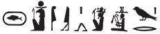
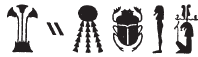
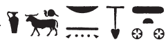
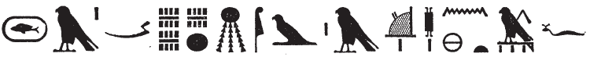
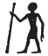
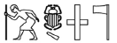

## Esna 318 {-}  
  
  

- Location: Column 12
- Date: Trajan 
- [Hieroglyphic Text](https://www.ifao.egnet.net/uploads/publications/enligne/Temples-Esna003.pdf#page=287){target="_blank"}
- Bibliography: @sauneron-5, pp. 87-88; see also [Tempeltexte 2.0](http://www.tempeltexte.uni-tuebingen.de/portal/#/text-detail/1202){target="_blank"}

NB: This hymn apparently continues the awakening hymn [Esna 379].

**§3**

  

^7^ *(rs=k nfr) *  
*ẖnmw-Rʿ nb tȝ-sn.t*  
*bȝ n bȝ.w *  
*n nṯr.w m ḫm.w* 
  
^7^ (Awake beautifully),  
Khnum-Re Lord of Esna,  
Ba of Bas  
of the gods in the shrines.

**§4**

  

*rs=k nfr*  
*Rʿ m ỉtn wr*  
*ḥȝỉ ḫprw*  
*ẖnmw-Rʿ nb tȝ-sn.t*  
*bȝ ḥry nṯr.w*  
*ṯnỉ ḫpr.w*  
   
Awake beautifully,   
Re as the great sun disk,[^fn-318-4]    
radiant of manifestation.  
Khnum-Re Lord of Esna,[^fn-318-4b]  
Ba, chief of the gods,   
distinguished of forms.  

[^fn-318-4]: {width=28%} - @sauneron-5, p. 87, read this as: "Rê ... Geb (?), Tanen l'Ancien." The first seated form of Khnum is a determinative to "Re", with Khnum wearing the sundisk; similar substitutions of a ram for a falcon head occur throughout Esna. The subsequent signs write *ỉtn*, with Geb representing *t < tȝ*, "earth", and Tatenen *tn* < *ṯnn*: @klotz-baboons, p. 58 (for similar spellings).

[^fn-318-4b]: {width=15%} - @sauneron-5, p. 87, read this more or less the same way, but noted the preceding signs could also be a cryptographic spelling of Khnum (p. 88, n. a). Based on the structure of this hymn, one expects to see an initial series of epithets, followed by "Khnum-Re Lord of Esna", then an extra designation of the god. In that case, while the preceding signs might write "Khnum" via acrophony, they wouldn't include the phrase "Lord of Esna." Accordingly, the rare hieroglyph of Khnum here likely serves as an ideogram for "Khnum-Re Lord of Esna." His counterpart, Khnum "Lord of the Field" is written with an appropriate ideogram in [Esna 324], 13.

**§5**

  

*rs=k nfr*  
*nbỉ ḥḥ.w*  
*rȝ-ḥzȝ (ḥr) ỉȝ.wt*  
*drp psḏ.t m ỉḫt=f*  
*ẖnmw-Rʿ nb tȝ-sn.t*  
*bȝ ʿȝ m kȝr=f*  
*zmȝ ỉḫt nn ȝb*  
^8^ *\{kȝr=f zmȝ ỉḫt\}*  
  
Awake beautifully,   
Lord of building,
chief of the potter's wheel, 
who seeks out the mounds,[^fn-318-5]    
and feeds the Ennead with his products.  
Khnum-Re Lord of Esna,[^fn-318-5b]    
great Ba in his shrine,    
who assembles food, without fail.   
^8^ \{his shrine, who assembles food\}  

[^fn-318-5]: {width=28%} - @sauneron-5, p. 87, read this sequence as: "maître du tour, Khnoub-Rê, au regard fascinant [sur] les montagnes (?)." Yet as noted above, Khnum is not usually mentioned into the middle of each verse. Instead, we recognize the sequence "Lord of Building, Chief of the Potter's wheel", which occurs elsewhere, e.g.: [Esna 276], 11, §1. The first group is clear, the second requires further comment: the man over the basket is a variant of "Heh", thus *ḥ(ḥ) + Rʿ > ḥry* , "chief of" (compare a spelling of "Horus" with the sundisk in [Esna 393], 23). The apparent *ḥz*-vessel is likely a mistake for the similarly shaped potter's wheel (*nḥp*). The final epithet begins with the ideogram of a wakeful eye; based on parallels and the context of supplying food, this is likely the verb *ḏʿr*, "to seek out", often determined with the same eye. For *ḏʿr-ỉȝ.wt*, "to seek out/search through the mounds", see PW*L*, p. 1226. Finally, the *ỉȝ.t* sign might conceivably be a mistake for the similar *ȝḫ.t*-hieroglyph, in which case this could write the more common phrase *ḏʿr ȝḫ.w*, "seek out benefactions": cf. @klotz-abydos, p. 148, n. c. 

[^fn-318-5b]: {width=18%} - This sportive writing features the same signs as the subsequent epithet ("ram ... who assembles offerings.") Here Esna is spelled: t***ȝ s****(< zmȝ)****n****(< nỉw.t)****.t****(< t*, "bread"). For a slightly different explanation, see @sauneron-5, p. 90, n. g.

**§6**

  

*rs=k nfr*  
*nḥḥ m ỉrw=f*  
*wḥm msḫʿ.w*  
*mỉ rʿ-nb*  
*ẖnmw-(Rʿ) nb tȝ-sn.t*  
*bȝ ʿnḫ*  
*ỉwty sk*   
   
Awake beautifully,    
eternity in his visible form,    
who repeats births     
just like every day.  
Khnum-(Re) Lord of Esna,   
living Ba,   
who never perishes.
  

**§7**

  

*rs=k nfr*  
*Ḥr m pȝ hrw*  
*psḏ m šnb.t*  
*m dbn(?) n psḏ.t=f*  
*ẖnmw-Rʿ nb tȝ-sn.t*  
*bȝ m ỉtr.ty*  
*sḫm-ḏsr=sn*  
  
Awake beautifully,     
Horus(?) during the day,     
who shines as a falcon,      
surrounded(?) by his Ennead.[^fn-318-7]    
Khnum-Re Lord of Esna.    
Ba in the dual chapels,      
their sacred power.  

[^fn-318-7]: {width=6%}{width=44%} - This passage is very difficult. @sauneron-5, p. 88, only attempted some of it: "Khnoum-Rê, Horus de Bouto, ... de son collège divin." Note that the epithets feature two words involving falcons, just like the spelling of "Esna" later in this verse. But the precise reading in each case is unclear to me. 
The first section could alternatively read: "The Ba of Re, Horus/falcon during the day." The present spelling assumes the falcon is a determinative, and the decorative spelling for Re simply stands as a uniliteral *r* (cf. [Esna 393], 23). A similar epithet occurs in [Esna 379], 23. As discussed above, the verse is unlikely to commence with the divine name Khnum.
Since this verse centers around Khnum-Re shining like a falcon, and the conclusion of the verse mentions "the dual chapels" of Egypt, home to the Ennead of the country, the following signs should probably refer to the sun encircled by the rest of the gods. 

**§8**

  

*rs=k nfr*  
*wbny nṯr.w*  
*wbd ẖȝk.w-ỉb.w*  
^9^ *\{wbd ẖȝk.w-ỉb.w\}*  
*m nsr.t=f*  
*ẖnmw-Rʿ nb tȝ-sn.t*  
*Ỉtm ʿȝ nbỉ.t*  
  
Awake beautifully,  
shining one of the gods,    
who burns the disaffected ones   
^9^ \{who burns the disaffected ones\}    
with his fiery tongue.  
Khnum-Re Lord of Esna,  
Atum,[^fn-318-8] Lord of the flame.  

[^fn-318-8]: {width=8%}{width=5%} - @sauneron-5, p. 88, read this group as "Tanen (?) l'Ancien", but this is just a variant of the standard, retrograde trigram for Atum, with the standing official here replacing the usual elderly man: @klotz-khepri, pp. 72-73. As noted there, multiple spellings of Atum feature similar signs in the 'correct' order: old man + scarab + *m*; another example was recently published in S. Cauville, *Dendara. Le porte d'Horus*, p. 116: {width=12%}.

**§9**

  

*rs=k nfr*  
*bȝ m Mȝnw*  
*srs.n=f nty.w-ỉm šps.w*  
*ẖnmw-Rʿ nb tȝ-sn.t*  
*Ỉtm m ḏ.t=f*  
*nb tmm.w*  
  
Awake beautifully,    
Ba in Manu,    
having awoken the noble deceased ones.     
Khnum-Re Lord of Esna,  
Atum in his body,   
Lord of the existing.

**§10**

  

*rs=k nfr*  
*ḥtp.tw m ʿnḫ.t*  
*ỉmnty.w m ỉȝw*  
*n st.wt=f*  
*ẖnmw-Rʿ nb tȝ-sn.t*  
^10^ *Wsỉr m ḏ.t=f ḏ.t*  
   
Awake beautifully,   
having set in the necropolis,   
the Westerners are in praise    
for your solar rays.  
Khnum-Re Lord of Esna,   
^10^ Osiris in his body, forever.  
 

**§11**

  

*rs=k nfr*  
*bȝ m ỉȝbt.t*  
*šhb ty.t=f ḏsr*  
*ẖnmw-Rʿ nb tȝ-sn.t*  
*dỉ ṯȝw*   
*n srq-ḥty.t*  
     
Awake beautifully,    
Ba in the East,     
Sheheb is his sacred image.[^fn-318-11]      
Khnum-Re Lord of Esna,    
who gives air   
to let throats breathe.[^fn-318-11b]

[^fn-318-11]: As @sauneron-5, p. 91, n. q noted, Sheheb is the name of the south wind, who features in *Esna* II, 105, the astronomical ceiling, and other temples and coffins.
[^fn-318-11b]: Or this could be: "who gives air to those who breathe": cf. [Esna 277], 24 (and note there).

**§12**

  

*rs=k nfr*  
*sʿnḫ ṯȝw*  
*ṯz mw m-ẖnw qs.w*  
*ẖnmw-Rʿ nb tȝ-sn.t*  
*dỉ ṯȝw m-ẖnw swḥ.wt*  
  
Awake beautifully,  
he who enlivens the chick,  
and binds semen in bones.  
Khnum-Re Lord of Esna,  
who gives air within eggs.  

**§13**

  

*rs=k nfr*  
*ỉrw=k qdỉ nṯr.w*  
*nw pȝwty*  
*nḥp rmṯ.w*  
*rs=k mỉ-qd*  
*ẖnmw-Rʿ nb tȝ-sn.t*  
^11^ *tȝ-ṯnn wtṯ m šȝʿ*  
   
*psḏ=k *  
*ḥʿʿ=n n mȝȝ=k*  
*dỉ=k Ỉwny.t m Šw-rḫ-dd-ṯȝw*  
*nn nṯr*  
*ỉr ỉr.n=k*  
  
Awake beautifully,   
your form builds the gods  
of the Primeval one,   
and fashions humans.  
May you awake entirely!  
Khnum-Re, Lord of Esna,   
^11^ Tatenen, who begat in the beginning.  
  
When you shine,  
we rejoice to see you,  
you place Iunyt in ecstasy!  
There is no god  
who can do what you have done.

**§14**

 

*rs=k nfr *  
*pȝ qd wr*  
*ẖnmw-Rʿ nb tȝ-sn.t*  
*pȝ ḥmww n ʿnḫ*  
*ʿȝ mnw*  
*grg.n tȝ*  
*ẖr ʿ=f*  
   
*mȝȝ r pȝ wḫȝ*  
*nty mḥy.t ḫft-ḥr*  
*(n) wbȝ*  
   
Awake beautifully,    
great builder,  
Khnum-Re Lord of Esna.  
The artisan of life,  
great of monuments,[^fn-318-14]   
populating the earth  
is under his control.  
  
(Look to the column   
to the north of the pronaos,   
immediately across).  

[^fn-318-14]: {width=18%} - @sauneron-5, pp. 88, 91, nn. u and w, did not translate this epithet, but compared it to a different group in the duplicate [Esna 249], 1, §14bis. However, that initial epithet is already present in this verse (*pȝ qd wr*), and it seems that this particular phrase does not show up in the duplicate of this verse. Although the winged scarab can represent a number of words, one value not in sign lists is *ʿȝ*, "great", which occurs elsewhere in [Esna 372], 15; [Esna 392], 20 and 21. The obelisk then can just write *mnw*, "monument; statue." As an artisan of living creatures, Khnum is elsewhere said to create humans as "statues" or "monuments": e.g. [Esna 277], 23, §7.

This hymn continues in [Esna 249]. 