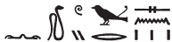
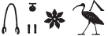
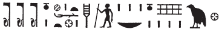

## Esna 320 {-}  
  
  

- Location: Column 12
- Date: Trajan 
- [Hieroglyphic Text](https://www.ifao.egnet.net/uploads/publications/enligne/Temples-Esna003.pdf#page=292){target="_blank"}
- Bibliography: @sauneron-5, pp. 234-238; @leitz-loeffler, pp. 132-135; see also [Tempeltexte 2.0](http://www.tempeltexte.uni-tuebingen.de/portal/#/text-detail/1205){target="_blank"}

  

^21^ *r' n smn nḥp*  
*m ẖ.t n ỉd.wt nb.w*  
*ḏd-mdw*  
   
*ỉ nḥp qmȝ swḥ.t*  
*ḥr nḥp=f*  
*ṯz=k qd m-ẖnw ỉd.wt *  
*(ḥr) ʿpr štȝ.wt twy m šzp=k*  
*(ḥr) ḫwỉ qmȝ.n=k* ^22^ *ỉmy.w=s*  
*nn šwỉ r=sn*  
*m ỉrw=k n Šw*  
   
*ẖnm ỉr.n=k m ʿnḫ*  
*m rn=k n ẖnmw*  
  
*sʿȝ ʿ.wt n nḥp.n=k nb.w*  
*m rn=k pfy n nḥp nn snw*  
   
*wbȝ-ỉb ḫnt swḥ.t*  
*mỉ qd=k*  
*šd ṯȝw m ḥȝ.t*  
*r-mn pḥwy*  
*m rn=k pfy n Ỉmn*  
   
*ḫf qrḥ.t*  
*sd sy r ssw=s*  
*r ỉr(.t) wȝ.t *  
*n gȝw-ḥty.t r nw=f *  
   
^21^ Utterance for establishing the potter's wheel  
in the womb of all females.  
Words spoken:  
  
I potter, who creates the egg   
upon his potter's wheel.  
You bind the miniature potter within women,  
equipping this womb with your form,  
protecting (*ḫwỉ*) what you created ^22^ with her,  
with them lacking (*šwỉ*) anything,[^fn-320-1]  
in your form of Shu (*Šw*).  
  
(You) who endow (*ẖnm*) what you made with life,  
in this your name of Khnum (*ẖnmw*);  
  
who grows the limbs of all you fashioned (*nḥp*),  
in this your name of Potter (*nḥp*) without equal.  
  
Intelligent one within the egg,[^fn-320-2]  
just like your form,   
who nurtures the embryo from the beginning  
until (*r-mn*) the end,  
in this your name of Amun (*Ỉmn*).    
  
Who watches the amniotic sac,  
and breaks it at its day, 
to create a path  
for the 'not-yet-breathing' at its time.[^fn-320-4]  

[^fn-320-1]: {width=18%} - As @leitz-loeffler, p. 134, n. h, suggested, this serpent (which elsewhere writes "Shai"), could here write *šwỉ*, "lack", creating alliteration with "Shu."  
[^fn-320-2]: {width=15%} - Reading uncertain. @sauneron-5, p. 235, n. 5 (followed by most translators), split up the text differently, and suggested *nn ḥr ỉb*, "sans que le coeur s'éloigne (de?)", understanding *ḥr* < *ḥrr.t*, "flower." For a medical interpretation of that reading, see @leitz-loeffler, p. 56, n. 195. Instead, the rosette can also write *wbȝ < wȝb/wnb*, "blossom", and thus we have a standard epithet denoting intelligence and attentiveness (*Wb* I, 290, 21). 
[^fn-320-4]: As in other texts at Esna, the 'not-yet-breathing' (lit. tight-throated one) is a euphemism for the fetus: cf.  @leitz-loeffler, pp. 22, n. 91, 48; 101-102, n. t.

^23^ *twt qdỉ rmṯ.w *  
*ỉr ỉḫt nb.w mr ỉb=f*  
*pr.t ȝḫ.t*  
*sṯnỉ nb.w ỉmỉ ẖ.t*  
*r grg tȝ pn ḏ.t*  
   
*ỉ nṯr.w nṯry.t nw nỉw.t tn*  
*sḫm.w nb nw spȝ.t tn*  
*ḥḥỉ ḫtb ms.wt*  
*m ỉr(.t) nfr ỉm*  
   
*wḏȝ ỉb=tn*  
*ṯz swḥ.t *  
*m ẖ.t n(.t) ỉd.wt*  
*r ʿpr tȝ m ḏȝm.w*  
*n nsw.t-bỉty*  
*(pr-ʿȝ ʿnḫ ḏ.t)|*  
*mry ẖnmw*  
  
^23^ You are he who builds people.  
who makes everything his heart desires;  
the excellent seed,  
who distinguishes lords within the womb,  
to populate this land, eternally.    
  
O gods and goddesses of this city,  
all powers of this district,[^fn-320-6]  
who seek to populate the fields,[^fn-320-7]  
performing good things therein.  
  
May your hearts be well!  
Bind the egg  
within the belly of females,  
in order to supply the land with generations,  
for the King of Upper and Lower Egypt,  
(Pharaoh living eternally)|  
beloved of Khnum.  

[^fn-320-6]: {width=33%} - In both phrases, the demonstrative pronoun *tn* is written with the city sign (*n < nỉw.t*). Nonetheless, it is unclear how the stick sign functions in the phrase *nỉw.t tn*, "this city."
[^fn-320-7]: For the verb *ḫtb*, "to found or populate (a region)", see the referneces in @klotz-caesar, p. 59, n. 99.
