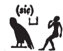
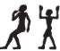
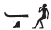
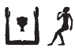
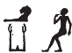

## Esna 323 {-}  
  
   
  
  
- Location: Column 12
- Date: Trajan 
- [Hieroglyphic Text](https://www.ifao.egnet.net/uploads/publications/enligne/Temples-Esna003.pdf#page=294){target="_blank"}  
- Bibliography: @sauneron-8, pp. 35, 72-73. See also [Tempeltexte 2.0](http://www.tempeltexte.uni-tuebingen.de/portal/#/text-detail/12011){target="_blank"}

This is a continuation of the Heka Litany, [Esna 242]

**(110)** {width=8%}

 

^27^ *n Ḥkȝ*  
*Ḥr ṯmȝ-ʿ *  
  
^27^ For Heka,  
Horus, Valiant of Arm.  

**(111)** {width=17%}

 

*n Ḥkȝ*   
*ʿn-ḫʿ.w*   
  
For Heka,  
Pleasant of appearances.

**(112)** {width=10%}

 

*n Ḥkȝ*   
*Nfr-ḥtp*  
  
For Heka,  
Neferhotep.  

**(113)** {width=7%}

 

*n Ḥkȝ*   
*Ḫnsw pȝ ẖrd*    
  
For Heka,  
Chonsu the Child.

**(114)** {width=12%}

 

*n Ḥkȝ*   
*Ḫr-zmȝ-tȝ.wy*
   
For Heka,  
Harsomtus.

**(115)**  {width=13%}

 

*n Ḥkȝ*   
*p(ȝ)-nb-tȝ.wy*   
  
For Heka,  
Panebtawy.[^fn-323-115]

[^fn-323-115]: This is the primary child deity from Kom Ombo.

**(116)** {width=12%}

 

*n Ḥkȝ*      
*nb sȝr.t*   
  
For Heka,  
Lord of the *sȝr.t*-plant.[^fn-323-116]

[^fn-323-116]: A unique epithet. *LGG* III, 737b, translated this as *nb srd*, "Der Herr des (Pflanzen)Wachstums", which makes sense. @sauneron-8, p. 35, and @koemoth-sar, pp. 150-151, classified this as an example of the term *sȝr(.t)* (*Wb* III, 422, 5).

**(117)** {width=3.5%}{width=5%}

 

*n Ḥkȝ*      
*nb wȝḏwȝḏ*   
  
For Heka,  
Lord of verdure.

**(118)** {width=13%}

 

*n Ḥkȝ*   
*wr bȝw*     
  
For Heka,  
great of power. 

**(119)** {width=11%} 

 

*n Ḥkȝ*     
*ḫpr ẖr ḥȝ.t*    
  
For Heka,  
who came about in the beginning.

**(120)** {width=10%}

 

*n Ḥkȝ*      
*m rn=f nb*     
  
For Heka,  
in all his names.  

**(121)** {width=10%} 

 

*n Ḥkȝ*         
*m ḫprw=f nb*   
  
For Heka,  
in all his manifestations.  

**(122)** {width=10%}

 

*n Ḥkȝ*     
*m sštȝ=f nb*      
  
For Heka,  
in all his secret forms.

**(123)** {width=8.5%}

 

*n Ḥkȝ*      
*m s.t=f nb mr kȝ=f ỉm*  
   
*dỉ=sn ʿnḫ-ḏd-wȝs nb.w*  
*snb nb*  
*n zȝ-Rʿ (pr-ʿȝ)|*  
*mỉ Rʿ ḏ.t*  
   
*mȝȝ r pȝ wḫȝ *  
*nty wbȝ=f n mḥty*  
*n ḫft-hr*  
   
For Heka,  
in all places his Ka desires.  
  
May they give all *ʿnḫ-ḏd-wȝs*,  
all health,   
to the Son of Re (Pharaoh)|  
(living) like Re, eternally!   
  
(Look to the column  
which is across it to the north side  
of the processional path)[^fn-323-123]  

[^fn-323-123]: According to @sauneron-oube, p. 21, this refers to column 11. Presumably, the following text would be the speech of Heka during the divine birth ritual: [Esna 308].