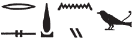
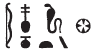

## Esna 324 {-}  
  
   
  
  
- Location: Column 12
- Date: Trajan 
- [Hieroglyphic Text](https://www.ifao.egnet.net/uploads/publications/enligne/Temples-Esna003.pdf#page296){target="_blank"}  
- Bibliography: @sayed-neith, p. 629, Doc. 1016; @shemanefer, p. 51; @gamelin-2019, pp. 30-31; see also [Tempeltexte 2.0](http://www.tempeltexte.uni-tuebingen.de/portal/#/text-detail/1215){target="_blank"}

#### Formula {-} 

^1^ *mn n=[t] šmr(.t)*  
*šps r nṯr.w*  
*ỉwn.t tw*  
*nḏ(.t) m-ḫnt r'-ḏȝ.w(?)*  
*pḏ.t šps.t šsr=t*  
*mḥ* ^2^ *šm-m-ḫnn*  
*(m?) ḫbḏ=sn*  
   
*sʿnḫ(.t) smȝ(.t)*  
*nb(.t) nbỉ.t*  
*mḏd(.t) ḥʿw*  
*n ḫm.w*  
*ỉn(.t) pḥw*  
*n šš zȝṯw=t*  
    
^1^ Receive the *šmr.t*-bow,  
o most august of the gods!  
This *ỉwn.t*-bow,  
protector within battle(?),[^fn-324-1]  
the august *pḏ.t* -bow and your arrow:  
fill ^2^ those who traffic in chaos   
(with?) their crimes.   
  
(You) who enlivens and kills,  
Lady of fire,  
who pierces the body  
of the ignorant ones;  
who brings an end  
to whomever violates your ground.[^fn-324-2]

[^fn-324-1]: {width=16%} - This reading is highly speculative, as it requires multiple emendations of individual signs.
[^fn-324-2]: For the final phrase, see @klotz-shu, pp. 309-311, n. o.

#### The King {-} 

 

^3^ *nsw.t-bỉty*  
*nb tȝ.wy*  
*(ȝwtwkrtwr kysrs)|*  
^4^ *(zȝ) Rʿ *  
*nb ḫʿ.w*  
*(dryns nty-ḫwỉ)|*  
   
^5^ *ḥry-tȝ*  
*n pȝwty-tpy*  
*r zȝ-Ỉs.t*  
*ḥqȝ tȝ.wy*  
*m pḏty nfr n Km.t(??)*  
    
^6^ *nṯr nfr*     
*[...]*  
*ṯtf pḏ.wt 9.t*  
*ỉr ḫrwy(.t) n ḫm.w*  
*nb qn m šsr*  
*gs-dp s(w) psḏ.t*  
*wr pḥty=f*  
*hb.n=f ptr.t*  
*[ḥr.w-nb.w(?)] wtḫ(.w)*  
*n ptr=f*  
   
*nb ḫpš*   
*(dryn[s nty-ḫwỉ])|*  
  
^3^ The King of Upper and Lower Egypt,  
Lord of the Two Lands,  
(Autokrator Caesar)|  
^4^ (Son) of Re,  
Lord of Appearances,  
(Trajan Augustus)|  
    
^5^ The successor,  
of He who is more ancient   
than the son of Isis,[^fn-324-3]  
ruler of the two lands  
as a good archer of Egypt(??).[^fn-324-4]  

^6^ The good god,   
[...]  
who overwhelms the Nine Bows,  
who makes a massacre of the ignorant.  
Lord of victory with an arrow,  
whom the Ennead protects;  
his strength is great  
when he enters the battlefield,  
[everybody(?)] flees  
just from seeing him.  
  
Lord of a strong arm,  
(Trajan [Augustus])|  

[^fn-324-3]: The same epithet occurs later (324, 13) as an epithet of Shemanefer; see also [Esna 328], B. A similar royal epithet occurs in [Esna 334], 6. The idea is that Shemanefer was a royal, fighting god long before Harsiese.

[^fn-324-4]: {width=14%} - Reading again highly speculative. In Neith's epithets, Esna is spelled with the bow and arrow, but it does not seem possible to recognize the same toponym here. Equally unlikely would be Nubian toponyms such as *Tȝ-sṯỉ* and *Ḫnt-ḥn-nfr*.

#### Neith {-}

^7^ *ḏd-mdw n N.t wr.t*  
*mw.t-nṯr nb(.t) tȝ-sn.t*  
*nṯr n nṯr.w*  
*mḥ[n.t n] nṯry.t*  
*m rn=s*  
*nb(.t) Zȝw*  
*ḫnty N.t*  
*nbnb(.t) Rʿ*  
   
*nb(.t) nṯr.w*  
*ỉr(.t) [w]nn.t*  
^9^ *nṯr nṯry(??)*  
*wr [...]*  
*mwnf n nb-[ḏ]r*  
*nḏ.t ỉt=f*  
*[...]* ^10^ *tpy.w-tȝ*  
*m ʿnḫ(?)*  
*m pḏ.t šsr.w=s*  
   
^11^ *dỉ=ỉ n=k ỉwn.t*  
*m hrw dmḏ*  
*bdš[.w...]*  
  
^7^ Words spoken by Neith the great,  
Mother of God, Lady of Esna,  
God of gods,  
Ur[aeus of] goddesses[^fn-324-5]  
in her name.  
Lady of Sais,  
foremost of the Neith nome,  
who protects Re.  
  
Lady of the gods,  
who made what [ex]ists,  
^9^ divine(??) god,  
great of [...],  
guardian of the [A]ll-Lord,  
protector of her father,  
[who preserves(?)] ^10^ those on earth  
in life(?)[^fn-324-6]  
with her bow and arrows.  
  
^11^ I give you the *ỉwn.t*-bow  
on the day of combat;  
the disaffected one[s...]  

[^fn-324-5]: Following the suggestion of @sayed-neith, II, p. 629, Doc. 1016.
[^fn-324-6]: Uncertain reading of the signs. For a similar allusion to Neith protecting those on earth, see [Esna 326], B.

#### Shemanefer {-}

 

^12^ *ḏd-mdw n šmʿ-nfr*  
*sbk-Rʿ zȝ N.t*  
*nṯr ʿȝ nb tȝ-*^13^*-sn.t*  
*snn ʿnḫ nty ẖnmw*  
*ḫprw ʿȝ n nṯr nb*  
*pȝwty tpy*  
*r zȝ Ỉs.t*  
*ḫnty(?)* ^14^ *šps n nṯr nb*  
*[...]n*  
*ṯȝy n N.t*   
*hrw dmḏ*  
*šsr m-ʿ=f*  
   
^15^ *tq(s)=ỉ sbỉw=k*  
*m hrw sk*  
*mḏd.n=ỉ psḏ.t*  
*r ḫfty=k*  
    
^12^ Words spoken by Shemanefer,  
Sobek-Re, son of Neith,  
Great god, Lord of Esna,  
living image of Khnum,[^fn-324-7a]  
great manifestation[^fn-324-7] of every god,  
even more ancient  
than the son of Isis,[^fn-324-8]    
august ^14^ crocodile(?) of every god  
[...]  
he whom Neith takes  
on the day of combat,  
with an arrow in his hand.  
  
^15^ I wound your rebel  
on the day of battle;  
and the Ennead fights for me  
against your enemy.

[^fn-324-7a]: The ideogram of Khnum wears a double-plumed crown, which identifies him as Khnum Lord of the Field, for which compare [Esna 253], 13: "Living image of the Lord of the Field." Cf. @gamelin-2019, p. 31.

[^fn-324-7]: The mummy here serves as an ideogram for *ḫprw*, "manifestation", restored from similar epithets of Shemanefer, where the same sign is a determinative for this word: [Esna 253], 13; *Esna* VI, 486, 8; *Esna* VII, 629, 12. The mummy sign has the same value in *Esna* VII, 622, 10 (compare [Esna 381], 11).

[^fn-324-8]: This epithet can be restored based on the parallel above (324, 5), [Esna 328], B, and the traces copied by @sauneron-5, p. 252, n. b. 

#### Behind the Divinities {-}

  

^15^ *nsw.t-bỉty*  
*[...]*  
*[...] wsn(.t)*  
*wtṯ.n=s nṯr nb*  
*nn nṯr *  
*ỉr=f ỉr(.t).n=s*  
*[...]*  
*ḥr.t-tp pḏ.t 9.t*  
*ḫȝs.t nb*  
*ḫr(.w) n bȝw=s*  
*nb(.t) šmr.t*  
*sḫm dndn*  
*ỉr(.t) ḫfty.w*  
*m [tm-wn]*  
*[N.t ...]*   
*[nb.t] ḫpš*  
    
^15^ The King of Upper and Lower Egypt,   
[...]  
[...] the procreator,  
she begot every god,  
without any god  
who might do what she did!  
[...]   
Chief of the Nine Bows,  
all foreign lands  
fall down for her power.  
Lady of the bow,  
mighty of rage,  
who makes the enemies  
[non-existent]:  
[Neith...]  
[Lady of] the strong arm.[^fn-324-9]

[^fn-324-9]: Restored after the royal epithet above (324, 6).