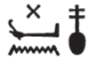
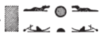
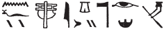

## Esna 326 {-}  
  
   
  
  
- Location: Column 12
- Date: Trajan 
- [Hieroglyphic Text](https://www.ifao.egnet.net/uploads/publications/enligne/Temples-Esna003.pdf#page=301){target="_blank"}  
- Bibliography: See [Tempeltexte 2.0](http://www.tempeltexte.uni-tuebingen.de/portal/#/text-detail/1217){target="_blank"}

 

^A^ *[...]  *  
*hrw sk [...]  *  
*[...] n zȝ.w-n=sn  *  
*nḫy(.t) nfr nt ʿȝ mȝʿ-ḫrw  *  
*gs-dp n tpy.w-tȝ  *  
   
*ỉỉ(.t) m ỉwn.t  *  
*mwnf(.t) swḏȝ(.t) nb-ḏr  *  
*m-ʿ ky.w  *  
*m ḫwỉ nṯr.w rmṯ  *  
*nb(.t) r'-ʿ ḫt  *  
  
^A^ [...]  
the day of striking[^fn-326-1] [...]  
[...] of the Guardian Deities,  
good protector of Great of Justification,  
guardian (*gs-****dp***) of those upon earth (***tp****y.w-tȝ*).  
  
She who comes with the bow,  
champion[^fn-326-2] who keeps safe the All-Lord  
from the rebels,  
while protect gods and people:  
Lady of Combat.[^fn-326-3]   

[^fn-326-1]: The same phrase with more context in [Esna 324], 15.
[^fn-326-2]: {width=6%}{width=9%} - Notable spelling of mwnf, "guardian; champion", but compare [Esna 324], 9, where Neith is also "champion of the All-Lord."
[^fn-326-3]: Similar epithet in [Esna 328], B.

^B^ *[...] ḫntỉ ḫdỉ  *  
*m ʿḥʿw [...]  *  
     
*[...] n=f  *  
*ỉn nty m wȝḏ-wr  *  
   
*nf(?) ỉqr   *  
*ỉr ḥm.yt   *  
*n nty ḥr-mw=f  *  
      
*ẖnmw p(ȝ)-nḫy nfr  *  
*n tȝ r-ȝw=f  *  
   
^B^ [...] going south and north [^fn-326-4]  
in ships [...]  
   
[...call(?)] unto him  
by he who is in the Great Green sea.  
  
Excellent wind(?),  
who controls the rudder [^fn-326-5]  
for whomever is on his water.  
  
Khnum the Good Protector  
of the entire earth.  

[^fn-326-4]: {width=15%} - Notable spelling with the two crocodiles.
[^fn-326-5]: {width=30%} - *LGG* I, 481b, and IV, 259b, read the first section as "great protector of the river (*nh wr ỉtrw*), and the second as "he who does the rowing (*ỉr ẖn.t*)." Despite the unusual spelling, this is almost certainly a popular sequence of epithets for Khnum the Good Protector, as preserved in the nearby [Esna 325], 8: {width=32%}. The first few signs appear to be mistakes, perhaps based on spellings such as those found in *Esna* VI, 479, 8-9, 15; 482, 8-9.

