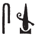
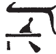
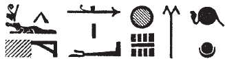
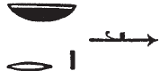

# Column 13 (328-336) {-}

## Esna 328 {-}  
  
  

- Location: Column 13
- Date: Probably Hadrian 
- [Hieroglyphic Text](https://www.ifao.egnet.net/uploads/publications/enligne/Temples-Esna003.pdf#page=305){target="_blank"}  
- Bibliography: None. See LGG references in [Tempeltexte 2.0](http://www.tempeltexte.uni-tuebingen.de/portal/#/text-detail/1222){target="_blank"} 

  

^A^ *nsw.t-bỉty  *   
*nb sḫ.t  *  
*nṯr ʿȝ ḥry nṯr.w nb  *  
*twȝ p.t  *  
*sṯz ḥr zḫn.wt=f  *  
*r sš ȝḫ.t n bȝ=f  *  
     
*ỉr tȝ pn   *  
*qmȝ nty ḥr=f  *  
*m nḥp  *  
*ỉmy-rȝ šmʿ *  
*n šmʿ-mḥw   *
  
^A^ The King of Upper and Lower Egypt,  
Lord of the Field,  
Great god chief of all the gods,  
who lifts up heaven,  
raised up[^fn-328-1] upon his supports,  
to open up the Akhet for his Ba.[^fn-328-2]  
  
He who made this earth,  
and created what is upon it  
as the Potter.  
Overseer of Upper Egypt[^fn-328-3]  
throughout all Egypt.

[^fn-328-1]: {width=6%} - This reading is based on the well-attested interchange between the *wḏȝ* and *wṯz* signs at Esna: @sauneron-2, p. xxxv. This verb could alternatively be *smn.w*, "established."  
[^fn-328-2]: This theme ties to the separation of heaven from earth, celebrated on [Phamenoth 1](https://bookdown.org/shemanefer/Esna2/calendar-ii-77.html#phamenoth-1). Once the sky is lifted up, it gives space for the celestial Ba to sail around.
[^fn-328-3]: {width=8%} - Reading after *LGG* I, 243c. This epithet occurs several times at Esna only.  

  
^B^ *nsw.t-bỉty  *   
*nṯr wʿ ḫpr m snw  *  
*tȝ-ṯnn pw ḥnʿ bȝ.t  *  
*nḏ.t pȝwty-tpy*  
*r zȝ-Ỉs.t  *  
   
*nḫt m pḏ.t=s  *  
*qn m šsr=s  *  
*nḥm(.t) Rʿ m sbỉ.w=f  *    
*N.t nb.t r'-(ʿ)-ḫt  *  
  
^B^ The King of Upper and Lower Egypt,  
Sole god who transformed into two:[^fn-328-4]  
that means Tatenen with the female Ba.  
She who protects He who is more ancient   
than the Son of Isis (Shemanefer).[^fn-328-5]  
  
Strong with her bow,  
mighty with her arrow,  
who rescues Re from his rebels:  
Neith, Lady of Combat.[^fn-328-6]  

[^fn-328-4]: {width=18%} - For the reading of this epithet, see @klotz-caesar, p. 173, n. 1130. The celestial pair (sun and moon) write "two", just as in the same epithet in [Esna 255], A. As the next line explains, this refers to the primeval, serpentine Neith who created the second serpent, Tatenen-Irita. Note that in the symmetric text (A), Khnum is called "Lord of the Field", with lord (*nb*) written with a ram wearing a red crown; while here, the first word *nṯr* is spelled with a crocodile with the same crown, an appropriate cult manifestation of Neith.
[^fn-328-5]: {width=20%}{width=10%} - *LGG* IV, 596b, cited this unique epithet, but only translated the first half. However, the same epithet occurs twice elsewhere to describe Shemanefer: [Esna 324, 13]:  {width=18%}. Although partially damaged there, in the same scene the king is described as the successor of the same god: [Esna 324, 5]: {width=22%}. Apparently Shemanefer, son of Neith, was considered even "more ancient" than Horus. 
[^fn-328-6]: {width=11%} - Following the suggestion of *LGG* IV, 86b-c to change the harpoon sign to a stick, and read *r'-(ʿ)-ḫt*, "combat." Similar spellings (with a stick) can be found in [Esna 337], B; [Esna 350], 16.