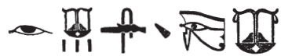
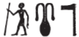

## Esna 332^bis^ {-}  

  

- Location: Column 13
- Date: Hadrian 
- [Hieroglyphic Text](https://www.ifao.egnet.net/uploads/publications/enligne/Temples-Esna003.pdf#page=313){target="_blank"}  
- Bibliography: @sauneron-5, pp. 227-230; see also [Tempeltexte 2.0](http://www.tempeltexte.uni-tuebingen.de/portal/#/text-detail/1230){target="_blank"}

^27^ *twt nb sḫ.t*  
*ḥqȝ ww*  
*ww=k pwy šww*  
*ẖnmw*  
*nn k(y) rdỉ ḥnb.t *  
   
*twt nb nṯr.w rmṯ.w*  
*ỉr wnn.t*  
*Ptḥ-Šw ḫpr m nsw.t tȝ.wy*  
*m pr-wr=f m ʿnḫ-tȝ.wy*  
*ỉty ḫʿỉ ḥr ns.t n nḥḥ*  
*nb mȝʿ.t *  
*ỉmy-rȝ nỉw.t=f* ^28^ *ḏ.t*  
   
^27^ You are Lord of the Field,  
Ruler of the agricultural district:  
the very sunlight is your district!  
Khnum,  
nobody else apportions fields.  
  
You are the Lord of gods and people,  
who made what exists,  
Ptah-Shu who became King of the Two Lands  
in his Per-Wer shrine in Ankh-Tawy (Memphis);  
Sovereign who appears on the throne of eternity;  
Lord of Maat,  
Overseer of his city ^28^, forever.[^fn-332b-1]  

[^fn-332b-1]: {width=20%} - @sauneron-5, p. 227, translated without further comment: "le dieu siegneur de son temple", and *LGG* III, 559a, only translated: "der Herr in ...?..." Rather, the first two signs appear to write *nb-mȝʿ.t*, a very common epithet of Ptah (*LGG* III, 639c), and the recumbent lion writes *ỉmỉ-rȝ*, "overseer", a common Late Period abbreviation; cf. *Wb* II, 94, 5; @klotz-philae, p. 92, n. m; and also *Esna* IV, 431, 4.

 

*twt Ỉrỉ-tȝ*  
*ỉr ḥb.w-sd.w*  
*ỉỉ.n nṯr nb ḥr-sȝ=f*  
*ḥr pẖr-ns.t=f m ḫʿ-nfr*  
*nn ḥb ʿḥ m ḫm=f*  
   
*zȝ Rʿ*  
*ỉwʿʿ mnḫ n Ỉtm*  
*swḏ=f n=f ỉȝw.t=f*  
*ḥr-sȝ ỉr.n=f ỉmỉ.t-pr*  
*ḥr rn=f*  
  
You are Irita,  
who makes Sed Festivals;[^fn-332b-2]  
every god came after him,  
succeeding his throne in Kha-Nefer;[^fn-332b-3]  
nobody enters the palace without his knowledge.  
  
Son of Re,  
excellent heir of Atum,  
to whom he granted his office,  
after he made for him an inheritance document[^fn-332b-4]   
in his name.  

[^fn-332b-2]: {width=30%} - This is apparently a dittography: the first group a standard spelling of the phrase, the latter more concise using the elaborate wedjat-eye for *ỉr* and the ideogram for *ḥb-sd*. Irita, as a form of Memphite Ptah, was naturally in charge of Sed Festivals. 
[^fn-332b-3]: As @sauneron-5, p. 229, n. t, noted, this is an alternative name for Memphis, similar to Mennefer or Kha'nefer (*ḫʿỉ-nfr*). Khnum is linked to this toponym elsewhere in *Esna* II, 16, 1. 
[^fn-332b-4]: {width=12%} - Note the unusual spelling of *ỉmỉ.t-pr*, "inheritance document." The standing man apparently writes *ỉ < ỉȝw*, "old man", just as in the writing of Atum immediately above: {width=10%}; for the latter, compare *Esna* II, 127, 9; 190; [Esna 214], A.

